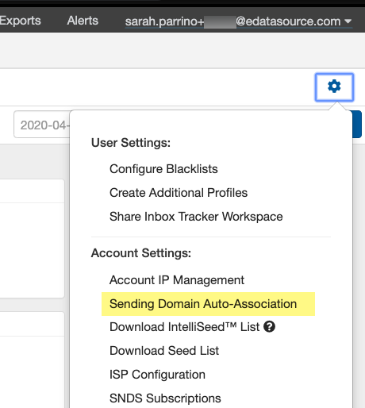

## To add a domain, simply follow these three steps:

 1. **Go to your Settings and select *Sending Domain Auto-Association***

**2. From the prompt, copy the address and send an email to it from the domain you wish to add to Inbox Tracker.** 

**3. The domain will be added upon checking valid SPF and DKIM records. You will need to add the domain to an Inbox Tracker profile.** 

 Please contact us by mailing [csteam@edatasource.com](mailto:csteam@edatasource.com) if you are experiencing issues or are interested in enabling this feature on your account.
