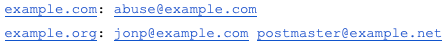
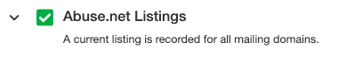

 An [abuse.net](http://abuse.net) listing is a best practice anyone who sends promotional email. This record is managed by *Network Clearing House*, a public database that keeps track of the main contacts for various sending domains. If a deliverability issue occurs, this company will ensure the right person is notified so the problem can be resolved.

**How to Create or Update a Listing** The [abuse.net](http://abuse.net) contact database has about 200,000 domains, which is less than 1% of the all the domains that exist. If an entry is nonexistent or incorrect, Network Clearing House relies on mailers like us to submit up-to-date entries for their database. To do so, follow these steps:

1. **Draft a plain text message to** [**update@abuse.net.**](mailto:update@abuse.net) Changing your mailing program to send plain text rather than formatted or HTML mail will allow the [abuse.net](http://abuse.net) system to decode your message.
2. **Your message format** should use the following format: name of the domain, a colon, and the reporting address(es), all on one line separated by spaces.

 You can send information for as many domains as you want in a single message. If there's more than one contact address for a domain, then send copies of mail to all of them. Don't use commas or mailto: URLs or any other extra punctuation. The entry for a domain automatically includes subdomains, so [mail.example.com](http://mail.example.com/) is the same as for [example.com](http://example.com/); separate entries aren't required.
 
 3. **Specify your entry.** Are these domains you are responsible for, or ones that you've researched? If the connection between a domain you've researched and the contact isn't obvious, explain how you found it.

 Once you've submitted your listing, check Reputation Advisor to see if your listing is present. Note that it may take up to 24 hours for the listing to show up in the platform.

 For further inquiries, reach out to [csteam@edatasource.com](mailto:csteam@edatasource.com).
