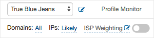
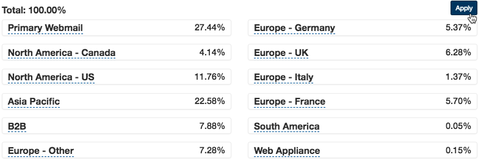

## ISP Weighting helps to create a more accurate representation of your user data. Compare and contrast data between profiles to see how different weights affect your results.

**At the top left of your dashboard, look for the text that says “ISP Weighting”.** 

**You can either manually set specific ISP weightings or upload your email list to determine your ISP makeup** *.* This data is not stored and is only used to analyze weights based on the domains. Press "Apply" to return to the dashboard.

**Use the slider to to turn the custom weights on or off.** 

**Remember, custom ISP weighting only applies to the specific profile you are viewing.** You are free to create an unlimited amount of profiles with varying ISP weightings.
