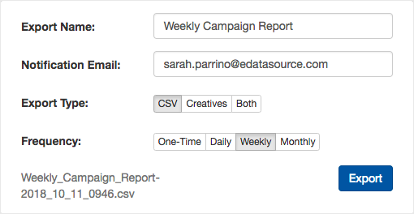

**Step 1 - Look for the download icon.** You can export campaign data from the following areas:

### Competitive Tracker

* *Advanced Search* and *Sending Domain* data can be exported as a CSV alone, or with creatives.
* *Brand Compare* exports generate a PDF document of the brand compare page. This export is *not* available via CSV.
* *Overlap Analysis* data can be exported as CSV or PDF

### Inbox Tracker

* *Campaign and IP data.* The data on the *Campaign Tracker*, "By Campaign" and "By IP" tables can be exported as a CSV alone, or with creatives.
* *Spam Trap Monitor* offers several export options to CSV
* *Command Center* has exports in several sections, such as Domain Trends, IP Deliverability, and Most Recent Campaigns; all available as CSV

**Step 2 - Fill out the details.** Name your export, choose the file type, and set the frequency you would like to receive the report. Then, press the “Export” button.

**Step 3 - Go to the “Exports” tab at the top**. From here you can download your report directly. Go to the “Scheduled” tab if you need to adjust your export settings.

*Organize your exported data by creating a Pivot Table - check out our* *[simple guide](/analyst/competitive-tracker/organize-exported-data-with-pivot-tables)* *to learn how!* 
