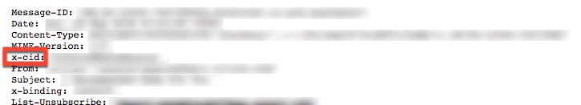
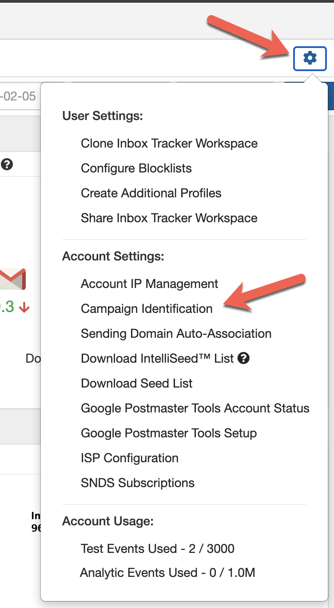
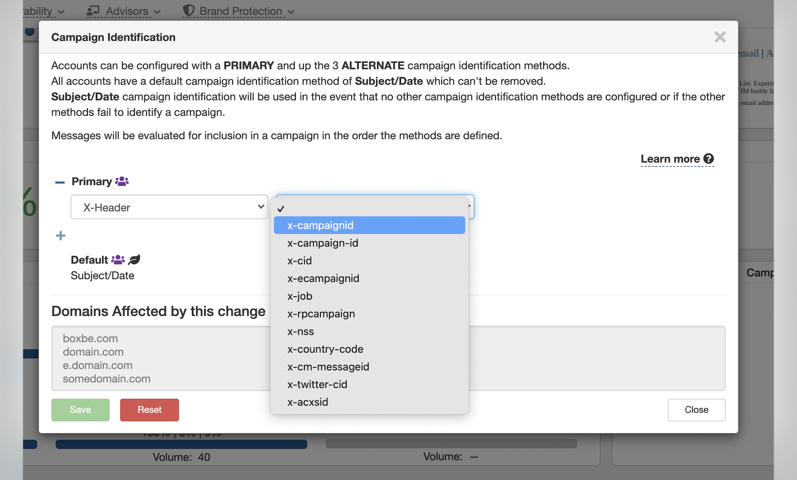
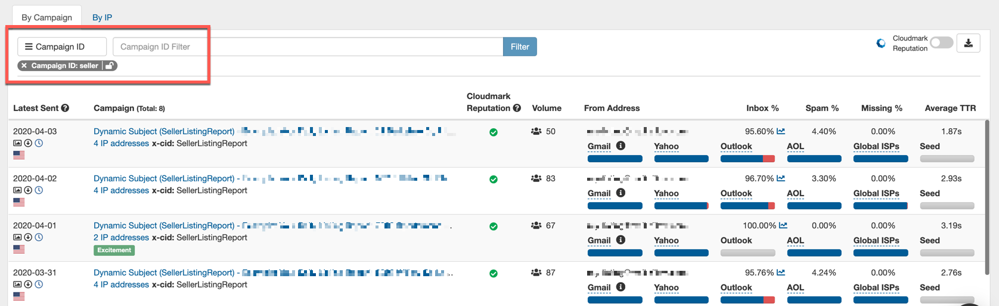
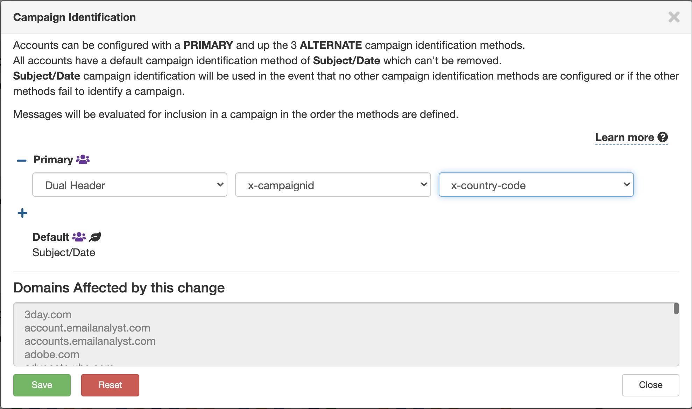
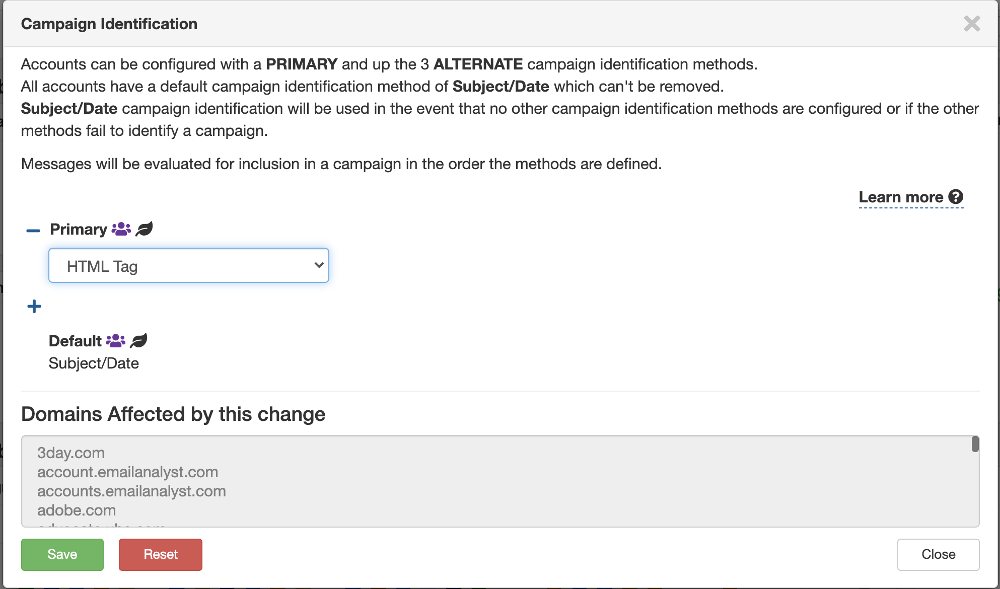

## For brand new accounts, our system identifies a unique campaign when it has a unique combination between the Subject Line and the Date. However, as a manager you can update your tracking method to have the system identify a campaign on a value that you define.

 Our system offers four alternative methods for tracking campaigns:

 -- X-header (x-cid or x-campaignID)

 -- Dual Header (combining two x-headers)

 -- Html Tagging

 -- X-mailer

 With our campaign tracking system you can have a primary and up to three alternate tracking methods to cover all of your different situations. For example, if you send with two or more ESPs there may be a case where they use different x-headers but with our system we can support all of them.

 First let's look at x-headers.  There are few steps to enable the setting for an X-header value to group your campaigns in Inbox Tracker. We recommend appending the X-Header value to your campaigns then confirming it by checking the raw headers of a few campaigns to verify the value is passing before updating your configuration setting in the UI.

 To make this update, you'll need to contact your sending ESP to have an X-header value appended. Here's an example of what the raw header looks like with an X-Header value for "x-cid":



 Our system supports many x-headers and they will be offered at the point of selecting x-header or Dual header tracking. If you don't see an x-header listed that you would like to use you can reach out to our support team and we will work to get it added to our system.

 Once you have confirmed that the X-Header value has been added to the email campaigns, we can change the Campaign Identification setting in the platform to look for the value that you have chosen to use.

 You can do this by going to your settings and selecting Tracking Method:



 From there, you'll be prompted to change your identification method to the value of your choice from our dropdown. Once you have selected it, click "Confirm" to update your campaign tracking method:



 Now, view your campaigns using the Campaign ID Filter:



 If you have two x-headers that can be combined to identify campaigns even more accurately, our Dual header option is for you.



 With Dual header tracking you can join Campaign Ids and other x-headers to group emails. For example if you Track X-campaignID and X-CountryCode this allows you to see specific campaign results by country.

 If you don't have control to easily change your x-headers, we have another option that might fit your needs.



 HTML Tagging allows you to add a comment to the HTML of your emails and we can sort your campaigns based on the tags you add.  With HTML tags you get to define the tag, which give you the flexibility to group individual campaigns or even group a series of emails to the same user journey (i.e. Welcome Series, Recapture campaign, etc.). Just add this tag to your email HTML and we will organize your data based on the tags we find.

```
<!-- MonitorCampaignID: xxxxxxxxxxx -->
```

 Example tags:

```
<!-- MonitorCampaignID: WelcomeSeries -->  
<!-- MonitorCampaignID: RecaptureCampaign1234 -->
```

*Note:  With our HTML tracking options, we even offer fallbacks so if you run a mix of HTML and x-headers in your campaigns. You can choose from 'HTML with x-cid' or 'HTML with x-campaignid' which will allow our system to organize by HTML, then x-header, and will fall back to Subject Date if neither of the other options are found.* 

 Once you have added your x-headers or HTML tags, we would be happy to assist you in verifying you are ready to switch to a new tracking method prior to changing your platform configuration.

 Our final option is x-mailer and is only used by a small subset of our senders.

 Please send an email to [support@edatasource.com](mailto:support@edatasource.com) 
