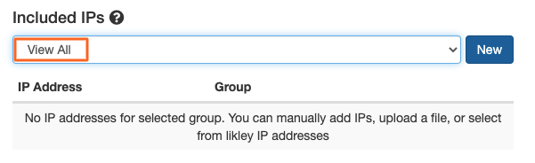

*This is an account-level setting. The platform will automatically detect your sending IPs based on the traffic from your sending domains. Those IPs will appear in the “Likely IPs” section. You may customize this by creating static groups of IPs. As you add or remove IPs from your sending infrastructure, you must make those changes in your IP groups as well.*

**Note:** You must have a Manager role to be able to access the Account IP Management page.

## Add a new IP Address to a new IP Group

Select the User Cog

Under Account Settings, select Account IP Management

Select New

Enter the name of your new IP Group and then select Create

Enter the IP Address and then select Add IP Address

## Add a new IP Address to an existing IP Group

Select the User Cog

Under Account Settings, select Account IP Management

Select View All and then select the IP Group

Enter the IP Address and then select Add IP Address

## Add Bulk Upload of IP Addresses

Select Select File and choose your list to upload.

The file upload only supports .txt format

The file shall only have 1 IP Address per line in the format 10.10.0.1

Select Process File

## Remove an IP Group

Select the User Cog

Under Account Settings, select Account IP Management

Select View All and then select the IP Group

Select Delete

Select Delete to confirm

