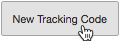
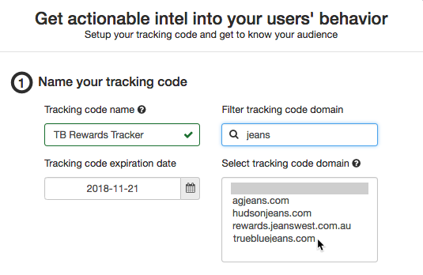
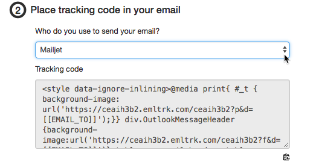
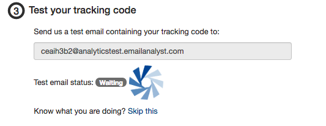
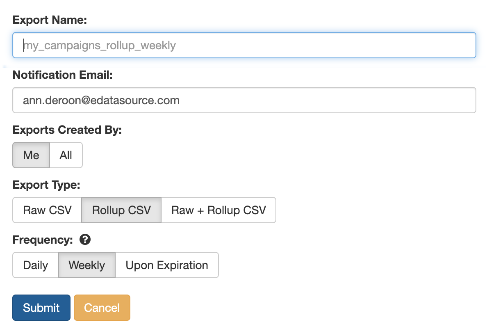
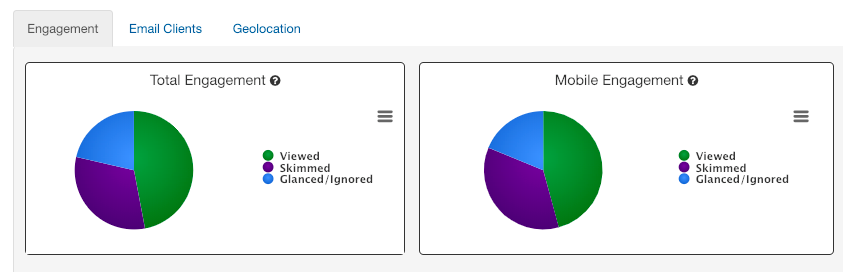
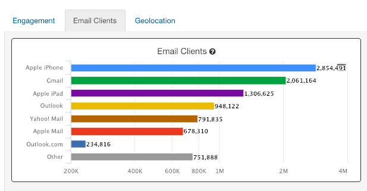
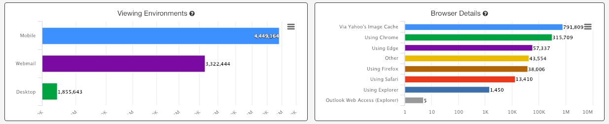
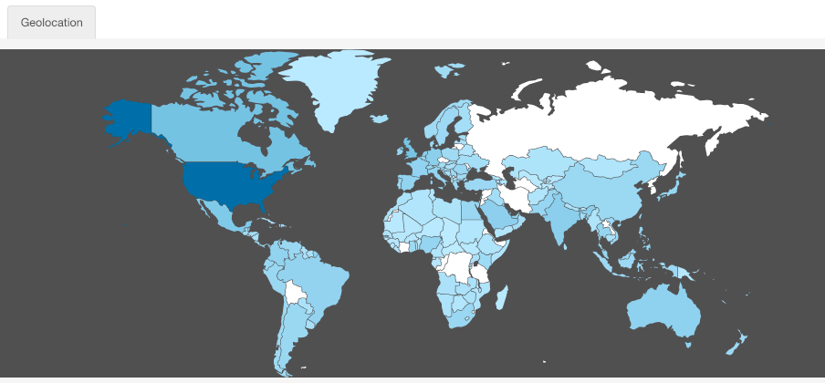
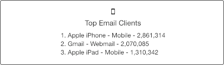

## Place the engagement pixel in the HTML of your next email campaign to find out:

* What browser or device they use to open the campaign
* Where in the world they're located when they interact with the campaign

**Navigate to Analytics Tracker and select “New Analytics Campaign”** 

**Follow the simple steps to create the tracking code:** 

1. Enter a name that you will recognize and connect to the email campaign
2. Set an expiration date when we should stop collecting new engagement data for this campaign

 Next, select your email deployment software (If you don’t see your ESP in the list, select “Other” and input the merge tag that your provider uses to dynamically publish the recipient’s email address into your email content. Example: %%emailaddr%%)

 Copy the tracking code and place it into your HTML. Once added, send a preview of your email campaign to the test address shown:

 Once you’ve mailed the campaign, come back to Analytics Tracker and view the results for the campaign. Each time one of your subscriber's opens the email containing the pixel, that is one Analytics event. Data will continue to be collected until the expiration date that you defined in the tracking code setup.

## Scheduled Analytics Exports

 We've made exporting Analytics campaigns a whole lot easier! You can now schedule an events export for 'daily' or 'weekly' during an active campaign, or 'upon expiration' of the campaign tracking.

 Here is a look at the all the export options that are available:

 Use your findings to prioritize optimization of your email template across email clients, browser and devices. Understand where your subscribers are located throughout the world and how much time they spend viewing your email.

