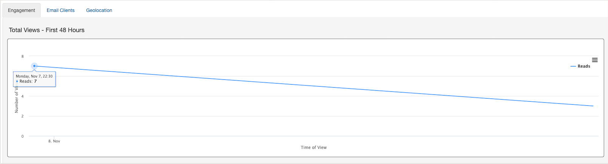

## Use the tracking pixel in your next email campaign to find out:

* What browser or device are used to open the email
* What regions recipients are located in when they interact with the email

Watch this short [video to learn how to use Analytics Tracker]([url](https://www.veed.io/view/b458f788-07e1-4553-b743-2d469a356ba2?panel=share)).

## Create a new tracking code: ##

### 1. Navigate to Analytics Tracker and select “New Analytics Campaign”

### 2. Name Your Tracking Code

- Enter a tracking code name
- Set an expiration date for tracking this campaign
- Click "Select your marketing software" button to proceed to the next step.

### 3. Place the Tracking Code in Your Email

- From the pulldown, select your email deployment software. If you don’t see your ESP in the list, select “Other” and input the merge tag that your provider uses to dynamically publish the recipient’s email address into your email content. Example: `%%emailaddr%%`
- Copy the tracking code, paste it into your HTML, and select Done. If you want to verify the tracking code before deployment select the "Verify Code" button.
- After you email the campaign, come back to Analytics Tracker and view the results for the campaign.

*Note: Each time one of your subscriber's opens the email containing the pixel, that is one Analytics event. Data will continue to be collected until the expiration date that you defined in the tracking code setup.*

## Scheduled Analytics Exports

We've made exporting Analytics campaigns a whole lot easier! You can now schedule an events export for 'daily' or 'weekly' during an active campaign, or 'upon expiration' of the campaign tracking.

Here are all the available export options:

Use your findings to prioritize optimization of your email template across email clients, browser and devices. Understand where your subscribers are located throughout the world and how much time they spend viewing your email.

