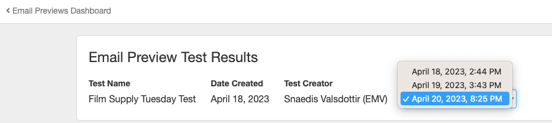

Design Tracker lets you see what your HTML email looks like in common email clients and devices. Use these email previews to catch rendering issues before you send your campaign.

Available with all Inbox Tracker accounts. Watch this short video on [how to use Design Tracker]([url](https://www.veed.io/view/3efe7959-d835-4a00-948c-93e4a0394871?panel=share)) to test your emails.

**Note**: This feature is currently in **Beta**. Not all accounts have access to it yet. 

## Test a new email campaign

There are two ways to test an email in Design Tracker:
- Send an email to a static email address
- Paste an email's HTML into a field and submit it

### Send an email to a static email address
- Enable your static email address.
	- In the Design Tracker tab, click on the **Configure** button in the top-right corner and select **Manage static email address**.
	- Click the **Enable** button in the module provided. 
	- Copy the static email address.
- You can now send your email to the static email address from wherever you create your campaign.

### Paste an email's HTML into a field and submit it
- In the Design Tracker tab, click the **New Email Preview Test** button in the top right corner.
- Fill in the internal **Test Name** field.
- Select the preview options you want to test your email with.
- Paste an email's HTML into the **Email HTML** field.
- Scroll down to click **Test Email Design**. You can leave the page while the test is running.

## Retest an email campaign
You can use either method of testing to retest the same email. Design Tracker will group emails based on Subject Line, so if you previously submitted your HTML directly but would now like to send to the static email, use the same Subject Line to have both test results appear in the same **Email Previews Dashboard**. You can then go between them using the drop-down menu that appears when an email has more than one test. 

### Retest an email campaign using the static email address
- Send your updated email to your static email address. 
- If the subject line remains the same, the new previews will show up in the same-named test.

### Retest an email campaign by pasting and submitting the HTML
- From the _Email Previews Dashboard_ of a tested email, click the **Retest Email** button in the top-right corner.
- Paste the email's new HTML into the HTML field.
- Scroll down to click **Submit Test**. You can leave the page while the test is running.

## Other features
- Use the _Approved / Not Approved_ buttons to indicate whether the previewed email looks good or not. 
	- This is an account-wide indicator. If another user looks at the _Email Preview Test Results_ after you've made a selection, they will see that selection.
- Export email test results using the **Export Results** button on the _Email Preview Test Results_ screen.
- Use the **Archive Test** button to hide tests from the _Email Previews Dashboard_. See archived tests by clicking the **Show** button next to **View Archived**, above the list of tests.
- Manage which email client/device options are used for tests made by the static email address in **Configure** >> **Manage Default Test Clients**.
