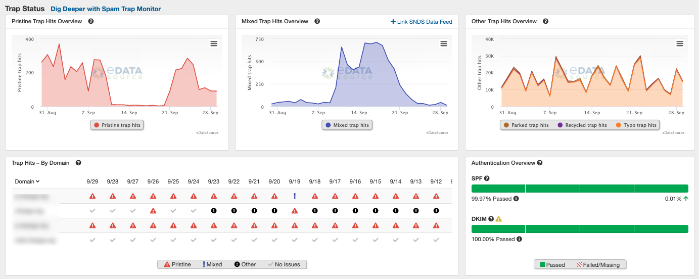
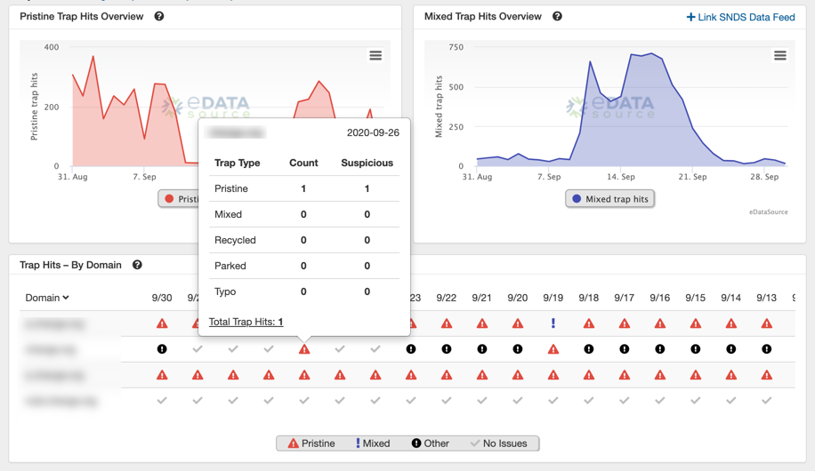
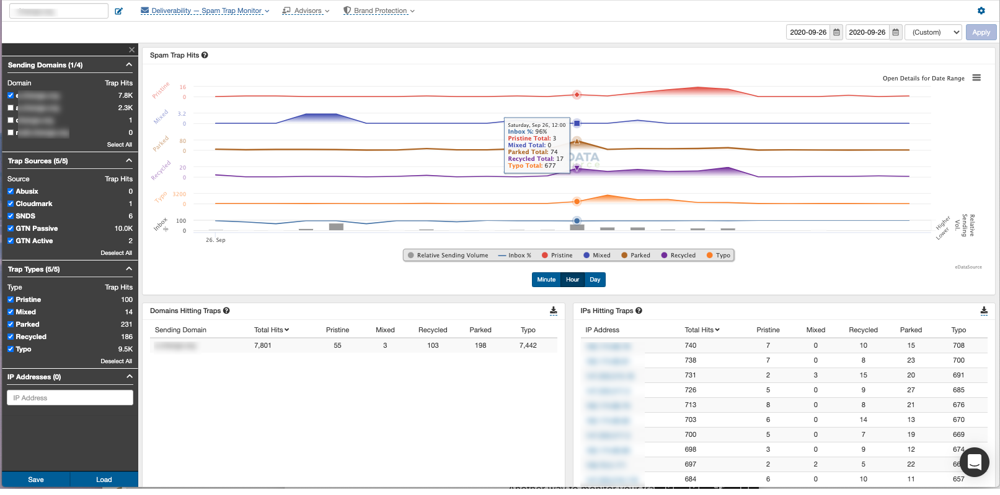
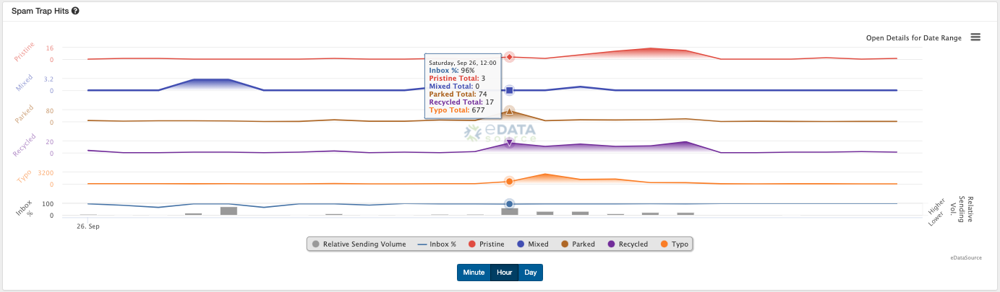
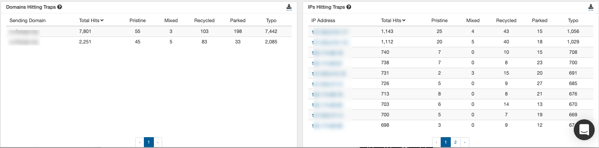
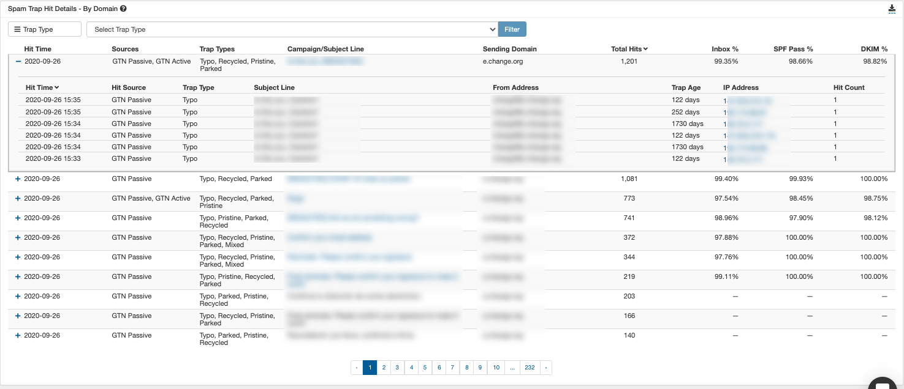

 Spam Trap Monitor was developed to provide actionable insights to help you and your team evaluate trap hits. The first thing you will notice when you start using our platform is the focus on trap [types and sources](/analyst/inbox-and-design-tracker/spam-trap-types-and-sources).

 The ***Trap Status*** section, displays the raw number of traps hit by type so you can monitor trends for all the domains on your profile.

 If you want to see trap counts for each domain separately, you can review that data on the ***Trap Hits - By Domain*** section (above). Hovering over a specific day, allows you to see how many traps were hit and how many of those hits came for suspicious (non-likely) IPs. We provide this data since spam trap hits from non-likely IPs may be evidence of spoof attempts against your sending domain. If you want more info for a particular day, simply click on the trap icon for the day you are interested in and we will take you to our Spam Trap Monitor page in for a closer look. *(Note: All times reported within Spam Trap Monitor are based on UTC)* 

 Let's dive into ***Spam Trap Monitor*** (above) and see what's available. On the left hand side of the page you will have access to control your monitor display. Profile domains can be filtered in or out, and you get to control which sources and trap types are visible. We also offer an option to filter to specific IPs, and you can save your display setting so that every time you load the page it will retain your viewing preferences.

 Once you have your viewing preferences set, you can dig in!

 The **Spam Trap Hits** display (above) allows you see hits by day, hour, and even minute if you are reviewing a single day. We've included inbox percentage and relative sending volume to let you see if the trap trends might be affecting deliverability. *If you want to focus on a specific time frame within this chart you can click and drag on the chart to zoom in for an even finer detailed view!* 

 Our ***Domains Hitting Traps*** and ***IPs Hitting Traps*** displays (above) allow you to review totals for each trap type by domain or IP. This allows you to see high-level information and can let you focus on the domains and IPs that are having the most issues.

 For even greater detail, our ***Spam Trap Hit Details - By Domain*** (above) and ***Spam Trap Hit Details - By IP*** displays allow you to see each subject line that hit a trap, along with from address, time of the hit, and trap type and source information. Note: *If suspicious IPs are identified, you may want to investigate further. Simply click on the IP link and we will provide WHO IS data identifying the owner of the IP.* 

 Spam trap monitor is supported with a on-demand and scheduled export capabilities so you can have all these deep insights delivered directly to your inbox.

 We believe these deeper insights will allow you and your team to easily monitor how effective your list hygiene, list management, and list acquisition practices are working for you.

 Enjoy!!
