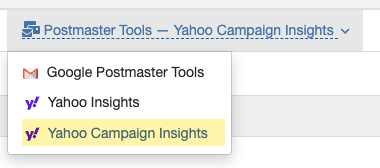
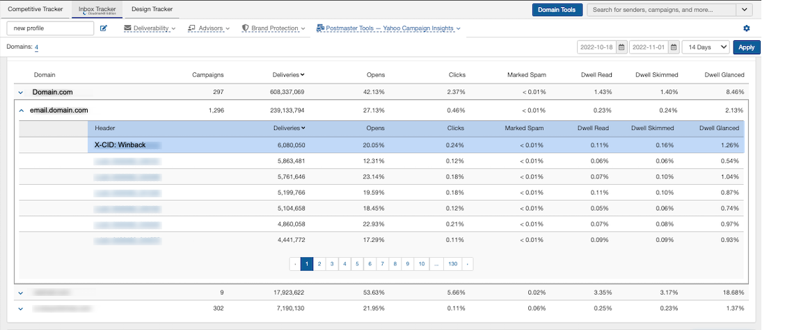
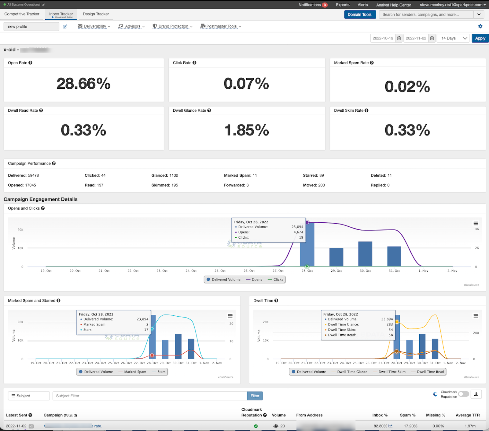
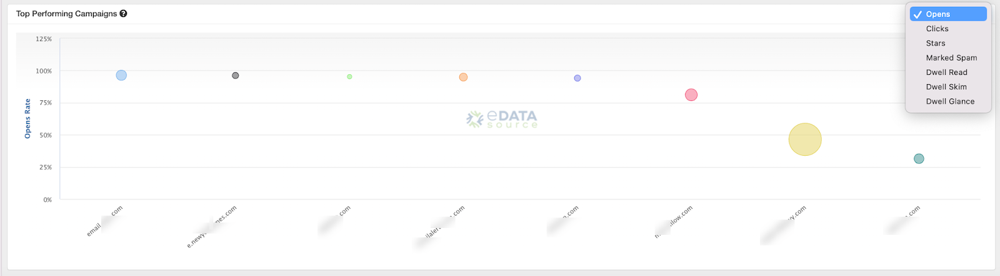
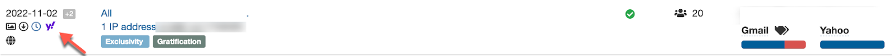

 Let’s face it, keeping tabs on your subscribers' engagement is tricky. With Apple MPP changes, prefetching, and use of proxies, traditional Pixel-based analytics are difficult to rely upon for gauging the performance of an email campaign.

 With our latest Inbox Tracker feature, *Yahoo Campaign Insights,* you can track your campaign engagement performance at all Yahoo Inc properties. We provide easy access to Opens, Clicks, Marked Spam, Starred, and Dwell information to let you know how subscribers engage with a campaign over time.

 With the Yahoo data feed, we can even let you know when your subscribers are engaging with your campaigns in Local time. Do your customers prefer to read your emails in the morning or late in the evening? Now you can see when your subscribers are most likely to engage with your brand.

 Click [here](https://www.loom.com/share/db3436827bc34cdea03b0077786b92b6) for a short tutorial on how to review engagement for your email campaigns.

**Finding Yahoo Insights Data** 

 The Yahoo Insights Dashboard can be found under the Postmaster Tools dropdown in Inbox Tracker:

 When selecting the domain in the dropdown, you will notice the data is not sorted by subject line, but instead organized by the first value within the email header:

 To see what subject line was associated with the x-header value, click on the x-header line item you want to learn more. The x-header drill down provides valuable information about the send, including open rates, click rates, marked as spam rates, and more. If we detected the campaign in our platform via panelists or seeds, we will show the subject line towards the bottom of the drill down section.

 Next, we allow you to find best performing campaigns across all of your sending domains with a single click. If you want to see the best performing Open rates across your profile you can do that in a snap.

 Finally, if you are tracking your campaigns in Inbox Tracker by campaign Ids being used by Yahoo Inc. we will automatically tag campaigns that have additional Yahoo Insights so you can dig even deeper to understand engagement performance.

 The best news, is Yahoo Campaign Insights provides you with these deep insights right out of the box, so no setup or configuration is required.

 Happy Sending!!
