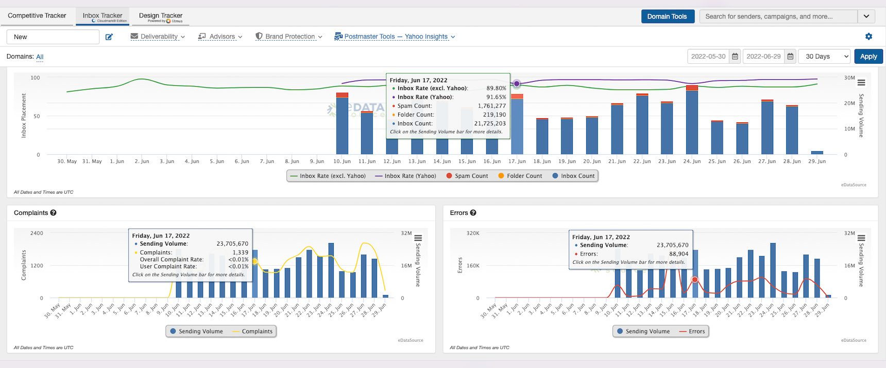

 The Yahoo Inbox Insights feature provides metrics on how many emails from a sending domain are delivered to the inbox, spam, and folders. It also provides metrics for error and complaint counts. Since we are reporting on data collected by the ISP, we are able to report on **ALL** of the deliveries for Yahoo Inc. properties (Yahoo, AOL, AT&T, etc.).

 You will find great insights from the deliverability data and can use the additional Feedback Loop (FBL) complaint data to gauge the effectiveness of each sending domain and IP.
 *You will also be able to use* 
 the error reporting to track down possible infrastructure issues with sending domains or IPs.

*Note: Errors account for situations where Yahoo accepted the message for delivery (i.e. the message did not bounce); but when it attempted to actually deliver the message to the recipient’s folder, it was unable to for some unspecified reason.* 

**How to View the Data** 

 We have created a new section called Postmaster Tools to give you easy access. This is where you will find "Google Postmaster Tools" and "Yahoo Inbox Insights".

 Yahoo Inbox Insights provides easy access to the data you need. Data is reported down to the hourly level if you are reviewing shorter time periods (one week or less).

