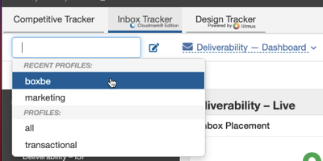
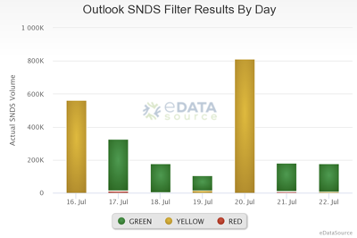
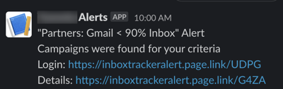

## Welcome to Inbox Tracker!

 This reference guide will help you get started with the basics of Inbox Tracker. For brand new users, we recommend going through the Configuring your Account and General Navigation sections to understand how the platform works. From there, you can look into the more advanced guides to take full advantage of all the features within Inbox Tracker.

### **Basic Platform Knowledge**

* **[What is a user panel?](/analyst/general/what-is-a-user-panel)** Learn more about our panel and how it makes our data unique.
* **[Common Terminology & Definitions.](/analyst/general/common-terminology-and-definitions)** This article covers our most common terms, phrases and words and what they actually mean within the platform.
* **[Naming conventions:](/analyst/general/name-mapping-sparkpost-vs-validty)** Validity/Return Path to Inbox Tracker

---

### Configuring your Account

* **Set up your profiles.** Profiles are a way for you to organize your sending domains and limit the deliverability data you want to see. Click in the text box in the top left corner to view and switch between profiles. You can edit or create additional profiles by clicking the pencil icon to the right of this text box.

* **Outlook SNDS Integration.** If you send on dedicated IPs, you can bring in SNDS data to understand how Outlook is rating you as a sender. Here is a [set of guides](/analyst/inbox-and-design-tracker/microsoft-snds-set-up-and-configuration) on how to to set up your Outlook SNDS account and how to bring that data into Inbox Tracker.

*SNDS renders a spam verdict on email from your IP(s):* 

*Green: up to 10% of the time* 

*Yellow: between 10% and 90% of the time* 

*Red: more than 90% of the time* 

* **Google Postmaster Tools Integration.** Similarly to Outlook SNDS, Google Postmaster allows you to see how Google is rating you as a sender. If you already have a Google Postmaster account, here is a [guide](/analyst/inbox-and-design-tracker/how-to-set-up-google-postmaster-tools) on integrating its data into the platform. If you do not have one configured, refer to [this guide](https://support.google.com/mail/answer/6227174?hl=en) from Google to get started.
* **Begin seeding.** In addition to our panel, you can send to a seed list to get better deliverability coverage across your campaigns. Refer to our [seeding guide(s)](/analyst/inbox-and-design-tracker/inbox-design-tracker#seeding) for guidance on integrating these addresses into your mail streams to increase the amount of campaign-level data.
* **Setting up alerts.** If you want to monitor your deliverability, traps, blocklists, etc. from afar, alerts are a great way to do that. Here is [a guide](/analyst/inbox-and-design-tracker/getting-started-with-alerts) on how to create a base-set of alerts to begin monitoring changes in your set up or performance.

*Alerts can be configured to go through your email or via [Slack](/analyst/inbox-and-design-tracker/how-to-configure-slack-for-inbox-tracker)*

---

### General Platform Navigation and Daily, Weekly and Monthly Goals

**Daily/Weekly Goals** 

* Review Spam Complaints, Spam Trap Hits, Blocklists and identify problematic campaigns that need further review.
* If your campaigns are time sensitive, review Average Time To Receive in Campaign Tracker to identify any delays from ISP throttling.
* Test variations of each Subject Line in Subject Line Predict prior to deployment to optimize open rates and compare against your industry average. Subscriber engagement impacts deliverability.
* Check your delivery alerts and Reputation Advisor report to stay on top of your deliverability trends.

**Monthly Goals** 

* Monitor your Inactive Rate. The goal is 40% or below inactive. If your inactive rate is above 40%, consider your engagement based segmentation for domains with low inbox placement, a programmatic reactivation series and identify a point at which you will no longer mail an inactive subscriber.
* Periodically include the **[Analytics Tracking Pixel](/analyst/inbox-and-design-tracker/how-to-use-analytics-tracker)** in a campaign to learn more about your subscribers including how much time they spend reading your email, whether they open on desktop or mobile, their preferred device and browser.
* Review **[Subject Line Advisor’s](/analyst/inbox-and-design-tracker/analyze-and-optimize-subject-line-performance)** sentiment analysis to determine which emotions and subject lines are resonating with your audience.

---

### Understanding your Results

* **[Cloudmark Troubleshooting Guide](/analyst/inbox-and-design-tracker/cloudmark-reputation-troubleshooting-guide).** Learn more about Cloudmark and get direction on how to handle email content flags.
* **[How to View/Interpret Your Google Postmaster Data](/analyst/inbox-and-design-tracker/how-to-view-interpret-your-google-postmaster-data)**
* **[Spam Trap Types and Sources](/analyst/inbox-and-design-tracker/spam-trap-types-and-sources)**

---

### Advanced Tools and Settings

* **[Update your tracking method](/analyst/inbox-and-design-tracker/how-to-update-campaign-tracking-method)**. By default, the system considers identifies a campaign when it has a unique Subject Line/Date. You can update your tracking method to use a different value to identify a unique campaign or group multiple campaigns in Campaign Tracker.
* **[How to use Analytics Tracker](/analyst/inbox-and-design-tracker/how-to-use-analytics-tracker)**. Embed a tracking pixel in your campaign's HTML to get additional data back about your subscribers, such as how long they spent viewing your message, what browsers they use, and where they are located.
* **[How to create DMARC records in Policy Manager](/analyst/inbox-and-design-tracker/dmarc-dashboard)**
* **[Analyze and Optimize Subject Line Performance with Persado](/analyst/inbox-and-design-tracker/analyze-and-optimize-subject-line-performance)**
* **[Setting Permanent Campaign Filters](/analyst/inbox-and-design-tracker/setting-persistent-campaign-filters)**
* **[How to use Command Center (for agencies and ESPs)](/analyst/inbox-and-design-tracker/command-center)**
* **[Customize your ISP weighting](/analyst/inbox-and-design-tracker/how-to-customize-your-isp-weighting)**
* **[How to Configure Reputation Advisor reports](/analyst/inbox-and-design-tracker/reputation-advisor-scheduled-report)**
* **[How to Auto-Add Inbox Tracker Domains](/analyst/inbox-and-design-tracker/how-to-auto-add-inbox-tracker-domains)**

---

### FAQ

[Is there a way to export campaign data?](/analyst/inbox-and-design-tracker/how-to-export-data) 

[Can I group campaigns based on a different value than the Subject Line/Date?](/analyst/inbox-and-design-tracker/how-to-update-campaign-tracking-method) 

[How can I create a Pivot Table to organize my exports?](/analyst/competitive-tracker/organize-exported-data-with-pivot-tables) 

[What happens if I go over my monthly or annual seed test, design previews or open analytics limits?](/analyst/inbox-and-design-tracker/what-happens-if-i-go-over-my-monthly-or-annual-seed-test-design-previews-or-open-analytics-limits) 
