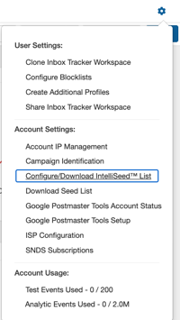

## The SparkPost Inbox Tracker platform takes a multi-sourced approach to gathering and displaying your deliverability data. In this article, we will cover:

* [What are seed lists?](#what-are-seed-lists)
* [Why should I use seed lists?](#why-should-i-use-seed-lists)
* [How do I implement the seed lists?](#how-do-i-implement-the-seed-lists)

## What are seed lists?

 In short, a seed list is a set of email addresses that shows the deliverability performance of a campaign after they are sent to.

 Our **virtual** seeds, also knowns as IntelliSeeds™, are virtual users who have behavior attributes modeled after real subscribers from our panel. They automatically subscribe themselves to email lists, read and delete at a certain cadence, and even go on vacation. Since IntelliSeeds™ look like a regular subscriber on your list to an ISP, having your sends to the virtual seeds to match your regular subscribers will result in the closest supplemental datapoint to panel available.

 For optimal seeding results, it is best to configure your seed list to only include ISPs that you send to on a regular basis. Account Managers can set which ISPs they want seed coverage on in *Settings*  *ISP Configuration*:

## Why should I use seed lists?

 Regular seed sends increase the amount of visible deliverability data on your domain's overall inboxing performance. Seeding is especially useful for senders with smaller list sizes and limited panel coverage.

 Another key benefit of seeding is that the initial send will show where ISPs are placing your mail to a brand new subscriber.

 Before you start seeding, we first recommend investigating how much data you have with panel alone. This can give you an idea of what type of campaigns may require more seeding than others.

 To see your overall panel coverage and how it varies on a campaign-basis, head to the *Deliverability* tab in Inbox Tracker and click on *Campaign Tracker*:

 The top of Campaign Tracker has a key under *Sources* where you can see where we are collecting data. If you are a new customer and haven't sent to our seed lists, our panelists are the only datapoint we'll have to measure your deliverability.

 To see **overall** panel counts, on the top lefthand side of Campaign Tracker you'll see My ISP Deliverability. Click on *Volume* twice to sort the panel counts from highest to lowest volume. These numbers reflect how many panelists we detected in the time period you have set:

 To see panel counts on a particular campaign, scroll to the bottom of Campaign Tracker:

 The above two campaigns have differing panel counts and have not sent to our seed lists (since the only *Source* is showing the panel icon). The gray bars under AOL indicate that no panelists were found for this ISP.

 You can see how many panelists were detected for each ISP by clicking on the small chart icon next to the inbox percentage:

 If possible, we recommend a minimum of 10 datapoints per ISP (especially for Gmail, Yahoo, AOL, and Outlook). In the example above, this sender should incorporate seed lists into future campaigns to get deliverability coverage for AOL and other ISPs that have little to no panel coverage.

 Campaigns that use a combination of our panel IntelliSeeds™ will eventually look like this:

## How do I implement the seed lists?

 IntelliSeeds™ are email addresses that we own and manage that provide additional deliverability data. Their uniqueness comes the fact that they engage with mail as if they were a real subscriber. Since IntelliSeeds™ look like real subscribers to an ISP, we recommend developing a sending strategy to them that emulates how you treat your regular audience.

### **How to Segment IntelliSeeds™ to Represent your Real Audience**

 Let's pretend that the entire IntelliSeed™ list makes up your whole mailing list. In your normal email sends, do you include every single subscriber on all email sends? Likely not; most senders have different segments of their list that influence the cadence and content that is sent.

 Although it may be tempting to include all the virtual seeds on your sends, here are they key benefits of splitting up the IntelliSeed™ list:

* **You do not want to overwhelm your genuine panel data with our virtual subscribers.** The panel is there to help you understand real subscriber experiences with your campaigns; including too many virtual seeds will overshadow data from your actual audience. If possible, we recommend striving for a 1:1 balance per campaign between panel and IntelliSeeds™.
* **Breaking up the list allows you to have extra "untouched"** IntelliSeeds™ **to be used later on.** Remember, one benefit to a first seed send is that it tells you where ISPs are placing your mail to a brand new subscriber. Having some untouched seeds throughout your term will continue to provide valuable insight as to how a new subscriber is experiencing your sends.

 Now that you understand the benefits of segmenting the IntelliSeeds™, it's time to develop a plan for how you want to incorporate them into your mailing list.

### Step 1: Create your First List

 As mentioned earlier, it is not recommended to incorporate the entire IntelliSeed™ list when you are first beginning to seed. Here is how you can create a subset of seeds to begin sending to:

1\. Click on *Settings*  *Configure/Download IntelliSeed™ list* 

2\. Select *Add New*

3\. We recommend the below settings for your first seed list. Other things you may want to adjust are which ISPs are included in the list. For example, a North American sender would only want the Primary Webmail, North America - US, and B2B regions selected.

### Step 2: Integrate Your IntelliSeeds™ into an Real Subscriber List

 Think about how a new subscriber gets on your mailing list. Do they sign up and receive a welcome email right away? Do they need to have a subscription in order to receive your emails?

 All brands have their own unique approach to sending email, so unfortunately there's not a one-size-fits-all approach to seeding either. Here are some common ways customers integrate IntelliSeeds™ into regular mailings:

* Have each segment represent a portion of your subscribers that receive a certain message stream. For example, perhaps one segment represents users that have made a purchase in the last 30 days. Another segment may portray subscribers that have signed up for emails in the last week. Or maybe you noticed your *Newsletter* campaigns have very little panel coverage; add your IntelliSeed™ segment to this mailing list to receive those campaigns on a regular basis.
* If your email segmentation is mainly based on engagement, another way you can approach the IntelliSeeds is to take each segment (or a few segments), and take them through your welcome series as if they were a new subscriber. That way the IntelliSeeds will naturally fall into your different engagement buckets to represent each portion of your engaged (or on-engaged) audience.
* If your mailing list requires some type of identifying information (such as zip code or past purchases), manually assign those same required attributes to IntelliSeeds™. Creativity is an asset when it comes to seeding strategy!

 You can reach out to our support team by mailing [support@edatasource.com](mailto:support@edatasource.com) .
