## Microsoft Smart Network Data Services (SNDS) can help marketers responsibly monitor their IP email deliverability and reputation at most Hotmail and Outlook email addresses.

 Microsoft SNDS covers outlook.com, hotmail.com, [msn.com](http://msn.com/) and [live.com](http://live.com/) email addresses. It does not cover Office365.

 This invaluable tool provides you with insights into metrics such as:

* The number of messages which were attempted to be delivered
* The number of recipients which actually received the message
* A look into how the Microsoft spam filters handled the messages
* Complaint rates
* And even sample headers and messages which caused high complaint rates

 In this article, we'll go over:

* ### What is the benefit of syncing SNDS within Inbox Tracker?
* ### How to set up SNDS and connect it to the platform
* ### Frequently Asked Questions

---

### What is the benefit of syncing SNDS within Inbox Tracker?

 Within the Inbox Tracker Dashboard, you'll find SNDS charts towards the bottom of the page:

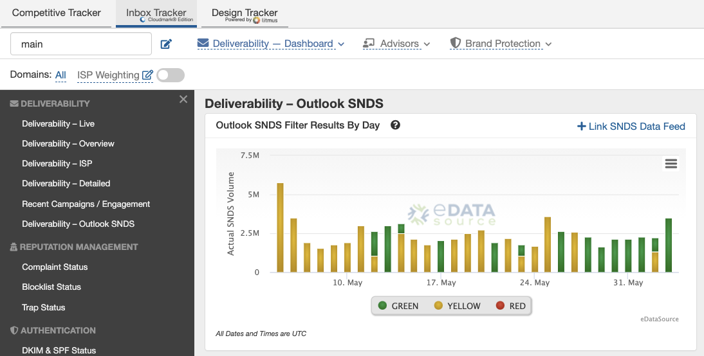

 SNDS configuration provides you with an additional datapoint in understanding how your daily sends and volume affects your IP reputation. The Outlook filters use the following rating system to reflect your performance:

| **Result** | **Verdict percentage** |
| --- | --- |
| Green | Spam < 10% |
| Yellow | 10% < spam < 90% |
| Red | Spam > 90% |

 For example, if you notice low deliverability rates to Outlook within Inbox Tracker, you should first check how much panel coverage the campaign(s) have. From there, SNDS can be used as a confirmation of whether a send was or was not well received.

 SNDS configuration also unlocks two additional metrics within the platform: The number of Outlook spam complaints (Dashboard) and SNDS trap hits (Spam Trap Monitor).

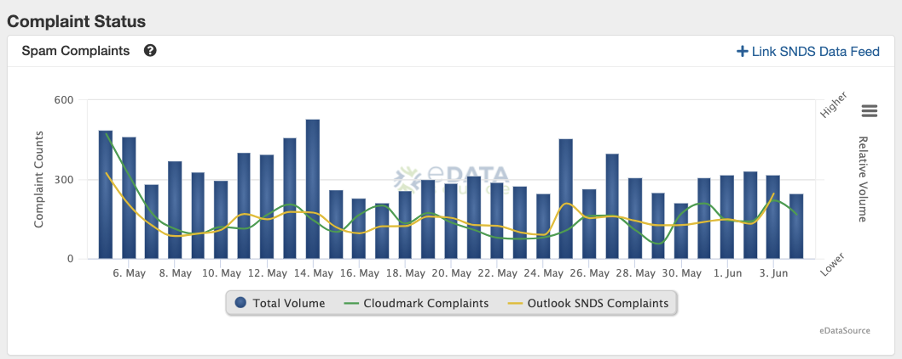

---

### How to set up SNDS and connect it to the platform

**There are three requirements for setting up Outlook SNDS:** 

1. **You must be marked as a Manager on your Inbox Tracker account.** If you are unsure whether you are a Manager, please contact our support team for guidance.
2. **You have to be sending on dedicated IPs.** If you are unsure whether you are sending on shared or dedicated IPs.
3. **You will need to know your ESP’s abuse/postmaster address** 

	1. For example, for SparkPost, it’s [abuse@sparkpostmail.com](mailto:abuse@sparkpostmail.com)
	2. If you are unsure of this, reach out to your ESP for more guidance
4. **A role account on Outlook**. This is just an ordinary Outlook email address you set up to access to the SNDS dashboard. We recommend making this account accessible across your team/organization. For example, the role account could be *[yourorganization@outlook.com](mailto:yourorganization@outlook.com)* or *[crmteam@outlook.com](mailto:crmteam@outlook.com).*

 Once all requirements have been met, you are ready to set up SNDS and link it to Inbox Tracker!

---

**Step 1 - Navigate to the Microsoft [Smart Network Data Service Page](https://postmaster.live.com/snds/index.aspx) and select Request Access.** 

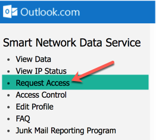

**Step 2 - While on the [Request Access](https://postmaster.live.com/snds/addnetwork.aspx) page, input your IP address or CIDR range into the *Network to request access for* input box and click *Submit***

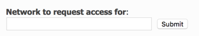

**Step 3 - After submitting your IP request you'll then be prompted with a list of verification [email addresses](https://postmaster.live.com/snds/FAQ.aspx#AddressChoosing) associated to the IP or IP ranges you entered.** Choose the valid email address that your service provider recommends submitting requests through.

 Once the request has been submitted, your Pending Requests will appear on the Request Access page:

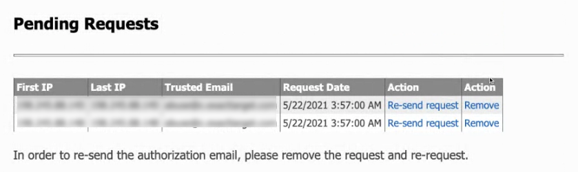

*Please note, while you can finish setting up SNDS in Inbox Tracker before your request has been authorized, data will only start populating after authorization has been granted.* 

**Step 4 - After the request has been submitted, you need to Enable Automated Access to get the feed links.** To do this, click the *View Data* link on the left.

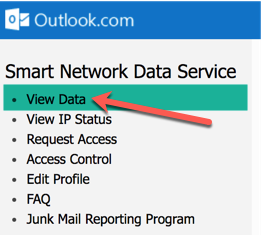

 Then, select *View or change your automated access settings*.

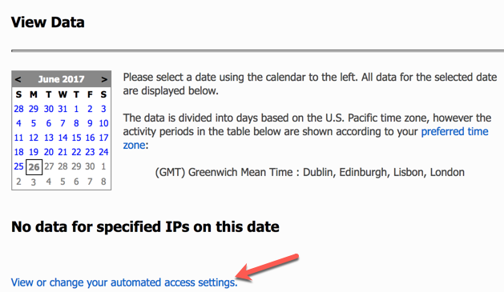

 Lastly, on the automated access settings page, you'll need to click the *Enable Automated Access* button.

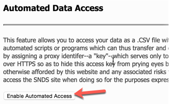

**Step 5 - Once automated access has been enabled, you will see two links that for your automated SNDS data feed and your access key.** The first line (the one ending with "data.aspx") is the one you will need to integrate your SNDS data feed with Inbox Tracker. Copy this link for Step 6.

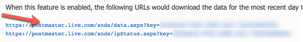

**Step 6 - Navigate to Inbox Tracker and click the Settings icon.** Select *SNDS Subscriptions* at the bottom of the Account Settings section.

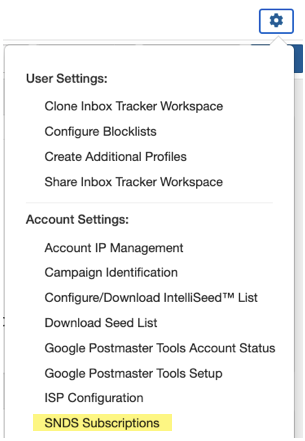

 At the prompt, enter a *Subscription Name* and the copied URL from Step 5.

*If you are having trouble accessing this prompt, please reach out to us in our in-app chat or ask your assigned account manager for assistance.* 

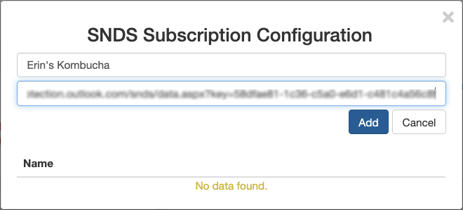

 Once authorized, our system needs 24 hours to pull in the initial data. From there, we will automatically sync your SNDS feeds for new data multiple times per day.

 Please contact our support team with any questions or concerns on the above process.

---

### Frequently Access Questions:
* **Why does my SNDS section says "Missing SNDS Data"?** 
	+ There are a few scenarios for this:
		- Your IPs have not yet been authorized by your ESP
		- The initial 24 hour time period for us to bring in your data has not passed
		- You have IP Groups that do not contain the IPs you want SNDS visibility on
		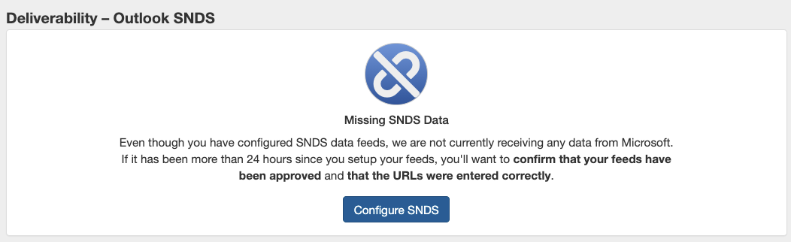
* **Why do all my SNDS traps show as Mixed?** 
	+ Mixed traps are the designation of spam traps when the provider does not specify whether the hit was Pristine or Recycled. Mixed should be considered more serious than recycled traps since some of the hits may be pristine.
	+ Here is Microsoft's reasoning behind showing their traps as mixed from their
	 [SNDS FAQ](https://sendersupport.olc.protection.ou%20tlook.com/snds/FAQ.aspx) 
	 page:
	*Trap accounts are accounts maintained by Outlook.com that don't solicit any mail. Thus any messages sent to trap accounts are very likely to be spam. Well-behaved senders will hit very few such accounts because they're generally sending to people who give them their address and because they collect and process their NDRs. Spammers have a much harder time avoiding them because, in general, they can't and don't do either of those good practices.* 
	*We recognize that providing the actual trap messages would be useful to legitimate businesses trying to clean lists or customers that are hitting these accounts, however this is another unfortunate case where the risk of the data being useful to spammers is too great.*
	+ To further investigate your complaints or trap hits, Microsoft does provide a sample header from send on one IP per day. You can read more about this in their FAQ page under "Sample messages".
