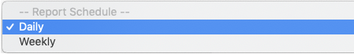

## Let eDataSource run over 100+ checks on your deliverability each day or week and alert you when things change.

**Navigate to Reputation Advisor within Inbox Tracker.** 

**There are two ways to access the Report Configuration page.** One link is in the top right corner next to the "Refresh" button.

 The other link is in the the left-hand navigation pane. Look for "Rule and Alert Configuration" under Preferences.

**Select the desired domain above the navigation pane.** 

**On the right side of the screen, switch on the "Report" button for your selected domain.** 
 You will get a confirmation pop up to enable alerts for the domain.

**Select your preferred reporting schedule.** To start off, we recommend scheduling daily alerts and then move to weekly alerts when all checks are stable.

**Customize your report by selecting the checks most important to you.** Remember, rules are an account level setting - so any changes you make will affect all users!

 Your report will be sent to the email address provided with the following indicators for each check:

**Your report will show the result of each check day-to-day or week-to-week depending on your selected frequency.** If you result becomes worse over time, the impacted check will be highlighted in red:

