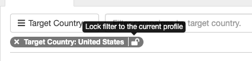
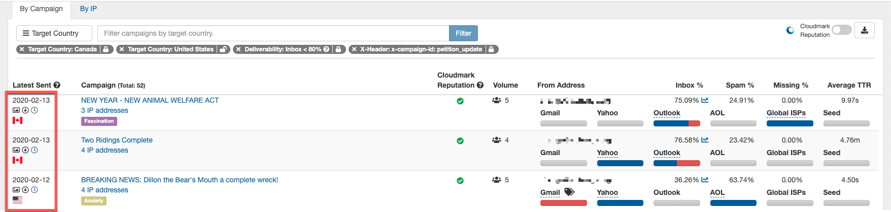

 This Inbox Tracker feature is designed to improve your experience and make it easier to see a targeted set of campaign data.

## Persistent Campaign Tracker Filters

 Within Campaign Tracker, we have expanded the filter options and given you the ability to make your filters persistent. You can now create or update profiles to focus on a specific set of campaign results beyond the sending domain.

 The available campaign filters are:

 - Subject Line Keyword
 - Campaign ID
 - From Address
 - Emotion
 - Deliverability (Inbox or Spam Percentage)
 - Target Country
 - Custom Header Key

**The best news is this is very easy to apply, and the payoff is immediate.** All you have to do is apply a filter and if you want to persist the filter for the profile just enable the lock on the filter.  Once filters are locked, simply update the name of your user profile to describe the targeted results.

 Here is an example to illustrate the value of applying a few campaign filters...

 In the example above, I have filtered to target countries (CA & US), for a specific X-header (petition\_update), that are experiencing deliverability below 80%.

 I hope you give them a try and let the system do more work for you!!
