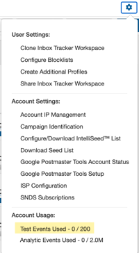
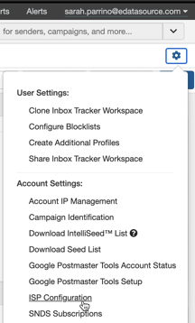
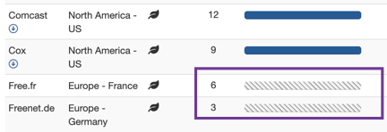
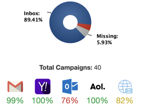

## The SparkPost Inbox Tracker platform takes a multi-sourced approach to gathering and displaying your deliverability data.

In this article, we'll cover best practices when sending to our **traditional** seed list.

_Please note: Your contract may not have traditional seed events. To check, go to Settings > Test Events Used. If no Test Events are listed, please navigate to our [IntelliSeed™ Sending Guide](/analyst/inbox-and-design-tracker/intelliseed-sending-guide) instead._

### What is a traditional seed list?

The **traditional seed list** is a list of static email addresses used purely for testing email delivery and inbox placement. A seed address will never engage with email, which means it looks like your most unengaged recipient list to the ISPs. Our seed list covers 72 ISPs providing a high-level view of inboxing to assist in identifying email authentication issues, IP performance, and domain reputation.

For optimal seeding results, it is best to configure your seed list to only include ISPs that you send to on a regular basis. Account Managers can set which ISPs they want seed coverage on in _Settings_ > _ISP Configuration_:  

###   
**Traditional Seed Implementation**

Remember, the traditional seeds are a list of static email addresses that do not engage with your emails, and are equivalent to the least engaged segment of your mailing list. Because ISPs look to engagement to determine inbox placement, there's a risk of oversending to the traditional seeds and skewing deliverability results. Follow these best practices to optimize data from the static seeds:  

**1\. The _entire_ traditional seed list should be included on a send.** If you are sending to the traditional seeds, our system expects every seed to receive the campaign. This is why it is important to change your _ISP Configuration_ to only reflect ISPs that you mail to regularly.

For example, if you only send to North America and you are including the .fr traditional seeds in your deployments, your ESP may be configured to suppress those .fr addresses and they will not receive the send. When this happens, the platform reports those deployments as a _Missing_:

These missing percentages count towards spam placement on the dashboard pie chart and can skew your inbox placement results. It is best to reduce the amount of undelivered deployments to the seeds as much as possible.

If you are seeing a regular _Missing_ percentage on all your seed sends, we recommend spot checking the delivery status to a specific seed address that is reporting the missing percentage.

In the example above, since "Free.fr" is showing that all six seeds did not receive the campaign. One of those six addresses is "[lalaith.rian@free.fr](mailto:lalaith.rian@free.fr)"; check your ESP to see if they are suppressing the address for any reason and if you can override that suppression to the free.fr ISP. If the seeds are bouncing, please notify our team at [support@edatasource.com](mailto:support@edatasource.com).

**2\. The traditional seeds should be deployed on a weekly basis.** Again, these seeds do not engage, so including these addresses on frequent sends will cause the ISPs to quickly place your emails into the spam folder. Weekly sends are a safe way to have additional data without damaging your reputation to the seed addresses. Think of a campaign in your program that deploys weekly, and simply include the traditional seeds (in their entirety) on that send for best results.

**3\. Strive to include the traditional seeds in a live send for optimal results.** If you can't include them in a live send, have the send be exactly the same as it is to your regular audience. Avoid using the words _"_seed" or "test" in the subject line; ISP algorithms detect these words and they may alter the results of the send.

Want help with developing a seeding strategy? Reach out to our support team by mailing [support@edatasource.com](mailto:support@edatasource.com).

