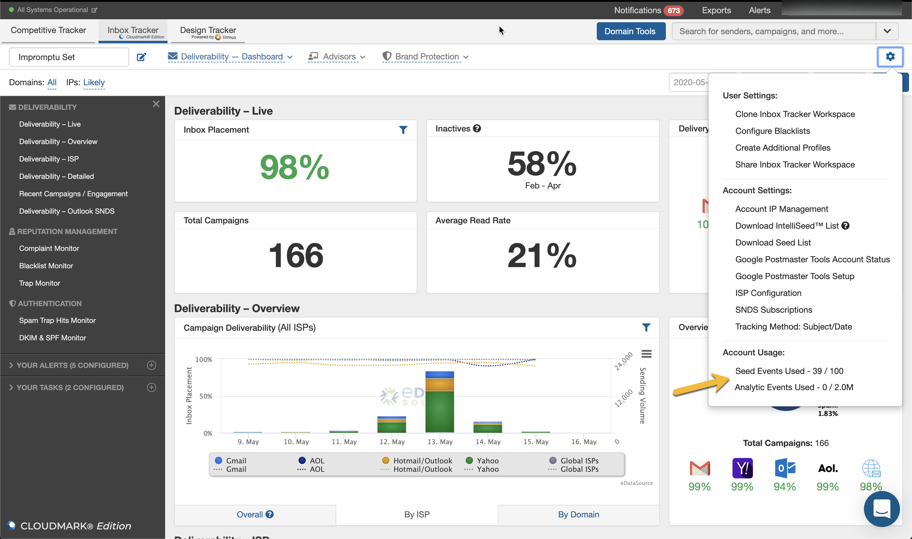
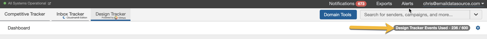

 Nobody likes surprises or unexpected overages. We don't either, which is why all of our account tiers will **automatically disable and prevent** any additional seed tests, design previews, or open analytics once you have **reached** your **account limits**.

 You can contact your account manager at any time to purchase and add additional events onto your account.

### How to Monitor Seed Test and Open Analytics Event Usage?

 
 You can monitor the Inbox Tracker Seed Test and Open Analytics usage by clicking the gear icon within Inbox Tracker. Under **Account Usage**, you will see how many seed events and analytics events you have used.

### What Happens When I Reach My Seed Test Limits?

 The platform will **automatically** **disable** the processing of any new seed tests when you reach your seed limits.

 You might reach your event limits while tests are "in-flight." If this happens, you will not be charged for any of these overages. However, if you choose to purchase additional test packages, any of these overages will be subtracted from the new event package.

### What Happens When I Reach My Analytic Open Limits?

 The platform will **automatically disable** the processing of any new analytic open events when you reach your limits.

 If you reach your event limits, any active campaigns will be expired, and you will need to create new campaign tracking codes. If you wish to ensure that the tracking codes remain active, please contact your account manager **before** reaching the event limits to purchase additional event packages.

 You might reach your event limits while campaigns are actively running. If this happens, you will not be charged for these overages. However, if you choose to purchase additional event packages, any of these overages will be subtracted from the new event package.

### How to Monitor Design Tracker Limits?

 You can monitor your design tracker limits in the upper-right corner of Design Tracker. Within the Events Used badge, you will see how many design tests you have used and how many are remaining.

### What Happens When I Have Reached My Design Tracker Limits?

 The platform will **automatically prevent** you from running any additional design tracker tests when you reach your Design Tracker limits.

 If you have any additional questions on event usage and limits, please reach out to your Account Manager or email us at [support@edatasource.com](mailto:support@edatasource.com).
