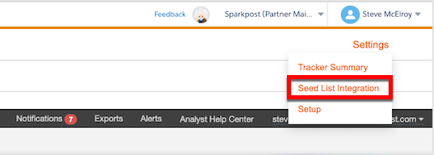
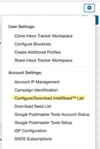
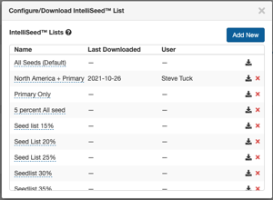
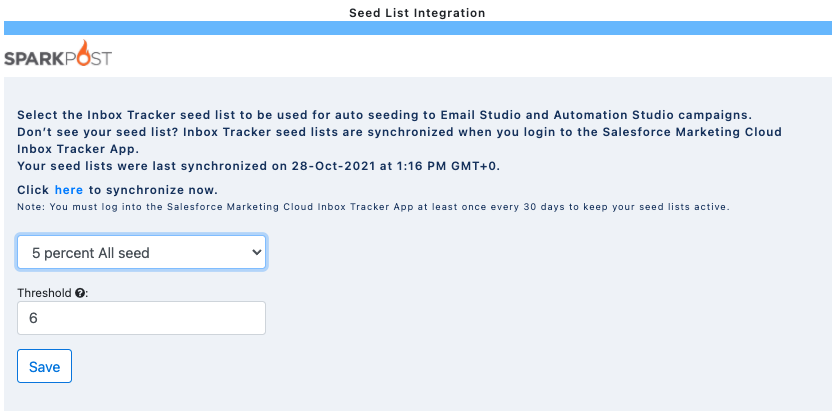
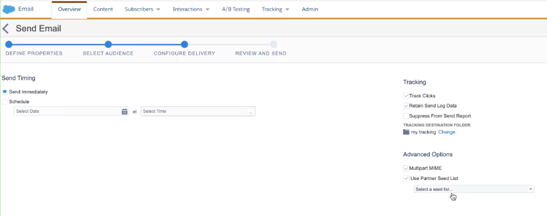
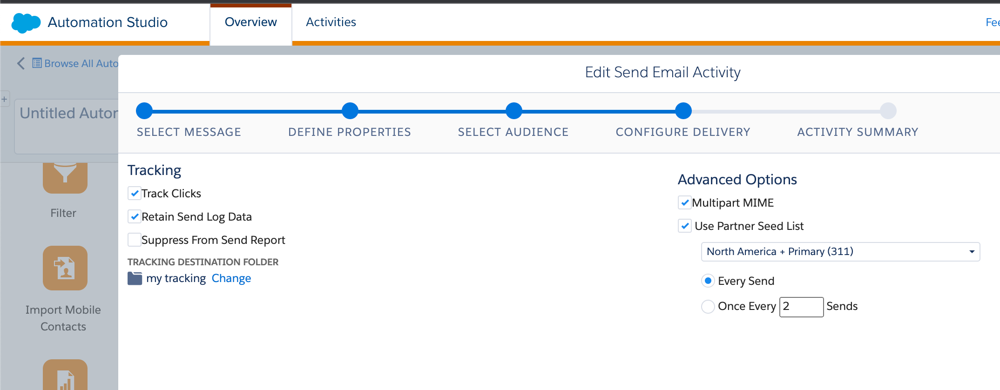

## The Inbox Tracker Salesforce Marketing Cloud application allows for auto and ad-hoc seeding through Email Studio or Automation Studio.

 In this guide, we'll go over:

* **[What are IntelliSeeds™?](#what-are-intelliseeds-)**
* **[How to Configure Auto-Seeding](#how-to-configure-auto-seeding)**
* **[Seeding Options via Email and Automation Studio](#seeding-options-via-email-and-automation-studio)**

### What are IntelliSeeds™?

 Our Salesforce Marketing Cloud seeding integration supports sends to IntelliSeeds™, or virtual seeds.

 IntelliSeeds™ virtual users who have behavior attributes modeled after real subscribers from our panel. They automatically subscribe themselves to email lists, read and delete at a certain cadence, and even go on vacation. Since IntelliSeeds™ look like a regular subscriber on your list to an ISP, having your sends to the virtual seeds to match your regular subscribers will result in the closest supplemental datapoint to panel available.

### How to Configure Auto-Seeding

 Within the Salesforce Marketing Cloud Inbox Tracker App, auto seeding can be configured on a business unit level by selecting *Settings* *Seed List Integration*.

 Within the Inbox Tracker UI, you can configure custom sets of IntelliSeed™ lists by selecting the *Settings Cog*  *Configure/Download IntelliSeed™ List.* Please read [this article](/analyst/inbox-and-design-tracker/intelliseed-sending-guide) for best practice guidance to consider when making these groups.

 Once your groups are created within the Inbox Tracker UI, they will show up in the dropdown selection pane under *Seed List Integration* within Salesforce Marketing Cloud.

 From here, simply select which seed list you want to utilize and select the minimum threshold volume needed in order for the list to be included on a send.

### Seeding Options via Email and Automation Studio

 Within **Email Studio** , you will have the option to select an IntelliSeed list for inclusion on a one-time send under *Configure Delivery* dialog.

 Within **Automation Studio**, there will be an option under *Configure Delivery* to the IntelliSeed list of your choice. You can also decide on how often you would like the seed list to be included on recurring sends.

