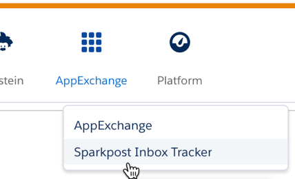
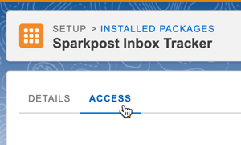
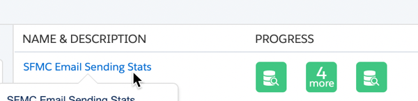
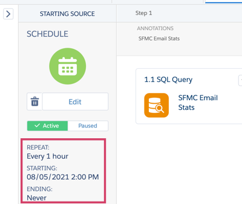

If you are a Salesforce Marketing Cloud Administrator, please follow these one-time steps to install the SparkPost Competitive Tracker application through the AppExchange.

### Step 1. Navigate to the AppExchange installation page by clicking [here](https://mc.exacttarget.com/cloud/#app/Administration/InstalledPackages/8283ba88-2804-4250-bf1d-e1e2b643747a/install)

* You will be automatically be redirected to the installation page if you are logged into SFMC

* In the top right corner, select *Install*

### Step 2. Confirm the installation

 Please do not skip this step! The data extension will not be visible if it is skipped.

* Refresh your browser window
* Click on the AppExchange icon to make sure that SparkPost Competitive Tracker is a selectable option and open it

### Step 3. Assigning users

* Please return to the [installation page](https://mc.exacttarget.com/cloud/#app/Administration/InstalledPackages/8283ba88-2804-4250-bf1d-e1e2b643747a/install). In the top tab, select *Access* 

*   This page allows you to enable a user's access to the Competitive Tracker application within SFMC. Upon granting access, these users will see our application listed in the AppExchange dropdown (as shown in Step 2). **There are two prerequisites to granting this access:**  

    1.  Users must have logins to Competitive Tracker

        +  Related: [How to Add Users](/analyst/general/how-to-manage-your-user-list/)

    2.  Individual users must have **Content Creator** rights in Salesforce or have custom role defined by organization that grants access to read/write content, data, applications, audiences, journeys

*   If you want to grant access to _ALL_ users that meet the above criteria, select _License All Users_ in the top right corner  

*   If you only want certain users to access the application, select your individual business units on the left and select which users you would like to delegate access. Make sure to press _Save_ in the top right.

### Step 4. Begin the collection process of your sends

* Navigate to this [this page](https://mc.s11.exacttarget.com/cloud/#app/Automation%20Studio/AutomationStudioFuel3/)
* Select *SFMC Email Sending Stats* 

* In the top right corner, click *Run once*
* Select the schedule to repeat every hour and the expiration to never

### Additional Information

 The configuration for the application, seed lists, and other information will be stored in the Data Extension folder named “SparkPost Integrations <MID Number>”.

* There are two ways to find the Data Extension

	+ Email Studio > Email > Subscribers > Data Extensions
	+ Audience Builder > Data Extensions

*Note: The application footprint Data Extension will not be created until an authorized user logs into application (as shown in [Step 2](/analyst/sfmc/inbox-tracker-installation-steps/#step-2-confirm-the-installation)).* 
