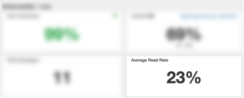
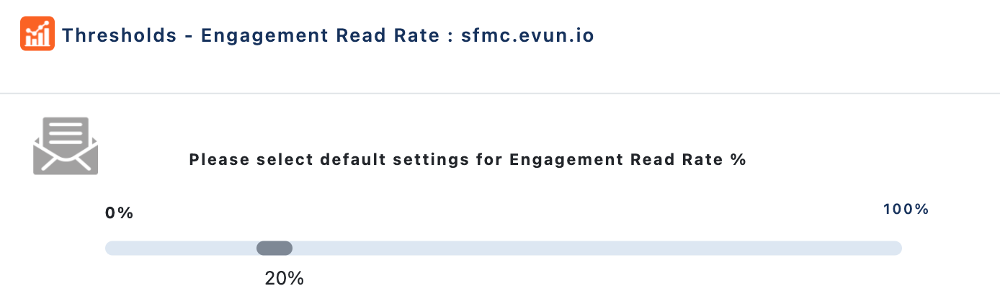
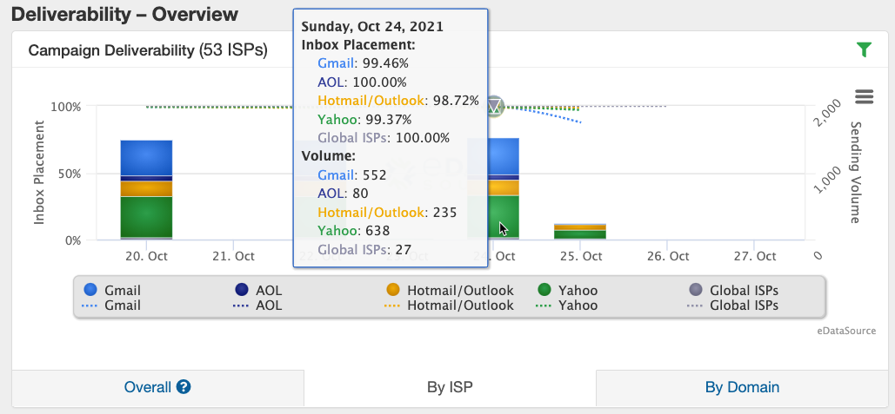
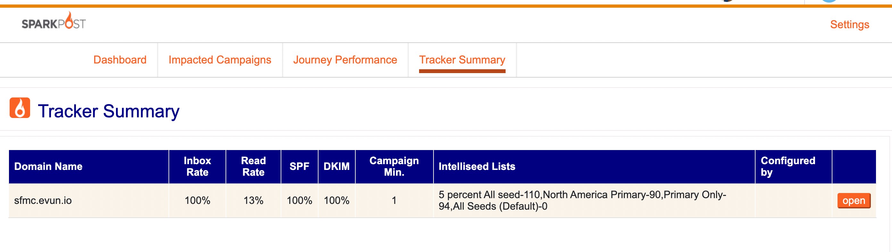
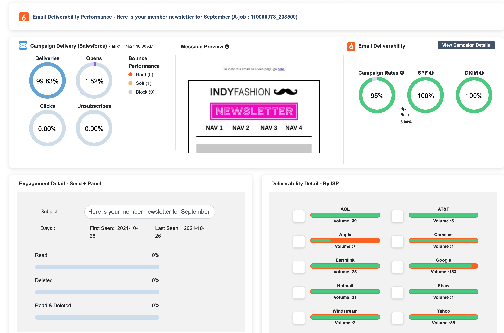
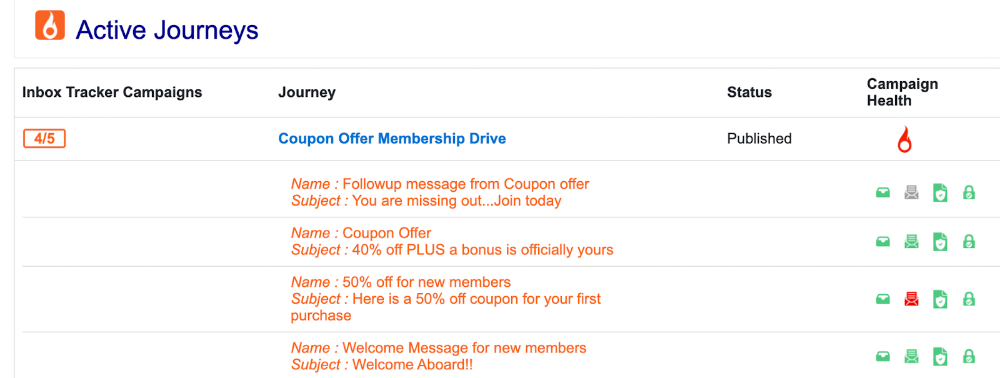
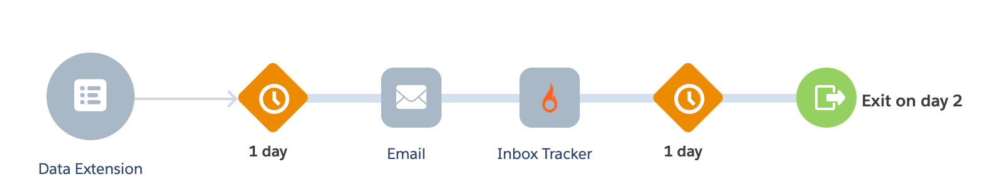
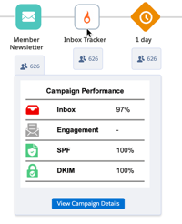

## The SparkPost Application within the Salesforce AppExchange combines your sending and deliverability data all in one place. Utilize the power of our panel and seed data to set inbox placement, engagement, and authentication thresholds to closely monitor campaign performance.

_Prerequisite: This article will not be relevant to you until a Marketing Cloud Administrator has followed these [Installation Steps](/analyst/sfmc/inbox-tracker-installation-guide). Please contact your Account Manager if you have any questions._

Once the application has been installed, navigate to _AppExchange_ > _SparkPost Inbox Tracker_. Use your Inbox Tracker email and password credentials to login to the application. In this guide, we'll review the three main tabs and settings within the application:

*   [Dashboard](#dashboard)

*   [Impacted Campaigns](#impacted-campaigns)

*   [Journey Performance](#journey-performance)

    *   [Adding the Inbox Tracker Custom Activity to Journey Flows](#adding-the-inbox-tracker-custom-activity-to-journey-flows)

### Dashboard

The Dashboard is a full IFrame version of Inbox Tracker. To learn more about how to use Inbox Tracker, please refer to our [Inbox Tracker Reference Guide](/analyst/inbox-and-design-tracker/inbox-tracker-reference-guide). If you have an accessibility preference, the web app version can also be opened from the IFrame version from clicking on various links, such as as clicking on a specific campaign for additional details.

### Impacted Campaigns

Impacted campaigns are any email that we’ve received from your domains that were detected in the platform from either panelists or seeds. The campaigns that show up will be based on thresholds that you define, which will provide a high-level view of campaigns that are not meeting your inbox placement, engagement or authentication criteria.

By default, all data in Inbox Tracker comes from our panelists, which is a small subset of your list that uses an email organization tool we own called Boxbe. If panel counts are missing or low, you can utilize our IntelliSeeds as a supplement to bring back deliverability data on your campaigns. Read more about auto-seeding functionality [here](/analyst/sfmc/auto-seeding-with-salesforce-marketing-cloud-inbox-tracker-app).

Thresholds can be set on a business unit or domain level to indicate when a campaign does not meet criteria on the following metrics:

*   **Inbox Placement -** For example, showing all campaigns that have an Inbox Placement of less than 90%.

*   **Read Rate -** Please note that this is our definition of read rate that is based solely on your panelists, _not_ seeds or your full subscriber list. We determine a read when the message goes from **bold** to unbold in the panelist’s inbox. To get an idea of your average read rate via the panel, navigate to the Inbox Tracker Dashboard and view a 30 or 90 day time period.  

    

    We recommend setting your engagement threshold to be a few points less than your 30 to 90 day average.  

    

*   **SPF/DKIM -** SPF and DKIM pass rates refer to whether your individual sends are passing authentication. We recommend that both of these thresholds are set to below ~99%. Perfection is the goal with SPF/DKIM pass rates.  

*   **Campaign Minimum -** Refers to how many data points (panelists or IntelliSeeds) are needed in order for a campaign to show under Impacted Campaigns. To get an idea of your average panel counts, go to the _Dashboard_ > _Deliverability - Overview_ > _By ISP_. Hover over the bars to get an idea of your average number of panelists on a day-to-day basis.  

    

    If you are seeing very low panel counts (less than 20-30 per day), you would benefit from regular incorporation of our IntelliSeeds. Please read [this](/analyst/inbox-and-design-tracker/intelliseed-sending-guide) article on on IntelliSeed sending best practices.  

    In the meantime, we recommend setting this threshold to account for your larger send days because they will have more data to assist with the actionability of your Impacted Campaigns criteria.

To view or edit your Impacted Campaigns thresholds, navigate to _Settings_ > _Tracker Summary_. The Tracker Summary page provides an overview of current threshold settings. Select Open on the individual row to edit the settings.  

Within your list of Impacted Campaigns, additional details that combine your sending and deliverability data can be viewed by clicking _Open_ under Details.

In the top right corner of this page, select _View Campaign Details_ to view the campaign drilldown within the Inbox Tracker UI.

### Journey Performance

The Journey Performance page will show all campaigns that have been detected via our panel or seeds that are associated with an active journey for a business unit or domain.

*   **Inbox Tracker Campaigns** indicates the number of campaigns that were detected through Inbox Tracker out of the total number of campaigns in the journey. For example, in the above screenshot, 4 campaigns were detected in Inbox Tracker via panelists or seeds out of 5 campaigns total within the journey itself.  

*   **Journey -** The blue text header indicates the journey itself, and the emails below show the individual sends that were picked up by panelists or seeds. On the right under _Campaign Health_, you can see the campaign’s performance ratings against the thresholds set under _Settings_ > _Tracker Summary_.

    *   By clicking on the blue title, you’ll be taken straight to the journey within Journey Builder.

    *   By clicking on the orange individual campaigns, you will find detailed drill-down information that unites your your sending and deliverability data.  

### Adding the Inbox Tracker Custom Activity to Journey Flows

The Inbox Tracker application integration allows you to add a Custom Activity to track the downstream performance of your individual campaigns. The benefit of including the Custom Activity is to see whether performance of an early campaign in the series is affecting downstream performance.

**Follow these steps to include the custom activity:**

1.  Navigate to Journey Builder

2.  Select _Create New Journey_

3.  Build a Multi-Step Journey

4.  Add a Data Extension, followed by an Email

5.  Find the Inbox Tracker Custom Activity and add it after **each email** in the entire Journey

Once the Journey is activated and it begins sending, the Inbox Tracker Custom Activity will show the following information on your individual campaigns:  

*   **Inbox Placement:** _Did my first campaign make it to recipient's inbox?_

*   **Engagement:** _Were users engaged with my first campaign and was the engagement consistent with later sends?_

*   **SPF/DKIM:** _Are all of my campaigns passing authentication?_

We hope this guide was helpful in giving you a good starting point with the Inbox Tracker Salesforce Marketing Cloud App Integration. If you need additional guidance, please contact your Account Manager for assistance.

