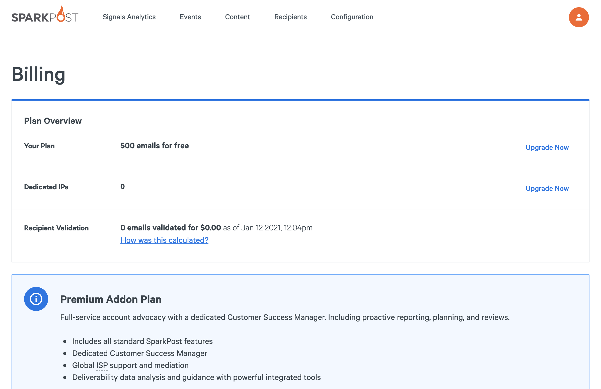
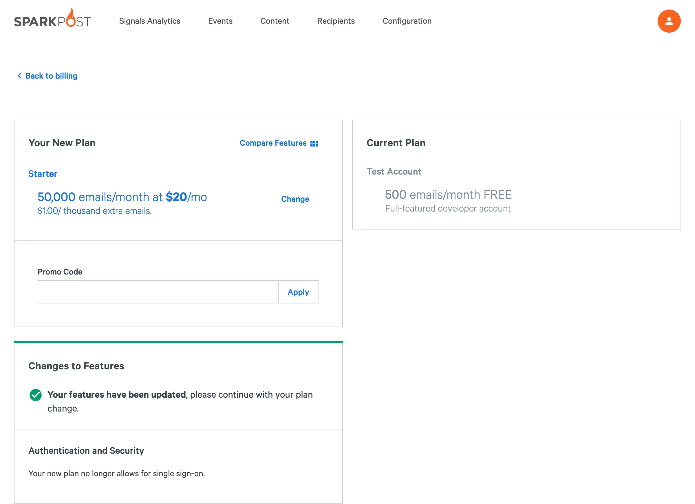

On the dashboard, click on the Account menu in the top right and select **Billing**. There you will be able to see the plan you are currently on, as well as an option to upgrade.

Click **Upgrade Now** to change your plan. You will be able to select any of the plans we offer. Enter your credit card information, click **Upgrade Plan**, and you’re good to go!

If you want something more customized, please contact our [Sales team](https://www.sparkpost.com/sales/).

If you have any other questions concerning your billing account, please contact our [Billing team](https://app.sparkpost.com/dashboard/?supportTicket=true&supportIssue=general_billing).
