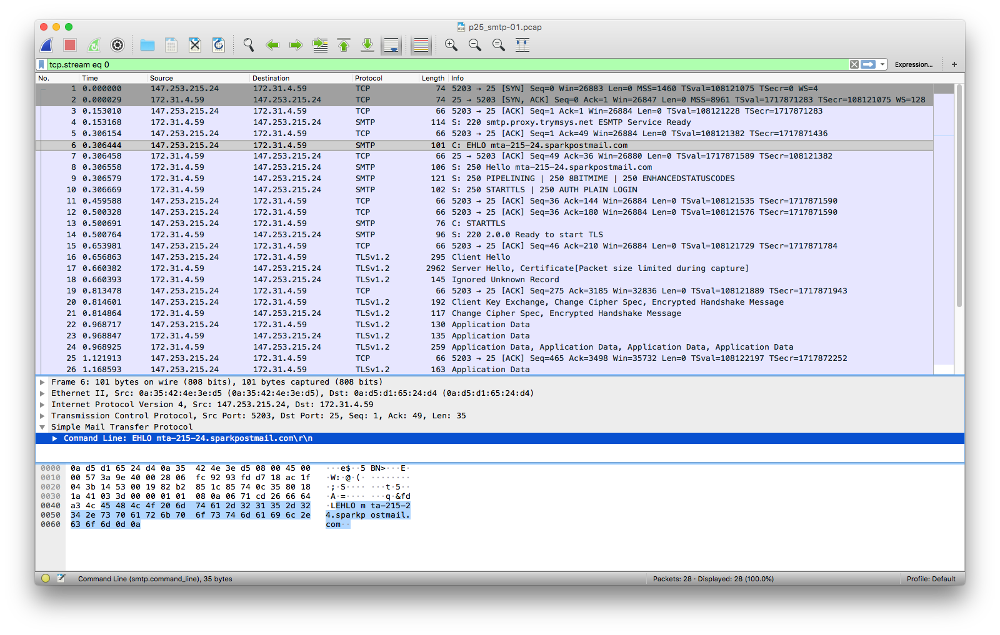

You may have noticed that recently allocated [dedicated IP addresses](https://www.sparkpost.com/docs/deliverability/managing-dedicated-ip-pools/) in your SparkPost account come from specific address ranges. 

Unless you are using our [Bring your Own IP](https://www.sparkpost.com/docs/tech-resources/bring-your-own-ip/) feature, your dedicated IPs come from a range registered to SparkPost.

```
whois 147.253.215.24
:
NetRange:       147.253.208.0 - 147.253.223.255
CIDR:           147.253.208.0/20
:
Organization:   Sparkpost (MS-820)
:
```

SparkPost automatically provides [Full-circle reverse DNS](https://en.wikipedia.org/wiki/Forward-confirmed_reverse_DNS), otherwise known as _“Forward-confirmed reverse DNS”_, for these dedicated IPs.

The IP address resolves back to a specific hostname using a PTR record, which uniquely resolves forward to that same IP address. You can see this using:

```
dig +short -x 147.253.215.24
mta-215-24.sparkpostmail.com.

dig +short A mta-215-24.sparkpostmail.com
147.253.215.24
```

The lookup from IP address back to hostname is done via a DNS PTR record. You can see this in full using the `dig -x` command above without the `+short` option:

```
dig -x 147.253.215.24

; <<>> DiG 9.10.6 <<>> -x 147.253.215.24
;; global options: +cmd
;; Got answer:
;; ->>HEADER<<- opcode: QUERY, status: NOERROR, id: 62812
;; flags: qr rd ra; QUERY: 1, ANSWER: 1, AUTHORITY: 0, ADDITIONAL: 1

;; OPT PSEUDOSECTION:
; EDNS: version: 0, flags:; udp: 512
;; QUESTION SECTION:
;24.215.253.147.in-addr.arpa.	IN	PTR

;; ANSWER SECTION:
24.215.253.147.in-addr.arpa. 296 IN	PTR	mta-215-24.sparkpostmail.com.

;; Query time: 11 msec
;; SERVER: 194.168.4.100#53(194.168.4.100)
;; WHEN: Wed Aug 14 12:19:03 BST 2019
;; MSG SIZE  rcvd: 98
```

You can also use online tools such as [MX Toolbox](https://mxtoolbox.com/ReverseLookup.aspx/) to view this relationship.

## EHLO hostnames in the outbound SMTP conversation
When SparkPost delivers email onwards to a mailbox provider, the SMTP conversation starts with the remote provider announcing themselves, and SparkPost replies with its hostname in the EHLO command, like this. The lines from SparkPost are annotated thus: `>`
```
  220 smtp.proxy.trymsys.net ESMTP Service Ready
> EHLO mta-215-24.sparkpostmail.com
  250-Hello mta-215-24.sparkpostmail.com
  250-PIPELINING
  250-8BITMIME
  250-ENHANCEDSTATUSCODES
  250-STARTTLS
  250 AUTH PLAIN LOGIN
> STARTTLS
  220 2.0.0 Ready to start TLS
```

Here's a network-level message exchange, showing the initial SMTP conversation, captured in WireShark.


