***Interested in getting access to these features?*** Sign up for a [personalized demo](https://www.sparkpost.com/deliverability-analytics-get-a-demo/)!

Get the full picture of your email lifecycle by combining your sending, engagement, and deliverability data into a single view. Deliverability Analytics empowers you to make effective, timely, data-driven, and strategic decisions to maximize the success of your email program.

This guide covers:
* [Deliverability FAQ](#deliverability-faq)
  * [What’s the difference between delivery and deliverability?](#whats-the-difference-between-delivery-and-deliverability)
  * [Where does deliverability data come from?](#where-does-deliverability-data-come-from)
  * [What makes our deliverability analytics better?](#what-makes-our-deliverability-analytics-better)
* [Deliverability Metrics](#deliverability-metrics)
  * [Getting Started with Seeds](#getting-started-with-seeds)
  * [Getting Started with Panel Data](#getting-started-with-panel-data)
  * [Retrieving Deliverability Metrics](#retrieving-deliverability-metrics)
* [Subaccount Access for Deliverability Metrics](#subaccount-access-for-deliverability-metrics)
  * [Enabling Access](#enabling-access)
  * [Retrieving Seed List](#retrieving-seed-list)
  * [Subaccount Users](#subaccount-users)
  * [Disabling Access](#disabling-access)
* [Benchmarking](#benchmarking)
* [Blocklists](#blocklists)
  * [Monitoring](#monitoring)
  * [Remediation Steps](#remediation-steps)
  * [Alerting](#alerting)
  * [Coming Soon: Blocklist Impact](#coming-soon-blocklist-impact)

## Deliverability FAQ

### What’s the difference between delivery and deliverability?

**Delivery** metrics measure how successfully your emails are handed over to the mailbox provider - how many emails were accepted vs. bounced?

**Deliverability** metrics measure what the mailbox provider did with your mail after they accepted it - did they put it in the inbox or the spam folder?

If we go old school and think in terms of physical mail, “delivery” is getting a letter in your mailbox. “Deliverability” is whether your kids/partner put the letter on the table for you to see, or threw in the back of the junk drawer where you’ll never look.

A key difference to note between delivery and deliverability metrics is that you won’t have deliverability data for every single email you send. You send your email to a sample group, we tell you where those emails ended up, and you can approximate that your actual sends were distributed similarly. It’s not exact, and we never pretend it to be - but it gives you some insight into something that you otherwise would have zero visibility into.

### Where does deliverability data come from?

Mailbox providers don’t like to share what they are doing with your emails to prevent abuse. Their goal is to send spam - which by definition means unwanted mail - to the spam folder. Our goal is to make sure that *wanted* emails are ending up where they should be - in the inbox.

Unlike delivery metrics - did the email bounce, was it accepted, etc. - deliverability metrics are generally not available from mailbox providers directly. You have to be a bit more creative in order to get deliverability data. The best way to get deliverability data is to send an email to a mailbox that you have access to, and look to see where it ended up. This sounds simple enough if you are just talking about one mailbox provider, but it gets complicated quickly. There are hundreds of mainstream mailbox providers, each with its own algorithm to determine what to send to the spam folder. Add in complicating factors like mailbox providers changing the algorithms over time and taking personal preferences and actions into account, and the end results is that getting a representative sample of your deliverability can be tricky.

#### Seeds

Never fear - that’s where a “seed list” comes in! A seed list is a set of email addresses (“seed address” or “seeds”) that are used exclusively for testing email delivery and inbox placement. When you send an email to the seed list, we can look inside these mailboxes and see if the email was delivered to the inbox or spam folder. Our seed list covers all the major mailbox providers, giving you a wide sample of deliverability data.

#### Panel Data

Complementing our extensive seed list is permissioned data from our [consumer panel](https://support.emailanalyst.com/en/articles/927828-what-is-a-user-panel), which is powered by a free email app called [Boxbe](http://support.emailanalyst.com/en/articles/2100545-consumer-panel-data-collection-privacy-practices). Boxbe is an email concierge app that allows consumers to better manage and control which messages make it to their inbox. We currently have subscribers at 42 global providers including Gmail, Outlook, AOL, Yahoo, Time Warner, Comcast, Apple Mail, and many others. Our panel data gives us a deeper look into deliverability, allowing us to measure and report data about actions that people take, like the effect of engagement on deliverability as well as when an email is moved to spam or moved to the inbox.

## What makes our deliverability analytics better?

By combining seeds *and* panel data, we give you a better picture of your deliverability than any other provider. Our seeds’ *breadth* of data and our panel’s *depth* of data enable you to make the most well-rounded data-driven decisions for your email program.

On top of that, we’re the only provider who gives you a full picture of the email lifecycle by combining your sending, engagement, and deliverability data into a single view. We don’t cordone off the sending and engagement data into a separate portion of the app. Since sending & engagement informs deliverability, and deliverability data (should) inform your sending, it’s critical that you see how these metrics interact.

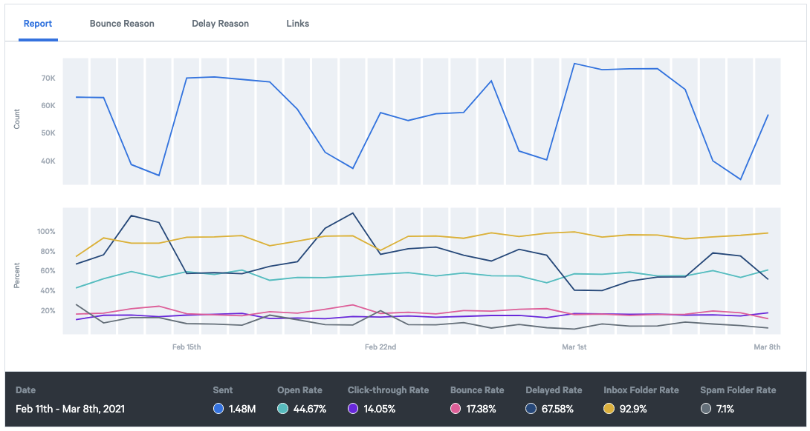

## Deliverability Metrics

### Getting Started with Seeds

In order to receive deliverability data from seeds, the first step is to start sending your campaigns to the seed addresses. [Download your seed list](https://app.sparkpost.com/inbox-placement/seedlist) ([EU](https://app.eu.sparkpost.com/inbox-placement/seedlist)) from the SparkPost app. Choose if you would like to copy the seed list or download it as a CSV. You can also retrieve the seed list [via API](https://developers.sparkpost.com/api/seed-list/). In order to use this API, create an API key with the `Seeds: Read-only` permission.

Set up your campaign per your standard process, and include the seeds in your recipient list. For the most accurate results, it is best to distribute the seeds equally throughout your send. If possible, avoid placing the entire list together at the beginning or end of a send. Make sure that the first seed in your list - your reference email address - is the first seed that you send to.

Send your campaign, and watch the results roll in! You can expect to see seed list results within a few minutes.

Learn more about seed list best practices [here](https://support.emailanalyst.com/en/articles/2440819-how-to-deploy-intelliseed-and-seed-lists).

The seed list is updated periodically, as we regularly expand our panel coverage as well as swap out stale seed addresses. We’ll send you an email when an updated seed list is available. An old seed list will still work, but using the most current version will give you the best insight into your deliverability. The email notifications will go to all active users on the account, including subaccount reporting users [who have access to deliverability metrics](#enabling-access). A user may unsubscribe at any time to stop receiving these notifications.

### Getting Started with Panel Data

Panel data associated with a sending domain in your SparkPost account will start flowing into your account immediately. If you already have a sending domain added and verified, no further action is needed! If you do not yet have a sending domain in your SparkPost account, please follow these [Getting Started steps](https://www.sparkpost.com/docs/getting-started/getting-started-sparkpost/) to set one up and verify it.

Note: You do *not* need to send emails to the consumer panel *through SparkPost* in order to see the data - we will show you panel data sent through any method. We do require a verified domain in order to display the results to the correct account.

### Retrieving Deliverability Metrics

SparkPost provides the following deliverability metrics [via API](https://developers.sparkpost.com/api/metrics/#metrics-get-metrics-summary):

|  Metric                | Description                                                          |
| :------------------- | :------------------------------------------------------------------- |
| `count_inbox_panel`    | Panel messages delivered to the inbox.                               |
| `count_spam_panel`     | Panel messages delivered to the spam folder.                         |
| `count_inbox_seed`     | Seed messages delivered to the inbox.                                |
| `count_spam_seed`      | Seed messages delivered to the spam folder.                          |
| `count_moved_to_inbox` | Panel messages delivered to the spam folder then moved to the inbox. |
| `count_moved_to_spam`  | Panel messages delivered to the inbox then moved to the spam folder. |

Use an API key with the `Metrics: Read-only` permission in order to retrieve your panel data programatically. Deliverability data can be updated for up to 10 days after an email is sent due to possible mailbox provider delays and campaign grouping logic, so we recommend using the API on demand to retrieve the most up-to-date information. If you choose to use the API to pull the data into your own database, we recommend polling the API every 30 minutes and then taking a more complete snapshot every 72 hours. [Contact our support team](https://app.sparkpost.com/dashboard?supportTicket=true&supportIssue=signals_issues) for additional guidance.

SparkPost also provides the following deliverability metrics in the [SparkPost app](https://app.sparkpost.com/) ([EU](https://app.eu.sparkpost.com/)):

| Metric               | Description                                                                                   | API Formula   |
| :------------------- | :-------------------------------------------------------------------------------------------- | :---------------- |
| Inbox Folder Count   | Number of seed and panel messages delivered to the inbox.                                     | `count_inbox_panel` + `count_inbox_seed` |
| Inbox Folder Rate    | Percentage of seed and panel messages delivered to the inbox.                                 | (`count_inbox_panel` + `count_inbox_seed`) / (`count_inbox_panel` + `count_inbox_seed` + `count_spam_panel` + `count_spam_seed`) |
| Spam Folder Count    | Number of seed and panel messages delivered to the spam folder.                               | `count_spam_panel` + `count_spam_seed` |
| Spam Folder Rate     | Percentage of seed and panel messages delivered to the spam folder.                           | (`count_spam_panel` + `count_spam_seed`) / (`count_inbox_panel` + `count_inbox_seed` + `count_spam_panel` + `count_spam_seed`) |
| Moved to Inbox Count | Number of panel messages delivered to the spam folder but then moved to the inbox.            | `count_moved_to_inbox`
| Moved to Inbox Rate  | Percentage of panel messages delivered to the spam folder but then moved to the inbox.        | `count_moved_to_inbox` / (`count_spam_panel` + `count_spam_seed`) |
| Moved to Spam Count  | Number of panel messages delivered to the inbox but then moved to the spam folder.            | `count_moved_to_spam` 
| Moved to Spam Rate   | Percentage of panel messages delivered to the inbox folder but then moved to the spam folder. | `count_moved_to_spam` / (`count_inbox_panel` + `count_inbox_seed`) |

To view the deliverability metrics in the UI, first click “Signals Analytics” in the top menu to be taken to the “Analytics Report”. Click “Add Metrics” and scroll to the “Deliverability Metrics” section to add your desired metrics. All [user roles](https://www.sparkpost.com/docs/user-guide/managing-users/) can view deliverability metrics in the UI.

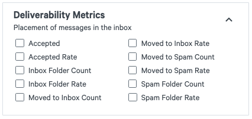

You also have the option to enable/disable the different data sources in the UI. After adding your metrics, scroll down to the “Breakdown by” section beneath the main graph. Select a “Breakdown by” category, and then click the “Data Sources” dropdown to select which data sources you would like to enable/disable.

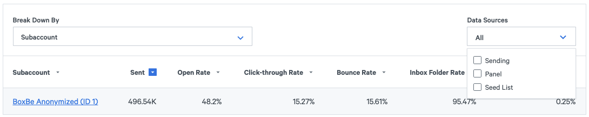

## Subaccount Access for Deliverability Metrics

Subaccounts can access deliverability metrics by sending to seeds or panelists just like a primary account. However - deliverability metrics are _not_ enabled for subaccounts by default. 

If you are using subaccounts to segment your mailstreams internal to your company, you can use deliverability analytics for your subaccounts for no additional charge. If you are using subaccounts for your customers/end users and you would like to offer deliverability analytics to them, please [get in touch with us](mailto:channels@sparkpost.com) for information about reseller agreements.

### Enabling Access

If you would like a subaccount to have access to deliverability metrics, enable the option on the subaccount configuration page. First click "Configuration" in the top menu and then select "Subaccounts". Search for the subaccount and then select it from the list. Open the configuration page for that subaccount and toggle the option on, then click "update subaccount".

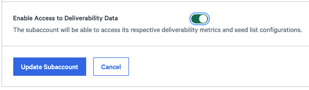

You can also enable [via API](https://developers.sparkpost.com/api/subaccounts/#subaccounts-put-update-a-subaccount). Use an API key that has the `Subaccounts: Read/Write` permission. (Note that you cannot set the option on subaccount creation, you must toggle it after creation.)

### Retrieving Seed List

Each subaccount has a specific reference seed (the first seed in the seed list), which helps match the data to the correct subaccount. Therefore, each subaccount sending to seeds needs to include the correct reference seed in their send. 

To retrieve the seed list for a specific subaccount, click "Configuration" in the top menu and then select "Seed List". Select the primary account, or select the subaccount that you wish to retrieve the seed list for. Note that only subaccounts with deliverability features enabled will be included in this list.

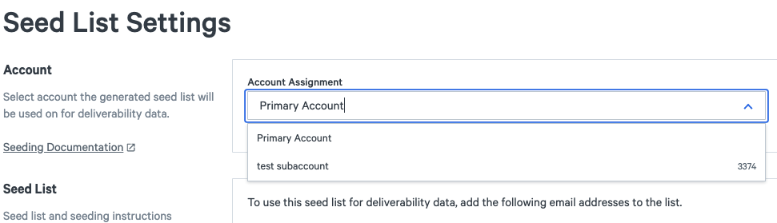

You can also retrieve a seed list for the primary account or a subaccount [via API](https://developers.sparkpost.com/api/seed-list/). In order to use this API, create an API key with the `Seeds: Read-only` permission.

### Subaccount Users

Once deliverability analytics have been enabled for a subaccount, any subaccount users will be able to:
1. Retrieve the seed list _for their subaccount only_ via the UI or API.
2. Access deliverability metrics _for their subaccount only_ via the UI or API.
3. Receive email notifications when the seed list has been updated. (Note that a user may unsubscribe at any time to stop receiving these notifications.)

### Disabling Access

To disable access for a subaccount, repeat the same steps as enabling. As soon as the product has been disabled, the subaccount will no longer be able to access their deliverability metrics or seed list. If access is re-enabled, a subaccount will be able to see their previous deliverability metrics.

## Benchmarking

In addition to tracking your specific inbox performance, SparkPost also provides an Inbox Rate Industry Benchmark, so that you can track your performance compared to your industry peers over time.

The Industry Benchmark provides daily inbox rate industry benchmarks of 25th, 50th (median), and 75th percentile in 18 different industry categories.

The Inbox Rate Industry Benchmark is also available [via API](https://developers.sparkpost.com/api/metrics/#metrics-industry-benchmarks) and in the SparkPost app.

To add the industry benchmark overlay to your Analytics Report, first select “Inbox Rate” as one of your metrics. Then scroll down to view the graph and click the “Industry Benchmark” overlay button.

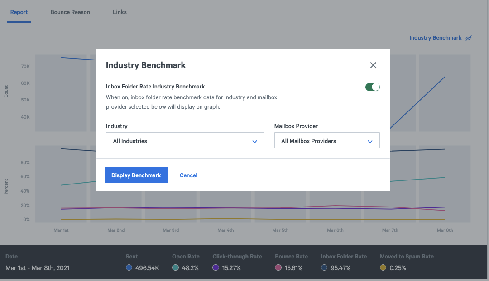

Click the button to toggle the benchmark on, and then optionally select the industry and/or mailbox provider. Both industry and mailbox provider default to “all” if not specified.

The inbox rate industry benchmark will be overlaid on your graph. The shaded area represents the area between the 25th and 75th percentiles. Hover over the graph to see more details.

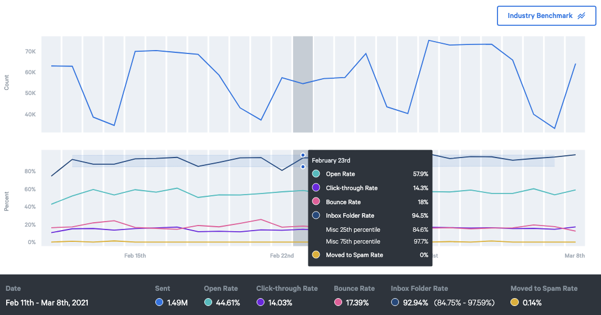

## Blocklists

An email blocklist is a list of sending IP addresses or domain names which are known to send spam or have poor sending practices. There are several blocklist lists, but some of the common ones are: [Spamhaus](http://www.spamhaus.org/), [Barracuda Reputation BlockList](http://www.barracudacentral.org/rbl), and [SpamCop](http://www.spamcop.net/). Each blocklist has its own criteria for how an IP or domain ends up on the list and method for removal.

Many mailbox providers use these blocklists as a component in determining which emails get sent to the spam folder. It’s critical for successful email deliverability to monitor your sending domains and IPs for blocklistings - so that you can address a blocklisting quickly and get back to the inbox.

### Monitoring

SparkPost allows you to monitor an unlimited number of sending domains and IPs - why pick and choose which of your domains are most critical for monitoring?

To set up an IP or domain to be monitored, navigate to the “Signals Analytics” tab and then the “Blocklist” tab in the SparkPost App. Click “Add to Monitored List” to add your first IP or domain:

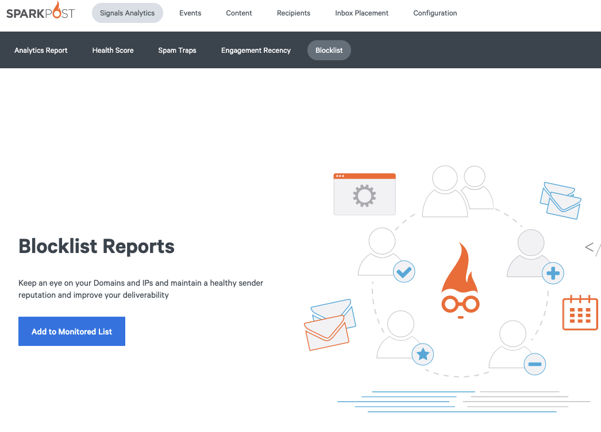

Add an IP or domain you want to monitor, and then click “Save”, or “Save and Add Another” to add additional resources.

On the “Monitored List” page, you will be able to see all sending domains and IPs that you are watching, as well as the number of active and historical incidents. Click “Remove from Watchlist” to stop watching a resource:

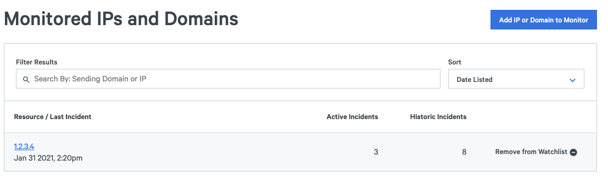

Click “Blocklisting Incidents” to view the full list of incidents. Now that you have added a resource to monitor, this will be the first page you see after clicking on the “Blocklist” tab going forward.

You can filter this page by sending domain or IP, or by blocklist name. You can also sort by any of the column names:

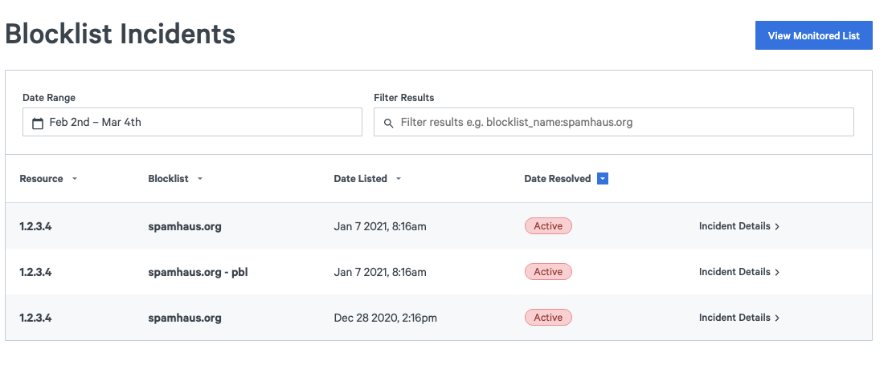

Click “Incident Details” to view more details about the incident:

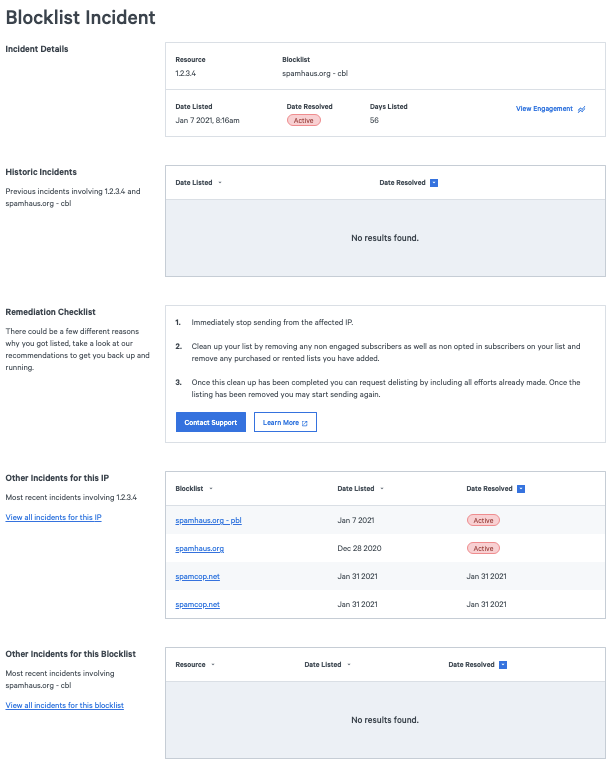

### Remediation Steps

For every blocklist incident, SparkPost includes a customized remediation checklist tailored to that specific blocklist, with detailed instructions of what you should do to address the situation. Our seasoned deliverability experts have provided these instructions so that you can remedy the issue as soon as possible.

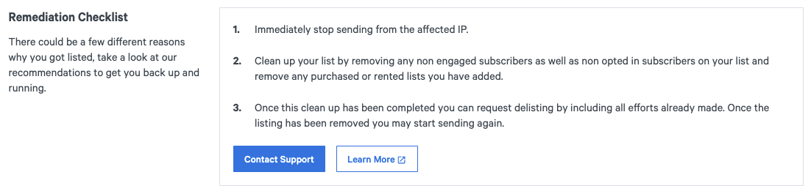

When you need to request removal from the blocklist directly, we provide you with the removal link. When it’s best for our support team to request removal on your behalf, we direct you to submit a ticket with all the relevant information pre-filled for your convenience so that our support team can respond right away.

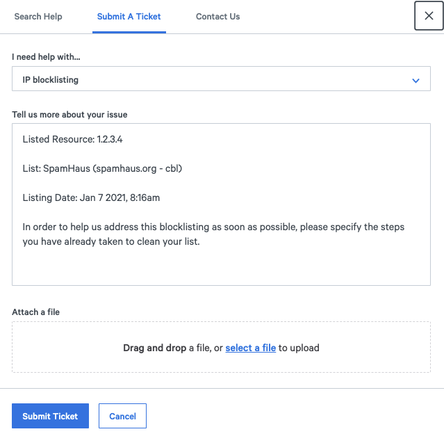

### Alerting

We want to make sure that you know about blocklist incidents as soon as possible, so we recommend you set up an alert. Click on your profile in the top right corner and then select “Alerts”.

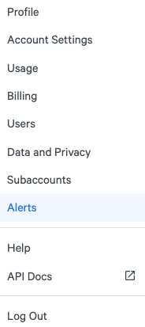

Click “Create an Alert” to set up your alert.

Set a name for your alert and then select “Blocklists” under “Alert Metric”. Select the blocklists and domains/IPs you would like to be alerted about. Lastly, choose how you want to be alerted - by email, slack, or webhook.

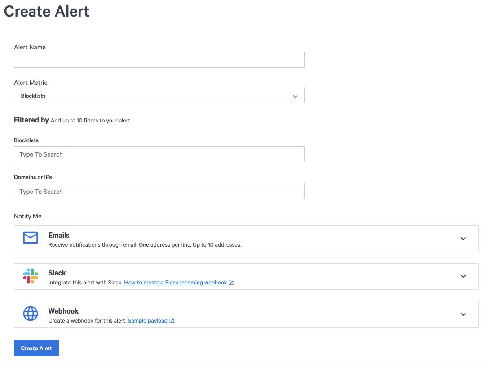

Click “create alert” to save your alert, and you’re all set!

### Coming Soon: Blocklist Impact

Not all blocklists are created equal - some are used by significantly more mailbox providers than others. We’re currently developing a blocklist impact analysis that will indicate the impact of a blocklisting for your specific IP or sending domain, based on your historical sending. Interested in learning more? [Contact us](https://app.sparkpost.com/dashboard?supportTicket=true&supportIssue=product/support_feedback&supportMessage=I%27d%20like%20to%20speak%20with%20the%20Product%20team%20about%20blocklist%20impact.) and we’d be happy to chat!
