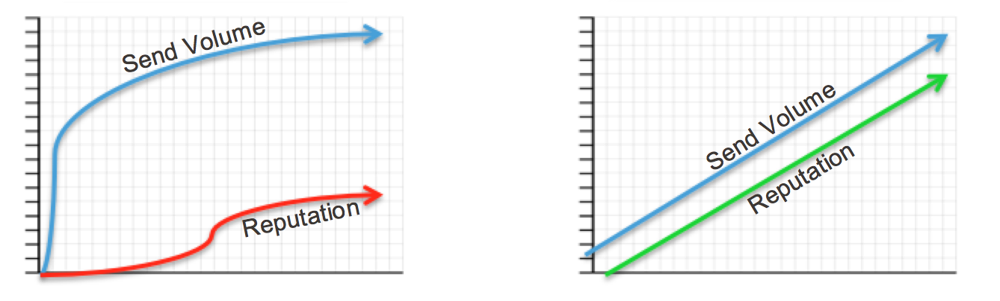

### IP Warm-up Definition 

IP warming is the process of methodically adding email volume to a new IP address gradually over several days and weeks in order to establish a positive sending reputation with mailbox providers.

### IP Warm-up Summary 

Mailbox providers view email from a new IP address as suspicious until they establish a positive sending reputation.  It takes 4-8 weeks to achieve maximum deliverability (depending on targeted volume and engagement).  Warming could take longer if mailbox providers don’t perceive that the email is "wanted" by the recipient (i.e., recipient has signed up explicitly).  Certain mailbox providers limit senders to thresholds - number of messages delivered per day - until they establish a reputation.

SparkPost recommends starting off with your best performing messages - those to highly engaged recipients.  Focus warming your most engaged subscribers and then add in the older segments as you progress.  Older segments should be added to the engaged segments in chunks of 15% of your existing volume as not to tip your reputation from good to bad. The goal during your the warm-up process is to send to subscribers who are least likely to complain and bounce.  This would include those that have opted-in most recently and are consistent openers/clickers.

During the Warm-up phase the more consistent you are with volume, frequency, complaint and bounce levels, the faster you will establish a positive sending reputation.  If you send infrequently - anything less than weekly - it will take more time to build a positive sender reputation.

### How many IP’s do I need?  

This is a question that we hear a lot and there isn’t a one-size-fits-all answer. Here are a few questions to ask yourself to help you determine just how many IP’s are needed to support your sending program. And if you need more help, please login and create a ticket.

1. How many unique message streams do I have?
    * Separating message streams on separate IP’s is a best practice and ensures that the sending activity from your Marketing emails doesn’t impact your ability to get your Transactional emails delivered to the inbox for example. 
    * Other message stream examples: transactional, marketing, individual brands, regions, etc.
2. What is the maximum volume that I need to send in a single day for each message stream?
    * A single IP address can technically send a large volume of mail quickly depending on sending reputation - that’s millions of messages per hour. For most senders the recommended volume after a proper warmup is 2 to 5 million per day from a single IP.
    * Senders with volume less than 500k messages per month or with inconsistent volume from week to week may not have enough volume to build and maintain a positive sending reputation with mailbox providers. In this case, a shared IP pool may result in better delivery and deliverability. 

### IP Warm-up Plan 

**Key to Success**           
* During weeks 1-2 send to your most active subscribers - those who have opened/clicked in the past 30 days
* During weeks 3-4 you can expand to subscribers who have opened/clicked in the past 60 days
* During the first 6 weeks do NOT send to subscribers who have not opened or clicked in the past 90 days
* If warming above 10 million subscribers, consider adding another IP

| Week 1 | Daily Volume per IP |
| ---|---|
| Day 1 | 200 |
| Day 2 | 500 |
| Day 3 | 1,000 |
| Day 4 | 2,000 |
| Day 5 | 5,000 |
| Day 6 | 10,000 |
| Day 7 | 20,000 |
| <strong> Week 2 </strong> | |
| Day 8 | 40,000 |
| Day 9 | 50,000 |
| Day 10 | 75,000 |
| Day 11 | 100,000 |
| Day 12 | 150,000 |
| Day 13 | 200,000 |
| Day 14 | 250,000 |
| <strong> Week 3 </strong> | |
| Day 15 | 325,000 |
| Day 16 | 400,000 |
| Day 17 | 500,000 |
| Day 18 | 600,000 |
| Day 19 | 750,000 |
| Day 20 | 1,000,000 |
| Day 21 | 1,250,000 |
| <strong> Week 4 </strong> | |
| Day 22 | 1,750,000 |
| Day 23 | 2,000,000 |
| Day 24 | 3,000,000 |
| Day 25 | 4,250,000 |
| Day 26 | 5,000,000 |
| Day 27 | 6,000,000 |
| Day 28 | 7,500,000 |
| <strong> Final Week </strong> | |
| Day 29 | 10,000,000 |
| Day 30 | DONE |

**What to Expect**          

Once you begin warming up your IPs you can expect some bulking and blocking to occur.  It is key to stick with the plan. Below are details of what you can expect and actions to take.

* **Bulking** at Yahoo, AOL, Gmail. Typically clears up after a few sends with solid positive metrics, but it can take time to get inbox delivery. **The key is to keep sending to engaged subscribers.**   
* **Delays** at AOL, Microsoft and Comcast.  The delays (421 bounces) will retry for 72 hours and if not delivered will bounce as a 5XX with the original 421 error in the bounce record.  *Delays are normal, and will lessen each day as reputation developes.  As long as they are ultimately delivering there is no concern.*  However if they are timing out in large quantities you should back down your volumes to that mailbox provider by tightening up your engagement window.
* Possible **blocking** by mailbox providers can occur if the list isn’t engaged enough.  The key is to segment carefully and tighten up engagement **Again the key is to keep sending.**                            
* It is important to monitor your metrics and adjust the plan accordingly during the warm-up period.

### Why is IP Warm-up Important?

**Warm-up Matters**        

| Quick Warm-Up:                                                                                                     | Slow Warm-Up:                                                                                                                                                                                                                         |
|:-------------------------------------------------------------------------------------------------------------------|:--------------------------------------------------------------------------------------------------------------------------------------------------------------------------------------------------------------------------------------|
| <ul><li>Mailbox providers see volume spikes</li><li>Unknown Senders</li><li>Blocks/Filtering/Rate Limiting will occur</li></ul> | <ul><li>Mailbox providers see the gradual build in volume</li><li>Good reputation develops over time</li><li>Blocks/Filtering/Rate Limiting rarely occurs (only occurs when engagement and complaint rates are low). </li></ul> |

**IP Warm-up Helps Build Your Sender Reputation**                                           

⇒Sender Reputation is how mailbox providers view you and your mail. 
* Email reputation controls access to the inbox
  * Bad reputation = Spam Folder or Blocks
  * Good reputation = Inbox
* Reputation can effect the domain and/or IP address and will be based on:
  * Spam complaints
  * Invalid email addresses (hard bounces)
  * Spam trap hits
  * Authentication (SPF, DKIM, DMARC)
  * Third-party blacklistings
  * Engagement

⇒Positive affects on your reputation are:
* Opens
* Clicks
* Authentication – DKIM, SPF, DMARC

⇒Negative affects on your reputation are:
* Poor or insufficient permission
  * High recipient complaints (report as spam)
* Poor list quality/hygiene - bad email addresses
* IP address and domain blacklistings
* Spam trap hits
* Large spikes in volume

**The Fundamentals of Reputation**                           

⇒Key Takeaways:
* Opt-ins are most important
* If people do not want your mail, your reputation suffers
* Mailbox providers and metrics are judge and jury when it comes to getting delivered to the inbox.
* You can not transfer your reputation from your previously used IP.
* If you use the same domain that reputation can follow you, however mailbox providers like Gmail use the reputation of the domain coupled with the reputation of the IP therefore you must follow the warm-up process.
* Mailbox providers trust metrics from their users and what they observe, therefore, no brand will get special treatment.
* B2B senders must follow the same warm-up process as B2C senders as many business domains are now hosted by Yahoo, Outlook, Gmail, AOL, etc.

### Permission and Engagement is Key
Permission is the cornerstone of building a good sender reputation.
* Subscribers complain about mail they are not expecting to receive.
  * Are you sending more frequently than you said you would?
  * Did they sign up for exactly what they are receiving?
  * Are you sending content other than what you said you would?
* Are you following best practices by staying up on the Can-Spam Act and the CASL laws?

**Why is Engagement Important?**   

Mailbox providers track how engaged subscribers are with an email and its sender, and the nature of the engagement.
* Positive actions may include opening a message, adding an email address to the contact list, clicking through links, clicking to enable images, and read rate such as scrolling through the message.
* Negative actions may include reporting the email as spam, deleting it, moving it to the junk folder, or ignoring it.
* Engagement ratings are another compelling reason to use only opt-in or confirmed opt-in email marketing lists. Opt-in maximizes the likelihood of engagement, because in theory there is a relationship already established with the mailbox provider.

**Remember Quality Always Wins Out Over Quantity.**                                       
* There is a charge for the volume you send. If the message is never opened that cost is wasted.
* Lower ROI when including disengaged subscribers in your campaigns.
* Disengaged subscribers are the common cause of complaints, spam traps, hard bounces which can affect deliverability/inbox placement to engaged subscribers which lower your ROI.
* Run regular re-engagement campaigns to win back the disengaged subscribers.
* Send to the disengaged subscribers less frequently than engaged subscribers.

**How to Keep your List Highly Engaged**                                 
* Send relevant content to engaged subscribers.
* Set subscribers’ expectations from the beginning.
* Give people who opt-in to your mail choices on how often they’ll receive emails from you (e.g., once daily, a weekly digest, as items become available or go on sale). If you send infrequently, make that clear. Ask them to whitelist you as they opt-in.
* Deploy a good onboarding program educating them on expectations.
* Keep your lists clean.
* Begin with your registration forms. If you have the option to block spammy, personal, or role-based email addresses, do so.
* As your lists age, weed out non engaged subscribers.

### Spam Traps

**Pristine Spam Traps**           
* Email addresses created solely to capture spammers (sometimes referred to as "Honey Pots"). These email addresses were never owned by a real person, do not subscribe to email programs and of course will never make a purchase. If you are hitting pristine traps, this typically indicates you have a bad data partner and/or poor list acquisition practices.

**Recycled Spam Traps**           
* Email addresses that were once used by a real person but abandoned and then recycled by mailbox providers as spam traps. Before turning an abandoned email address into a spam trap, mailbox providers will return an unknown user error code for a period of time (6 to 12 months). If you are hitting a recycled spam trap, this typically indicates that your data hygiene process is not working.

**How to Avoid and Remove Spam Traps**                               
* Do not purchase or rent lists.
* Remove hard bounces.
* Continuously re-engage your inactive subscribers.
* Remove unengaged subscribers (if re-engagement attempt is not successful).
