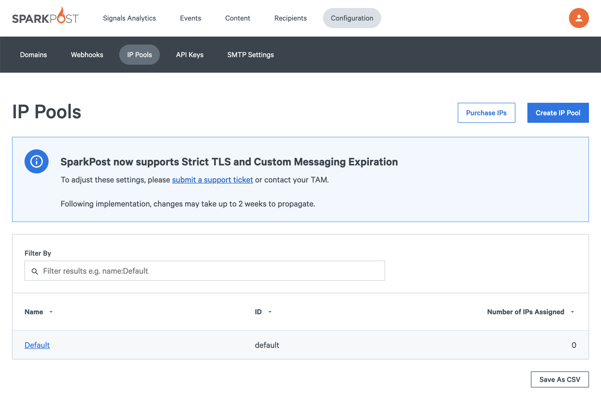
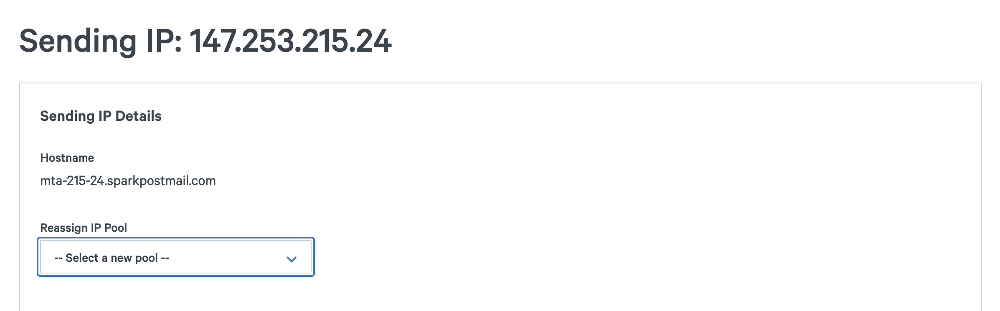
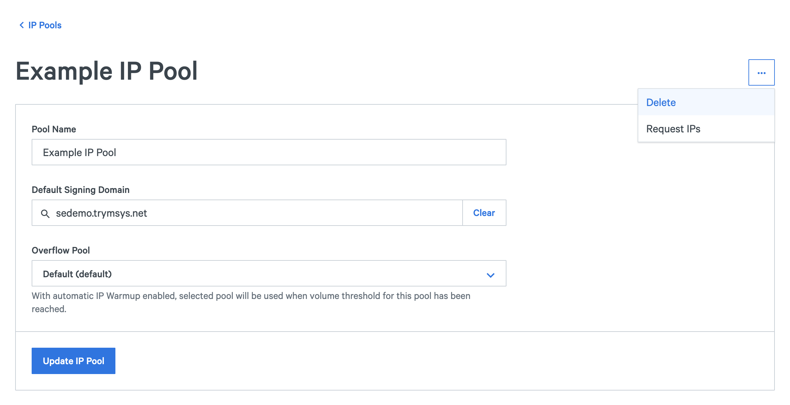
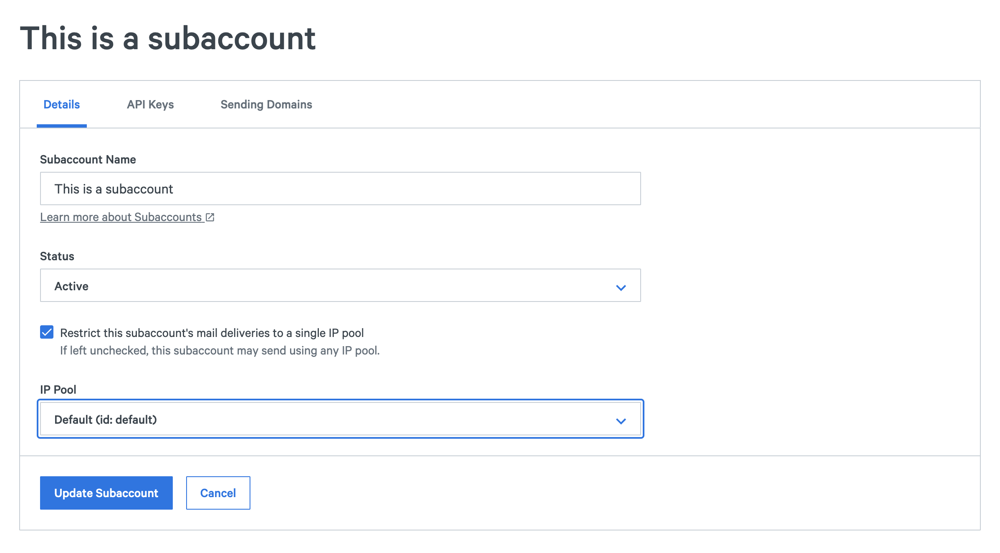

So now you have dedicated IPs. In which IP pools would you like them? Would you like a marketing pool? Would you like a transactional pool? You can manage this in the SparkPost app.

In the SparkPost app, select **Configuration** > **IP Pools**. The default pool is already there for you. The default pool is used if you do not specify an IP Pool in your transmission. Since the default pool is the "fallback", you must always have at least 1 IP in the default pool.
                                                                                                              

**Create**

You can create new IP pools by selecting New IP Pool button.

Create the IP pool name, search for the sending IP you want to use and select create.

**Move**

To move Sending IP from 1 IP Pool to another, select edit on the original IP pool. Find the Sending IP you are moving and in the drop down select the IP pool you are moving the sending IP to. Finish but selecting update.

**Delete**

To delete an IP pool, select Delete from the dropdown menu at the top of the IP Pool details page. Please note that sending IPs still in that pool will move to the default pool.

**Subaccounts**

When you have subaccounts, you can define which IP pool the subaccount uses.  The IP pool assigned to the subaccount acts as the default IP pool for that subaccount.  All messages injected by the subaccount will then automatically use that IP Pool. This means that subaccount transmissions do not need to specify the ip_pool value. Subaccounts will receive an error if they attempt to specify an ip_pool value which differs from the assigned IP pool.

To assign an IP pool to a subaccount, search for the subaccount, edit the subaccount, search for the IP Pool ID and update

