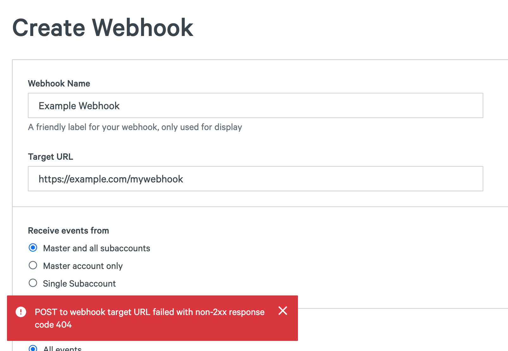

When you create a new webhook in the SparkPost UI, you may see an error similar to the following:

This error occurs when SparkPost sends a test batch to your webhook endpoint and, if an error is detected during that test, this error is shown.  There are a few common steps you can take to rectify the issue:

* Webhooks require you to publish an HTTP service (the "target URL" above) to receive event data.  Your service must be in place *before* you register the webhook with SparkPost.
* Your receiving HTTP service must return a 200 status code when it successfully receives an event batch.  Any non 200 response is treated as an error.
* For security reasons, SparkPost only supports standard ports 80 (for HTTP traffic) and 443 (for HTTPS traffic). Make sure your webhook endpoint is listening for traffic on at least one of these ports.

For more details on managing your webhooks and handling webhook event data, check out [this support article](https://www.sparkpost.com/docs/tech-resources/managing-webhook-data/) and [this blog post](https://www.sparkpost.com/blog/webhooks-beyond-the-basics/) on the topic.
