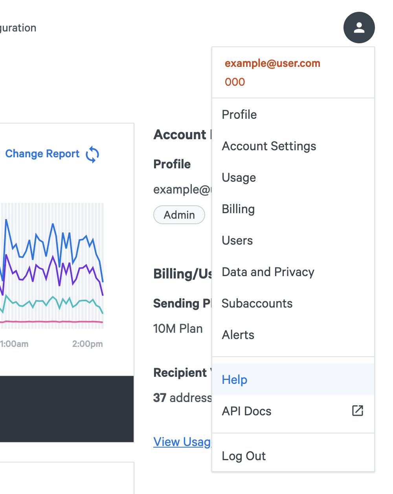
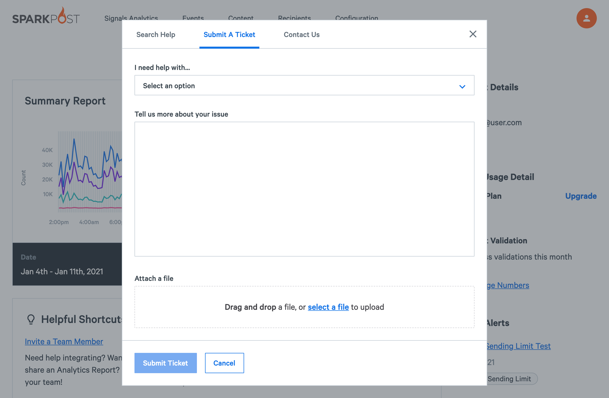

Raising a support case is just a couple of clicks away in the SparkPost UI. From the Account menu under your email address in the top right hand corner please follow these steps 

1. Select 'Get Help' from the drop down menu
2. From the Help window select 'Submit A Ticket' tab
3. Select one of the case options from the drop down list (Mandatory), please select the one closest to your issue, this helps us route your case to the appropriate SparkPost Support guru. 
*Note:* In certain circumstances the options list may be limited or only a single option is available based on your account status.
4. Use the free form text box to tell us more about your issue, you can add in attachments as needed.
5. When you are ready press the ‘Submit Ticket’ button, this will send your case to support and also provide a confirmation screen, once you have noted your case number click 'Continue' to return to the UI. You will also receive an email confirmation which you can reply to with further details if needed. The SparkPost team will be in touch as soon as they can.

If you need to raise a case immediately please log in to your account or click [HERE](https://app.sparkpost.com/dashboard/?supportTicket=true). [EU](https://app.eu.sparkpost.com/dashboard/?supportTicket=true)
