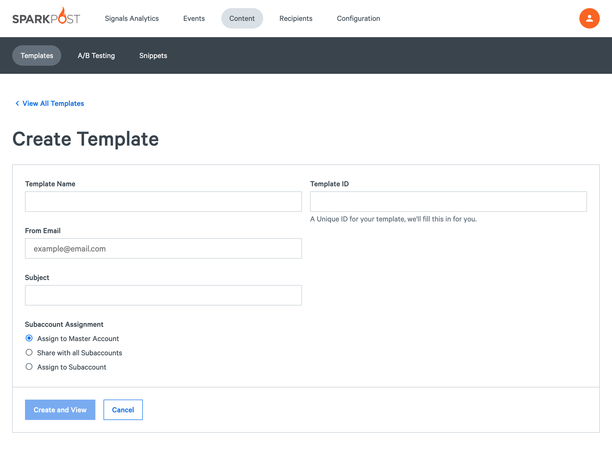
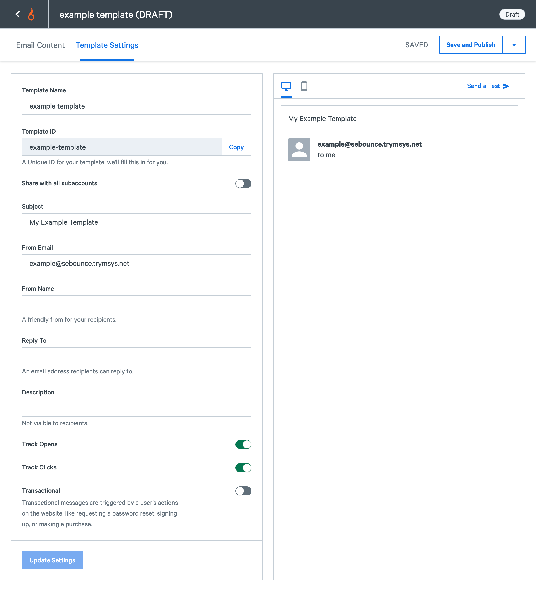
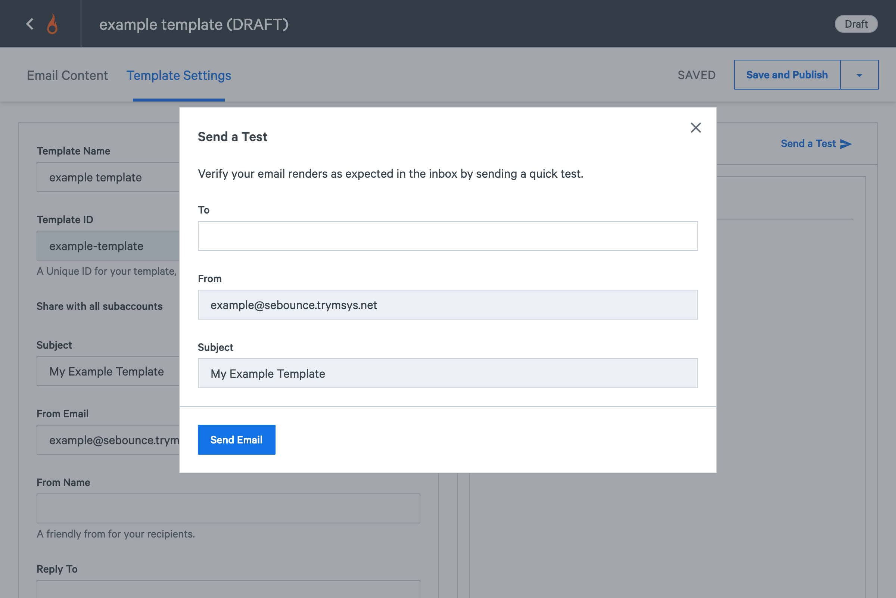

## Create a template

Once you understand how to [send an email (transmission)](https://www.sparkpost.com/docs/getting-started/getting-started-sparkpost/#sending-email), you'll want to know how to create templates in SparkPost if you do not wish to use inline content in your transmissions API call.

Currently there are two ways you can create templates in SparkPost:

* [Create templates in SparkPost using the app](https://www.sparkpost.com/docs/getting-started/creating-template/#creating-templates-with-the-app)
* [Create templates in SparkPost using the API](https://www.sparkpost.com/docs/getting-started/creating-template/#creating-templates-with-the-api)

## Why create templates in SparkPost?

* **Reference:** Easily communicate with your team by having a set of named templates to reference.
* **Error Reduction:** Reduce duplicated efforts and potential embarrassing emails with typos or errors.
* **Simplification:** Building a library of "go-to" templates for recurrent use-cases reduces workload for your development team.
* **Systemize:** Using SparkPost templates in concert with substitution data can make it easy to create re-usable templates that allow for one to one personalized content.

## Creating templates with the app

Creating a template using the SparkPost app is simple. To get started, let's go step-by-step through how you can define a new template.

### Defining your email template in SparkPost

1. **Open the templates view:** Click on **Content** > **Templates** in the main SparkPost navigation.

1. **Make a new template:** Click on the **Create Template** button to open the SparkPost template editor.

    

1. **Name your template:** Input a human-friendly name for your template in the "Template Name" field. This field will *not* be displayed to recipients.

1. **Provide an ID for your template [optional]:** Input an ID for your template (note that if you do not provide an ID, SparkPost will create an ID for you). This field will *not* be displayed to recipients and is used to help remind you of the purpose of the template. *Note: The template ID is used when referencing the template via the API - When using a given template for an outbound message, you will reference the template ID, not the template name itself.
    
1. **Define subaccount usage of the template:** Choose whether or not to share this template with subaccounts by clicking the checkbox titled "Share with all subaccounts". If a primary account creates a template and does not elect to share it with subaccounts, only the primary account may use that template. If the template is shared with all subaccounts, every subaccount has access to use the template, but only the primary account has edit permissions. If the primary account creates a template on behalf of a subaccount and assigns it to a single subaccount, both the primary account and subaccount can use and edit that template.

    Read more about using subaccounts in SparkPost [here](https://www.sparkpost.com/docs/user-guide/subaccounts/).

1. **Define the subject of the template:** Input the subject line of the template that will appear in your recipient's mail client.

1. **Define the from name of the template:** Input the from name to be used in the template. This is the name displayed in your recipient's email client, often called the "friendly from".

1. **Define the from email of the template:** Input the full email address this template will be sent from. This is often displayed next to the from name (friendly from) in most mail clients.
    
1. **Define the reply to of the template:** Input the reply to address of the template. If a recipient chooses to reply to a message sent using this template, this is the address that will be used as the reply to.
    
    

1. **Provide a description of the template:** Input a description of this email. This field will NOT appear to your recipients and is used to help remind you of the purpose of the template.

1. **Choose engagement tracking options:** If you would like this template to have open and click tracking enabled, click on either of these buttons. Orange is enabled, and grey is disabled.
    
1. **Choose transactional message options:** Choose whether to mark this template as a transactional message. Orange is enabled, grey is disabled (and therefore "non_transactional".) Appropriately categorizing your templates is important because both "transactional" and "non-transactional" templates have separate suppression lists. For more information on suppression lists, see this article [here](https://www.sparkpost.com/docs/user-guide/using-suppression-lists/).

1. **Define the content of the template:**
    * **[Creating HTML Content](https://www.sparkpost.com/docs/getting-started/creating-template/#authoring-html-content-for-your-templates)**
    * **[Creating Text Content](https://www.sparkpost.com/docs/getting-started/creating-template/#authoring-text-content-for-your-templates)**
    * **[How to Use The Template Language](https://developers.sparkpost.com/api/template-language/)**

At this point, we are *technically* done with our template and we could "Save" or "Save and Publish", but let's take a few minutes to test this template and make sure it is behaving as we expect.

## How to test and preview templates in the SparkPost app

To test an email, you simply make sure all the above steps are completed and then click the "Preview" button. This allows you to view your email template.

To send yourself (or approvers) a test transmission of your email template, enter the email addresses (comma separated) into the "To" field and click on the "Send Email" button.

**Please be aware that sending a test email is an actual transmission (make sure you don't have any LIVE customer email addresses in the "To" field).**

If you are using substitution data in your emails, there are additional steps you must take to test your replacement values. [Read more about using substitution data in SparkPost to create dynamic email templates](https://developers.sparkpost.com/api/template-language/).

## Creating templates with the API

### Prerequisites

* **SparkPost API Key:** You will need to have a SparkPost API Key with all the appropriate data-access permissions for Templates API management. [How to create a SparkPost API Key](https://www.sparkpost.com/docs/getting-started/create-api-keys/)
* **HTTP Request Knowledge:** You will need to understand how to make HTTP(S) requests.
* **Tools:** You will need to have a REST Client, or access to a terminal which supports cURL.

Once you have all the prerequisites on-hand, you're ready to read the [Templates API Documentation](https://developers.sparkpost.com/api/templates.html). All of the SparkPost API Reference documents contain all the data specifications for the objects upon which you're interacting and a set of request examples.

## Authoring HTML content for your templates in the SparkPost app

If your email template requires any type of customized data to be displayed, please take a moment and read [how to use substitution data to create dynamic email transmissions](https://developers.sparkpost.com/api/template-language/).

* **Choose HTML in the template editor:** Choose "HTML" in the drop-down box.
* **Insert your HTML:** You can either use the SparkPost HTML editor or you can copy and paste your HTML into the Template Editor.
* **Include test substitution data [optional]:** If your template's HTML is using [substitution data](https://developers.sparkpost.com/api/template-language/), then you will need to add some "Test Substitution Data". This is a JSON object that you can author(or copy/paste) by clicking the "</>Test Data" button. Please note that either the "substitution data" or "metadata" objects will replace substitution variables within your template. The difference between the two, when you begin using a template in production, is that values nested in the "substitution data" object will not appear in message events, whereas values nested in the metadata object will appear in message events.
* **Preview your HTML Template:** Once you have added the HTML you wish to use, click the "Preview" link to view the rendered output example.

## Authoring Text content for your templates in the SparkPost app

If your email template requires any type of customized data to be displayed, please take a moment and read [How to use substitution data to create dynamic email transmissions](https://developers.sparkpost.com/api/template-language/).

* **Choose Text in the template editor:** Choose "Text" in the drop-down box.
* **Insert your Text:** You can either use the SparkPost Text editor or you can copy and paste your Text into the Template Editor.
* **Include test substitution data [optional]:** If your template's Text is using [substitution data](https://developers.sparkpost.com/api/template-language/), then you will need to add some "Test Substitution Data". This is a JSON object that you can author(or copy/paste) by clicking the "</>Test Data" button. Please note that either the "substitution data" or "metadata" objects will replace substitution variables within your template. The difference between the two, when you begin using a template in production, is that values nested in the "substitution data" object will not appear in message events, whereas values nested in the metadata object will appear in message events.
* **Preview your Text template:** Once you have added the Text you wish to use, click the "Preview" link to view the rendered output example.

Outstanding! You've sent your first email / transmission in SparkPost and you've created your first template.
