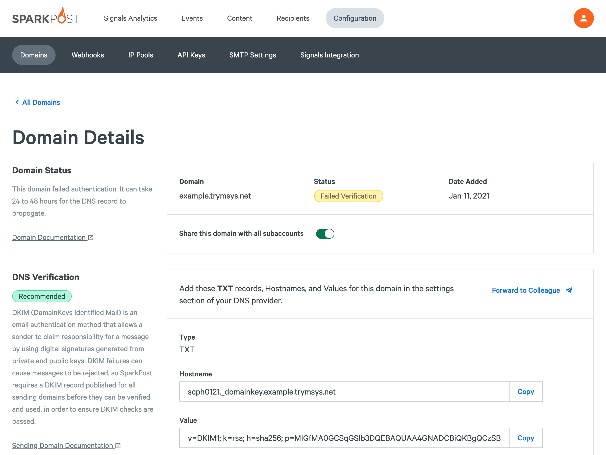
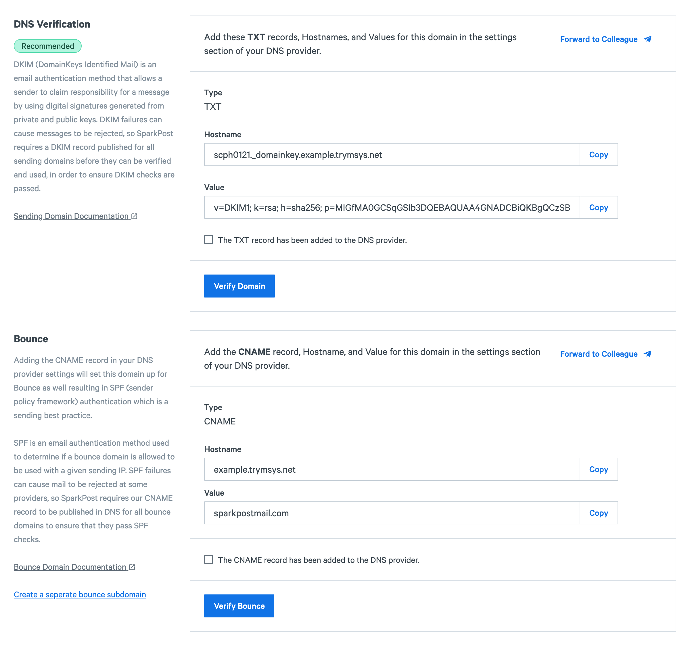
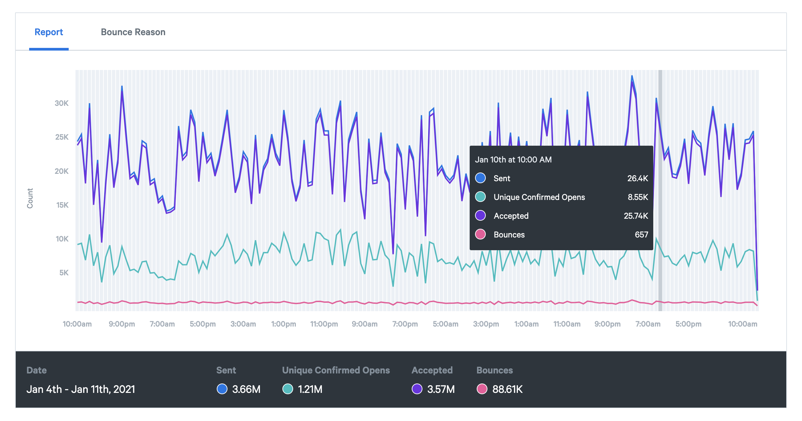

Welcome to SparkPost! This guide describes the steps you’ll need to follow to start sending mail. We'll run through account setup and best practices to have in place before you begin sending. We'll also point out some useful resources along the way to help you get the best from SparkPost.

SparkPost is a developer-centric email delivery service. That means pretty much everything described in this guide can be done through the SparkPost API. If you'd like to just skip to the end, the [SparkPost API documentation](https://developers.sparkpost.com/api/) is worth a visit.

Note: SparkPost is available in multiple regions. "SparkPost" refers to the SparkPost service hosted in North America. "SparkPost EU" refers to the SparkPost service hosted in Western Europe. An account created with SparkPost cannot be used with SparkPost EU, and vice-versa. You may use accounts in both regions. 

* [Signing Up And In](#signing-up-and-in)
* [Preparing Your "From:" Address](#preparing-your-from-address)
* [Important: Coming From Other Email Services](#important-coming-from-other-email-services)
* [Sending Email](#sending-email)
* [Tracking Recipient Behavior](#tracking-recipient-behavior)
* [Improving Reputation And Branding](#improving-reputation-and-branding)
* [Signals Analytics and Tracking](#signals-analytics-and-tracking)
* [Where To Next?](#where-to-next)
* [How To Get Help](#how-to-get-help)

## Signing Up And In

First things first: sign up for your SparkPost account [here](https://app.sparkpost.com/join) ([EU](https://app.eu.sparkpost.com/join)). After sign-up, we will send you a verification email; please do verify your email address so SparkPost can contact you if you need support later on and send you important service announcements.

## Preparing Your "From:" Address

The very first thing your recipients see when they open your email is your address in the From field, so it's important to set it properly from the get-go. In SparkPost, that means creating a sending domain, the domain name you'll use to send email from. We recommend using a subdomain like *mail.myawesomedomain.com*, but using a top-level domain is also allowed.

### Prerequisites

To create a sending domain in SparkPost, you will need ownership or administrative access to your domain name, for example: *myawesomedomain.com*. You will also need access to make DNS configuration changes through your domain registrar (or DNS provider) for your sending domain.

If you do not have a domain name, you'll need to purchase one to use with SparkPost. Here are a few useful and popular domain name registrars:

* [Cloudflare](https://www.cloudflare.com/plans)
* [GoDaddy](https://support.godaddy.com/help/article/680/managing-dns-for-your-domain-names)
* [NameCheap](https://www.namecheap.com/)
* [DNSSimple](https://dnsimple.com/)

To set up your sending domain, add the domain to your SparkPost account, verify that you own it and wait a moment while our Compliance team runs a few quick checks. Follow the detailed steps below to get it done.

Note: SparkPost expects to see a [legitimate web presence](https://www.sparkpost.com/docs/getting-started/requirements-for-sending-domains/#website-requirements) on each sending domain, so please ensure your website is accessible before adding a domain to your SparkPost account. If you use a subdomain, a legitimate web presence is only needed on the top-level domain.

## Domain Setup
### Step 1: Add the Domain

If you didn't add a sending domain during your sign up process, you can [add one now in the SparkPost app](https://app.sparkpost.com/domains/create) ([EU](https://app.eu.sparkpost.com/domains/create)). If you already added a domain, visit the [Domains](https://app.sparkpost.com/domains/list) ([EU](https://app.eu.sparkpost.com/domains/list)) page to find your existing domain and click on the domain to complete the domain set up.



### Step 2: Verify Domain

Before you can send mail using your domain, we need to verify that you own it. Adding a DNS record to your domain is the recommended way to complete this verification. In the **DNS Verification** section you can find the TXT record Hostname and Value you need to add to your domain's DNS records.



If you are using a subdomain, we recommend you also add the CNAME record specified under the **Bounce** section. Top-level domains should skip this step and add a [custom bounce domain](#header-Bounce-Domains).

Unfortunately, some DNS records take longer to update than others, even up to 24 hours. If you want, you can check to see if the DNS value has updated using a service like [Whats My DNS](https://whatsmydns.net). Just be sure to use the correct hostname there, too.

Some providers are particular about how the hostname is entered, so please check with your domain provider to see if there are any special requirements for entering your DNS TXT record.

You're almost done! While you've been verifying ownership of your domain, the addition of this DKIM DNS record will [also help your reputation as an email sender](https://www.sparkpost.com/docs/faq/why-configure-dkim/). DKIM is a widely-used email standard that most email services will use to verify that your emails were in fact sent by you and weren't intercepted or changed along the way.

*Note:* If you don't have access to update your DNS records for this domain, you can verify ownership further down in the page by sending an email to a mailbox you control on your domain. Then click on the link in the received email to verify. This will allow you to send email from this domain, but SparkPost will not be able to DKIM-sign the mail it sends on your behalf, which could cause deliverability issues. We recommend using DNS verification whenever possible for this reason.

Here are some how-to documents for editing DNS records with common DNS providers:

* [CloudFlare](https://support.cloudflare.com/hc/en-us/articles/200168626-How-do-I-add-a-SPF-record-)
* [GoDaddy](https://www.godaddy.com/help/manage-dns-for-your-domain-names-680)
* [NameCheap](https://www.namecheap.com/support/knowledgebase/article.aspx/317/2237/how-do-i-add-txtspfdkimdmarc-records-for-my-domain)
* [DNSSimple](https://support.dnsimple.com/articles/dkim-record/)

### Step 3: Final Review

Once your DNS record has been found, your domain's status will change to "Pending". This means the domain is in our final review process which will verify that the domain meets [our best practice requirements](https://www.sparkpost.com/docs/getting-started/requirements-for-sending-domains/). This usually takes just a few minutes, but can sometimes take up to an hour. Once the review is complete, the domain will be ready to send.


## Important: Coming From Other Email Services

Now that you have an account and a domain, it's tempting to just start sending mail. If you're coming from another email service though, there is just 1 more vitally important step required to ensure you only send mail to the right people.

Most services will build up a list of addresses to avoid emailing in a suppression or black list. This list contains all your collected typo addresses along with those which have unsubscribed over time and also those who have complained. Your SparkPost account has a suppression list but it's empty to begin with and it really needs all those addresses from your old service.

It is extremely important you bring your suppression list into SparkPost to avoid sending mail to those addresses. Otherwise your account could be suspended and your reputation as an email sender will suffer.

To load your suppression list, you can [upload a CSV to your account](https://app.sparkpost.com/lists/suppressions/create) ([EU](https://app.eu.sparkpost.com/lists/suppressions/create)). The format is:

```
recipient,type,description
dont@send.com,non_transactional,“Unsubscribed”
spam@complaint.com,non_transaction,“Spam Complaint”
not@exist.com,transactional,
not@exist.com,non_transactional,
```

* The top header line defining the columns is required and case sensitive.
* recipient column: email address.
* type column: "transactional" or "non_transactional" depending on which type of mail should be suppressed.
  * Transactional emails are one-time notifications such as password resets and purchase confirmations.
  * Non-transactional emails include high-volume traffic such as newsletters and marketing communications.
* description column: optional notes on why this address is suppressed, in quotes.

Once your suppression list has been imported, you are ready to send safely and successfully.

Here are migration guides for other popular Email Services:

* [Mailgun Migration Guide](https://www.sparkpost.com/migration-guides/mailgun/#migrate-your-suppression-list)
* [Mandrill Migration Guide](https://www.sparkpost.com/migration-guides/mandrill/)
* [SendGrid Migration Guide](https://www.sparkpost.com/migration-guides/sendgrid/#migrate-your-suppression-list)
* [Mailjet Migration Guide](https://www.sparkpost.com/migration-guides/mailjet/#migrate-your-suppression-list)

## Sending Email

If you'd like to dive right in, you can read the [API reference documentation](https://developers.sparkpost.com/api/) and we have a [collection](https://www.postman.com/run-collection/81ee1dd2790d7952b76a) for [Postman](https://www.postman.com/) to help you experiment with manual API calls.

In case you need it, SparkPost also supports [SMTP-based email delivery](#header-SMTP) with a few modern twists.

### REST API

#### Authentication

Authenticate each request by setting the Authoriation header with a valid API key. You can issue and manage the API keys on your account from the [API Keys](https://app.sparkpost.com/account/api-keys) ([EU](https://app.eu.sparkpost.com/account/api-keys)) page, each with its own permissions so you can restrict what each key is used for. Make sure to store your API keys somewhere secure and never share them publicly.

```
"Authorization": "14ac5499cfdd2bb2859e4476d2e5b1d2bad079bf"
```

#### Sending

The one stop shop for most your emails sending needs is the [Transmission API endpoint](https://developers.sparkpost.com/api/transmissions/). It supports high volume, multi-recipient delivery, [dynamic email templates](#header-Email-Templates-And-Personalization), per-recipient metadata and many more. Here's a simple transmission request using curl:

```bash
# e.g. if your sending domain was mail.example.com
curl -XPOST \
  https://api.sparkpost.com/api/v1/transmissions \
  -H "Authorization: <YOUR API KEY>" \
  -H "Content-Type: application/json" \
  -d "{"content": {"from": "us@mail.example.com", "subject": "A Great Email", "text": "With great things to say."}, "recipients": [{"address": "developers+started@sparkpost.com"}]}"
```
The endpoint URL depends on your account region ([US, EU](https://developers.sparkpost.com/api/#header-endpoints)).

### SMTP

If you need to integrate with a service which only speaks SMTP. Check out the [SMTP Settings](https://app.sparkpost.com/account/smtp) ([EU](https://app.eu.sparkpost.com/account/smtp)) page on your account to properly configure your SMTP Client. And check out the [SMTP Reference](https://developers.sparkpost.com/api/smtp/) for advanced features and information.

Note: some hosting providers block outbound SMTP so you may need to request that access before you can send via SMTP from your host.

## Tracking Analytics

SparkPost can automatically track when your recipients open your email and click on links for reports on [Signals Analytics](https://app.sparkpost.com/signals/analytics)([EU](https://app.eu.sparkpost.com/signals/analytics)).

### Tracking With The REST API

The API has open and click tracking enabled by default. You can also control open and click tracking on each transmission by creating a custom [tracking domain](#header-Tracking-Domain) to round out your email branding.

### Tracking With SMTP

You can control SMTP tracking at the account level in the [SMTP Settings page](https://app.sparkpost.com/account/smtp) ([EU](https://app.eu.sparkpost.com/account/smtp)).

You can also enable tracking on SMTP by adding an `X-MSYS-API` header to your messages with the open_tracking and click_tracking fields set:

```
X-MSYS-API: { "options" : { "open_tracking" : true, "click_tracking" : true } }
```

## Improving Reputation And Branding

To maintain your sending reputation and ensure the mail you send is branded as your recipients expect, you can create a custom bounce domain and custom tracking domains for your SparkPost account.

### Bounce Domains

Each email you send will have 2 main sender addresses:

* The header from address is the one that appears in the From: field. The header from address includes one of your sending domains.
* The bounce address appears in the `Return-Path` header and is used by mail software to return undeliverable mail and report on errors.

By default, SparkPost uses a generic bounce domain for your email, such as *sparkpostmail.com*. You can add your own bounce domains to control the branding of your emails more fully as well as to create a deliverability best practice known as SPF alignment. Creating a related bounce domain creates "relaxed alignment", which is good (e.g. mail.example.com for sending and bounces.example.com for bounces), while setting up an existing sending domain as a bounce domain creates "strict alignment", which is even better (e.g. mail.example.com used as both).

To do this, visit the [Domains](https://app.sparkpost.com/domains/list) ([EU](https://app.eu.sparkpost.com/domains/list)) page and either add a new domain or edit an existing domain. In either case, **you will need to edit DNS records to set up your bounce domain**. Add the CNAME record with the value shown under **Bounce** and verify. DNS updates can take up to 24 hours to complete, but are usually available within an hour. Once verified the domain will be ready for use as a Bounce domain.


### Tracking Domain

In order to track clicks on your emails, SparkPost wraps links in your emails to add tracking information, replacing each URL with a tracking service URL using the generic SparkPost domain name: spgo.io. You can create your own custom tracking domains from the [Domains](https://app.sparkpost.com/domains/list/) ([EU](https://app.eu.sparkpost.com/domains/list/)) page. You can set a tracking domain as default to be used in all your emails, or link a tracking domain to a sending domain to be used on all emails sent with that domain.


## Signals Analytics

Signal Analytics, Events, and Webhooks help you keep track of your SparkPost account activity and email delivery performance. Metrics and events are both available visually and through the API, while webhooks offer an efficient way to have SparkPost push message events directly to your own app.



<div align="center"><em>Summary report</em></div>

### Events

When you send an email through SparkPost, it emits a sequence of events so you can see when it's delivered, when the recipient opens it and clicks on links, and various related events. Here's a chart of SparkPost's major message events in sequence:


<div align="center"><em>SparkPost message events in sequence</em></div>

Events are stored for 10 days and can be searched from **[Events](https://app.sparkpost.com/reports/message-events) ([EU](https://app.eu.sparkpost.com/reports/message-events))**. The same data is also available through the [Events API endpoint](https://developers.sparkpost.com/api/events/).

### Webhooks

Webhooks post events as they happen to an HTTP endpoint of your choice. You create webhooks from the [Webhooks](https://app.sparkpost.com/webhooks) ([EU](https://app.eu.sparkpost.com/webhooks))page. Read up on [how to handle webhook events](https://www.sparkpost.com/blog/webhooks-beyond-the-basics/) and [check out the API documentation](https://developers.sparkpost.com/api/webhooks.html) for the details.

### Metrics API

[Signals Analytics](https://app.sparkpost.com/signals/analytics) ([EU](https://app.eu.sparkpost.com/signals/analytics)) is the easiest way to review your sending performance. You can also access these metrics by [API call](https://developers.sparkpost.com/api/metrics.html) to create your own custom applications.

## Where To Next?

Beyond the basics, SparkPost also has a slew of additional capabilities which may prove useful. Here are some common follow-on topics to explore.

### Email Templates And Personalization

If you're sending similar content to lots of people, Templates let you write the message once using substitution variables and logic for personalization. You can create and edit templates on your account in the [Templates](https://app.sparkpost.com/templates) ([EU](https://app.eu.sparkpost.com/templates)) page. Check the SparkPost [template language](https://developers.sparkpost.com/api/template-language/) for information on how to personalize your emails.

### Service Providers - Subaccounts

If you send email on behalf of your own customers and want to keep their activity separate from each other, and from yourself, you should consider using [Subaccounts](https://developers.sparkpost.com/api/subaccounts.html). They allow you to provision sending domains and API keys on a per-subaccount basis, as well as retrieving metrics and message events for each subaccount.

### Receiving Email

SparkPost can receive email on your behalf and forward to your own HTTP endpoints. Start by setting up an [inbound domain's](https://developers.sparkpost.com/api/inbound-domains/) DNS records, so SparkPost can start receiving email sent to it. Then receive parsed emails using [Relay Webhooks](https://developers.sparkpost.com/api/relay-webhooks.html).

## How To Get Help

For general questions, you might find a ready-made answer by searching SparkPost's [support articles](https://www.sparkpost.com/docs/).

If you run into an issue with your account you can contact our support team by clicking on the question mark on the top right of [your dashboard](https://app.sparkpost.com/dashboard) and submitting a ticket. You can also follow the [SparkPost Status](https://status.sparkpost.com/) page for service updates.

If you're interested in chatting with other SparkPost users, discussing your integration and getting involved with our developer community, join our [Community Slack team](https://slack.sparkpost.com/).
