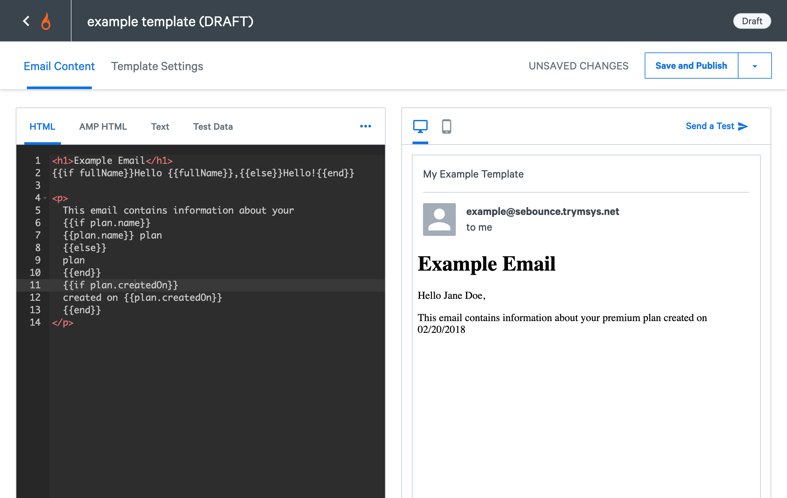
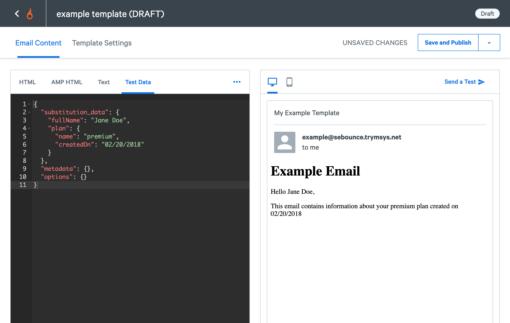
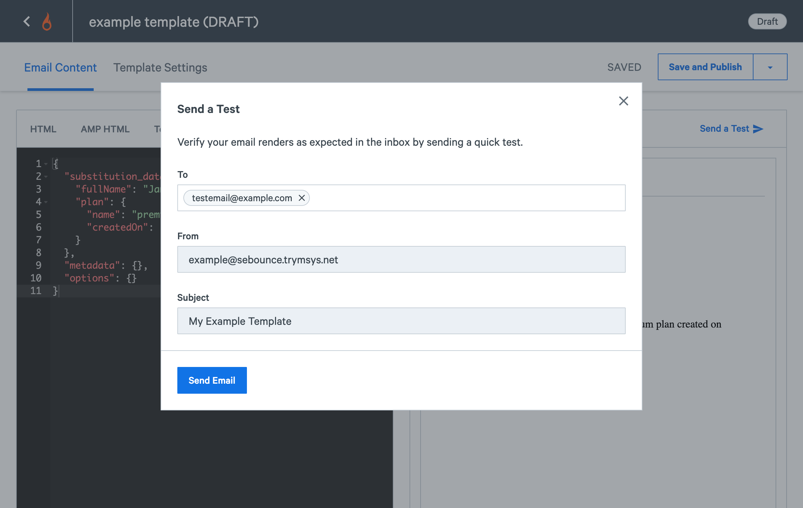

In the SparkPost UI, you can use the "Preview" mode of the template editor to render your HTML or text templates and send tests of your template.

There are some limitations on test sends; you can only send up to five (5) people at a time. **DO NOT USE THIS FOR PRODUCTION TRANSMISSIONS!**

The following example code is used to illustrate our preview and test send functionality, but you may use your own content if you wish. To use the preview functionality, login to your SparkPost account and create a new template with the following parameters:

* **Template Name:** SparkPost Preview Test Template
* **ID:** my-preview-test-template
* **From Name:** This is the "human friendly" name that is shown to recipients in their email client
* **From Email (sender):** Your user on the valid sending domain
* **From Email (@domain):** Must be one of your **valid** sending domains. [Learn how to configure a sending domain in SparkPost](https://www.sparkpost.com/docs/getting-started/getting-started-sparkpost/#preparing-your-from-address)
* **Subject:** Test Email, Please do not respond
* **Description:** This is a simple test template used to test SparkPost's Preview Functionality
* **Engagement Tracking:** Turn on Track Opens and Track Clicks

## The Test HTML Content

```
<h1>SparkPost Test Template</h1>
{{if fullName}}Hey {{fullName}},{{else}}Greetings!{{end}}

{{if product.name}}
<p>
Thank you for your interest in [{{product.name}}](https://www.sparkpost.com/docs/product.url "product.description")
</p>
{{end}}

<p>
Just reply to this email with any questions you may have, we're happy to help!
</p>

All the best,
<br />
{{if companyName}}
{{senderName}}
{{else}}
Example Company
{{end}}

{{if sparkpostSupportEmail}}
<p>
If you are not the intended recipient, please contact <a href="mailto:{{sparkpostSupportEmail}}">SparkPost Support</a>.
</p>
{{end}}
```

## The Test Text Content

```
SparkPost Test Template
{{if fullName}}Hey {{fullName}},{{else}}Greetings!{{end}}

{{if product.name}}
Thank you for your interest in {{product.name}}.
{{end}}

Just reply to this email with any questions you may have, we're happy to help!

All the best,
{{if companyName}}
{{senderName}}
{{else}}
Example Company
{{end}}

{{if sparkpostSupportEmail}}
If you are not the intended recipient, please contact SparkPost Support via email: {{sparkpostSupportEmail}}).
{{end}}
```

## Example Substitution Data

```json
{
  "senderName": "First Last Name",
  "fullName": "Test FullName",
  "product": {
    "name": "The coolest product ever",
    "url": "https://sparkpost.com",
    "description": "The Developer's Choice for Email Infrastrucutre"
  },
  "sparkpostSupportEmail": "support@sparkpost.com",
  "sparkpostSupportPhone": "123-456-7890"
}
```

**NOTE: You have to have a completed template definition (and any necessary substitution data used in either the TEXT or HTML versions of the template) prior to the "Preview" functionality being enabled.**

The last thing we want to do is "Save" our template. The difference between "Save" and "Save & Publish" is:

|                | Usable in Production | Requires Override to Use in API | Editable | State     |
|:---------------|:---------------------|:--------------------------------|:---------|:----------|
| Save           | YES                  | YES                             | YES      | Draft     |
| Save & Publish | YES                  | NO                              | NO       | Published |

Click the "Save" button (for this example, so we can easily edit it if something is incorrect).

## To View Your Email in Preview

Once you have your completed template content and have provided the substitution data, you can click the "Preview" button to view your template rendered with your test substitution data. Below is an example of a completed template.



## To Send a Test Email in Preview

You have the option to set `substitution_data`, `metadata`, and `options` values in the test data screen (accessed by clicking on the "*TEST DATA*" button). SparkPost Enterprise users **MUST** provide a configured `binding_group` name in the `options` object, in order for the test emails to be sent.



While you have the Preview window still open (viewing your rendered template with substitution data) you can enter up to five (5) email addresses in the "To" field. Then click the "Send Email" button, and your email will be sent to those addresses. You can see an example screenshot below of the preview.



**BONUS FEATURE**: Sending test transmissions also generates **REAL** webhook events, so you can use it to test those as well.
