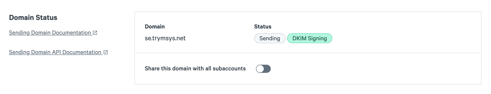

At SparkPost we strive to ensure that all of our customers are **Responsible Senders**.  We do this by providing guidance on [deliverability best practices for inbox placement](https://www.sparkpost.com/docs/deliverability/optimizing-deliverability-and-inbox-placement/), providing real-time feedback on your sends and by enforcing policies that protect our sending reputation and the reputation of our customers.

The gold standard for a **Responsible Sender** is one who sends only to those recipients who want and expect the content, and one who practices good list hygiene as follows:

* Confirms email addresses for all recipients (double opt-in)
* Does not send to invalid email addresses
* Stops sending to recipients who don't open and read their content any more
* Stops sending to recipients who have unsubscribed
* Has a clear web presence, usually where a customer can sign up and manage their experience

As part of being a **Responsible Sender,** we ask all customers to complete the domain validation process -- after which your domain(s) will be activated and ready for use.  This process has two steps:

### Step One: Ownership Verification

First, we need to make sure you own the domain you want to set up. *Adding a DNS record* is the recommended way to show that you own your domain. Depending on how you plan to use the domain, you'll want to add different DNS records so you can verify ownership and get the domain properly set up all at once.

* For a domain that you plan to use as a **sending domain** (From), you should add a TXT record with the provided DKIM information. This will make this domain ready for sending and DKIM-signing, verifying ownership and at the same time resulting in better DKIM alignment.
* For a domain that you plan to use as a **bounce domain** (Return Path), you should add a CNAME record with the provided hostname value. This will verify ownership and make this domain ready for bounces.
* If you don't have access to the domain's DNS records, you can verify ownership by requesting an email be sent to any address on the sending domain and then clicking the link in the received email. (Note: this email verification option is not available for bounce domains which _must_ be CNAME-verified.)

### Step Two: Compliance Review

Once ownership of your domain has been verified through any one of the above methods, the domain enters our compliance process. At this point your sending domain will have a status of "Pending" for up to an hour until our compliance checks are complete. 

Once the review is complete and your sending domain passes the checks, your domain will be marked as "Verified" and ready for use (for sending, DKIM-signing, and/or bounce).

## If Your Domain Is Blocked...

If your domain's status is "Blocked", it's generally because your domain is already in use by another SparkPost account, your domain has been previously blocked for sending abusive traffic through our service or another provider, or because one or more of the requirements below are not met:

### Domain Requirements

* You must own or have administrative access to your domain -- that is confirmed when you complete the [Sending Domain Verification Steps](https://www.sparkpost.com/docs/getting-started/getting-started-sparkpost/#step-2-verifying-domain-ownership)
* An A record or MX record in DNS must exist for your domain
* The organizational domain cannot be used across more than one SparkPost account (for example, you cannot have mail.acme.com associated with one account while alert.acme.com belongs to another account)

### Website Requirements  

Your domain must have a live and working website at `http://<sending-domain>` or `http://www.<canonical-domain>`. Note that the canonical domain is the main domain name including TLD but without any subdomain elements. For instance, a sending domain of *mail.example.com* has the canonical domain *example.com*.

That website must follow these guidelines:

* Is not under construction or a holding page
* Contains your privacy policy outlining how you work with your customers' data
* Does not contain content that violates our [Messaging Policy](https://www.sparkpost.com/policies/messaging/)
* Resides in the same country from where you registered your account

If you make changes to your blocked sending domain and would like us to re-evaluate your domain, please [submit a support request](https://app.sparkpost.com/dashboard?supportTicket=true&supportIssue=sending_domain_block)

## Additional Resources:

* Having trouble setting up your sending domain? See our article on how to [Create a Sending Domain](https://www.sparkpost.com/docs/getting-started/getting-started-sparkpost/#preparing-your-from-address)
* A step by step guide to setting up your account for success with our [New User Guide](https://www.sparkpost.com/docs/getting-started/getting-started-sparkpost/)
