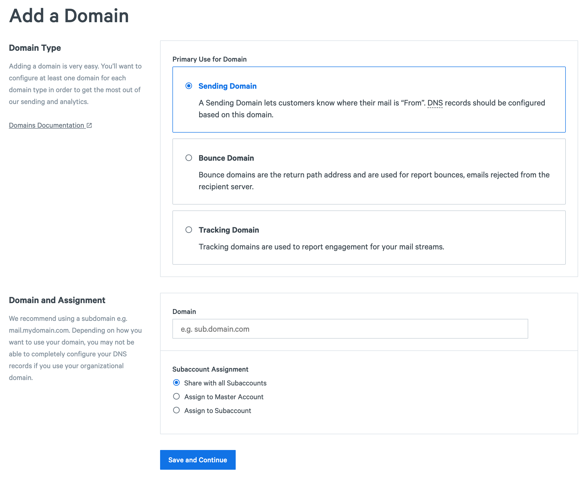
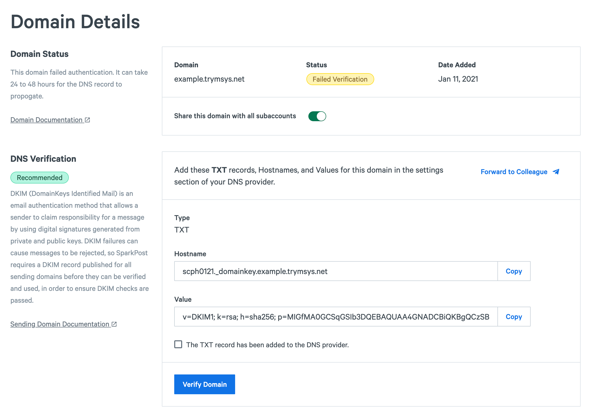
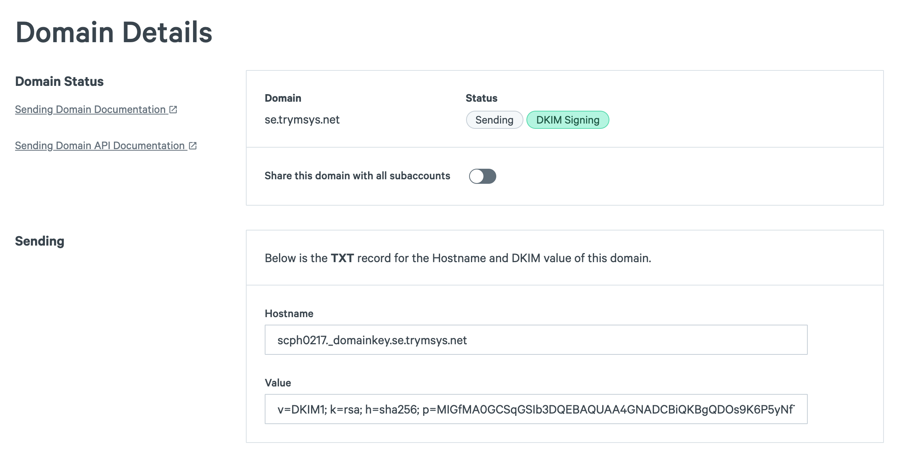

Start from [Domains create](https://app.sparkpost.com/domains/create) ([EU](https://app.eu.sparkpost.com/domains/create)) page to set up the type of domain you want.

Then verify the domain by adding the records outlined in the DNS Verifaction section to your domain's DNS settings.

It can take some time for DKIM records to propagate. You can check the TTL (time to live) amount within your DNS provider. Once they do you can verify the domain. If the domain validates successfully, this is what it should look like:

*Note:* If you ever remove your domain from your account and re-add it, this will reset the TXT record for the domain, so you will need to update your DNS TXT record to re-verify the domain.
