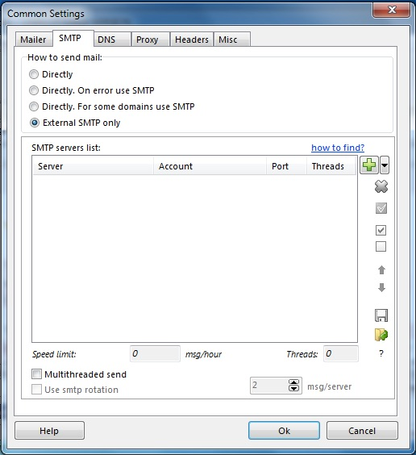
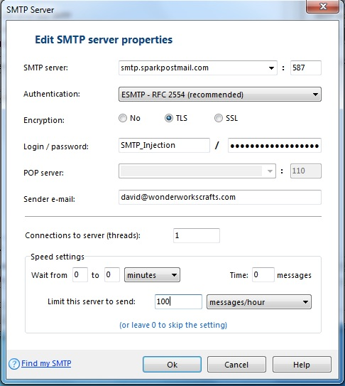

The following steps will walk you through using SparkPost with AtomPark Software's [Atomic Mail Sender](http://www.atompark.com).

Click on 'Common Settings' under the Settings menu and select the SMTP Tab:

Click on the green '+' sign to set up a new SMTP account and enter the information in as shown:

* Set the SMTP server name to "smtp.sparkpostmail.com"
* Set the port to 587
* For encryption, select TLS
* Set login in as "SMTP_Injection"
* Set the password to a valid API key you have generated from your account with the 'Send via SMTP' permission enabled
* You can also set the hourly send limit to be your quota on SparkPost (see the Usage page under your Account tab to see your current limits)

Happy Sending!
