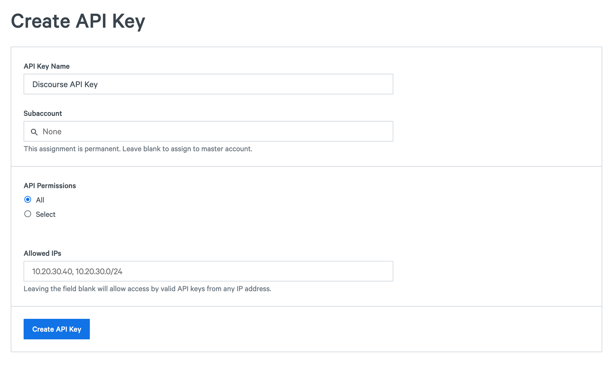

To use SparkPost with Discourse you’ll need to:

*   Sign up for a SparkPost account
*   Create and verify a sending domain in SparkPost
*   Create an API key in SparkPost
*   Install Discourse
*   Update the SMTP credentials in your Discourse config
*   Change the default from email Discourse uses to send messages

## Sign up for a SparkPost account

Visit our [sign up](https://app.sparkpost.com/join) page and create your SparkPost account.

## Create and verify a sending domain

Visit the [Sending Domains](https://app.sparkpost.com/account/sending-domains) page and create a new domain. To verify your domain, do one of the following:

* Sending a verification email to abuse@yourdomain.com
* Sending a verification email to postmaster@yourdomain.com
* Setting up a valid DKIM DNS record

Choose the method that works best for you. View [this support article](https://www.sparkpost.com/docs/getting-started/getting-started-sparkpost/#preparing-your-from-address) for more detailed information on setting up sending domains.

## Create an API key in SparkPost

Visit the [API Keys](https://app.sparkpost.com/account/credentials) page and create an API key with the “Send via SMTP” permission:



## Install Discourse

There are lots of links available on the web for installing Discourse so this article won’t provide a detailed walkthrough. If you’re starting from scratch we highly recommend this article: [How to use the Discourse One-Click Application on DigitalOcean](https://www.digitalocean.com/community/tutorials/how-to-use-the-discourse-one-click-application-on-digitalocean).

If you follow that guide, you’ll be prompted for SMTP credentials. Use the following information:

```
DISCOURSE_SMTP_ADDRESS: smtp.sparkpostmail.com
DISCOURSE_SMTP_PORT: 587
DISCOURSE_SMTP_USER_NAME: SMTP_Injection
DISCOURSE_SMTP_PASSWORD: YOUR-API-KEY
```

Where YOUR-API-KEY is the key you created above with the “Send with SMTP” permission.

## Update the SMTP credentials in Discourse

If you have an existing installation of Discourse, open up your Discourse installation’s app.yml file and update the following settings:

```
DISCOURSE_SMTP_ADDRESS: smtp.sparkpostmail.com
DISCOURSE_SMTP_PORT: 587
DISCOURSE_SMTP_USER_NAME: SMTP_Injection
DISCOURSE_SMTP_PASSWORD: YOUR-API-KEY
```

Where YOUR-API-KEY is the key you created above with the “Send with SMTP” permission.

## Change the default from email Discourse uses

By default, Discourse will send email from the hostname you configured Discourse with. For instance, if you set the DISCOURSE_HOSTNAME setting to ‘discourse.mysite.com’, Discourse will send emails with the from address noreply@discourse.mysite.com.

To change this, uncomment and edit this line in your Discourse installation’s app.yml file:

```yaml
- exec: rails r "SiteSetting.notification_email=noreply@your-sending-domain.com"
```

Note that you should replace “your-sending-domain.com” with the sending domain you created and verified earlier.

You'll need to issue a rebuild after uncommenting the above line and setting the from email address as required.

## Go forth and send!

Your Discourse installation should now be configured to send email through SparkPost.
