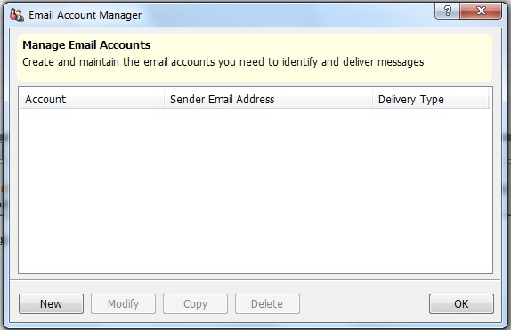
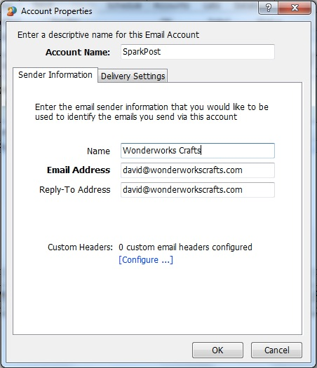
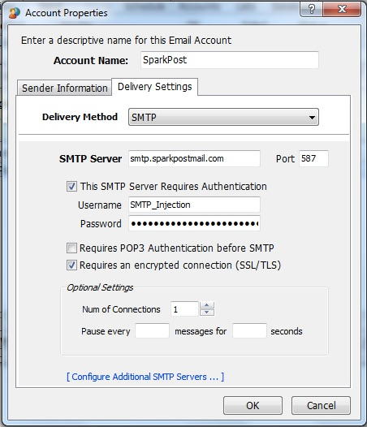

The following steps will walk you through using SparkPost with LmhSoft's [eCampaign 11](https://www.lmhsoft.com/ecamp/).

Click on 'Accounts' to go to the Email Account Manager:

Click on the 'New' button to set up a new SMTP profile and enter your name, email address and reply-to (note that the domains for the email addresses should be ones that you have set up on your SparkPost account):

Click on 'Delivery Settings' to set the following:

* Set the SMTP Server to smtp.sparkpostmail.com
* Set the port to 587
* Check the box that says "This SMTP Server Requires Authentication"
* Set the username to SMTP_Injection
* Set the password to an API key you've created on your SparkPost account with the 'Send via SMTP' permission enabled
* Check the box that says "Requires an encrypted connection (SSL/TLS)"
* Click "OK"

Now you're ready to send!
