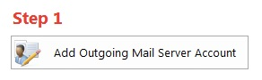
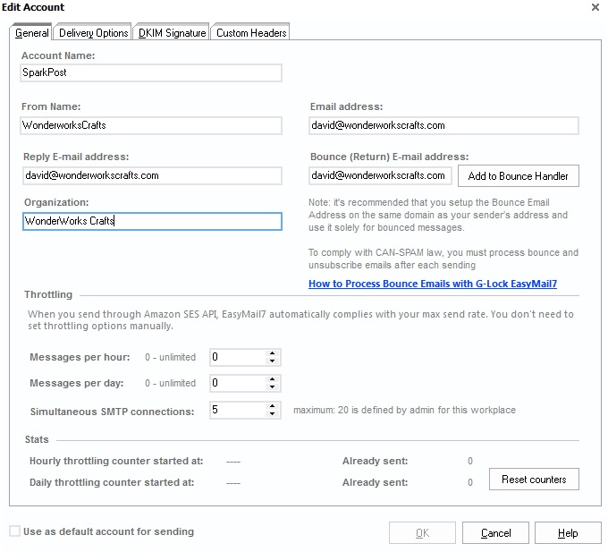
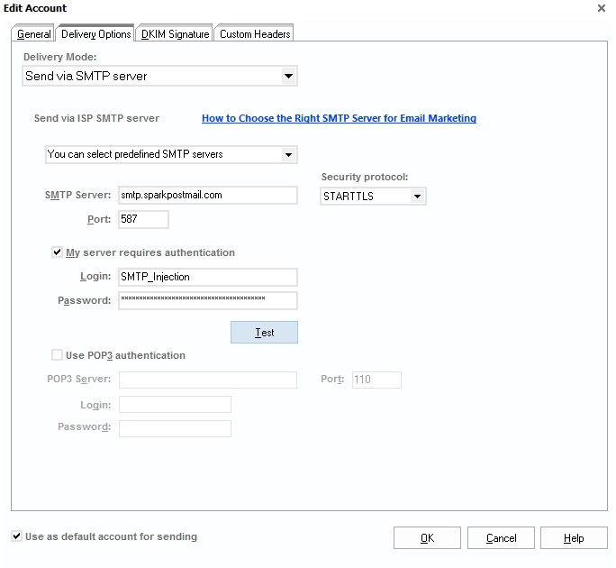

Using SparkPost with G-Lock Software's [EasyMail7](http://easymail7.com) is easy!

Just click on 'Add Outgoing Mail Server Account' in the Getting Started window:

Then set up a new profile for your SparkPost account, entering your From Name, Email address, Reply E-mail address and Organization name (don't worry about the Bounce E-mail address since SparkPost automatically handles Bounces for you):

You can also set up the throttling values based on your SparkPost quota (see your Usage report under your Account settings for your SparkPost hourly and daily quota limits).

Then click on Delivery Options at the top of the dialog to enter your SMTP information.  Select 'Send via SMTP server' and set the SMTP Server to be smtp.sparkpostmail.com, set the security protocol to be STARTTLS, the port to 587, enable 'My server requires authentication' and enter SMTP_Injection as your username and an API key generated from your SparkPost account that has the 'Send via SMTP' permission enabled:

Select 'Use as default account for sending' (unless you are using other mail servers as well). Click the 'Test' button to send a test message to an email address of your choosing - and you should be good to go!
