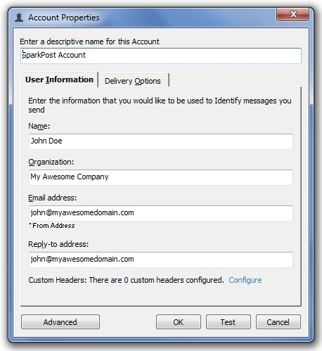
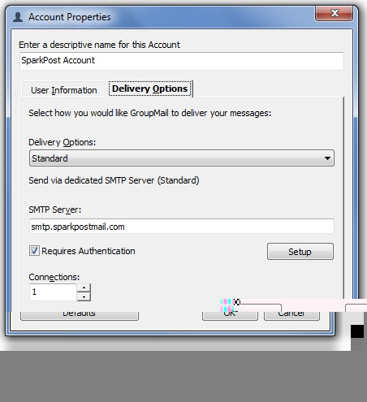
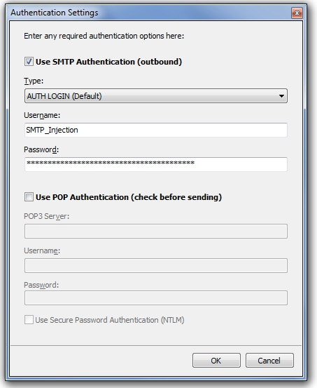
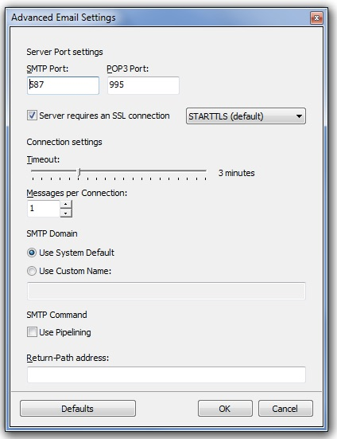

The following steps will walk you through using SparkPost with Infacta's [Group-Mail](http://group-mail.com).

Go to the Accounts dialog and set up a New Account.  Enter your details on the main account settings page as appropriate:

IMPORTANT: The email address and reply-to address MUST be set to an address at a domain that you have configured and verified on your SparkPost Sending Domains setup page (in this case 'myawesomedomain.com').

Then click on the 'Delivery Options' tab and set it up as follows:

Enable the 'Requires Authentication' toggle and click 'Setup'.  Select 'Use SMTP Authentication' with AUTH LOGIN as the authentication type.  Then enter SMTP_Injection for the username and a valid SparkPost API key that you have generated from your account with the 'Send via SMTP' permission enabled.

Click OK and the click on the 'Advanced' settings button.  Set your SMTP port to 587 and enable the 'Server requires an SSL connection' and select STARTTLS as the type (which is the default):

And that's all there is to it!  Happy sending!
