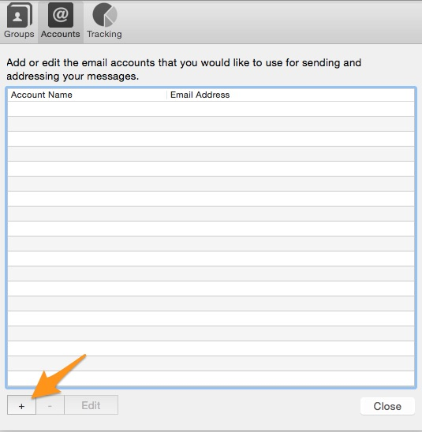
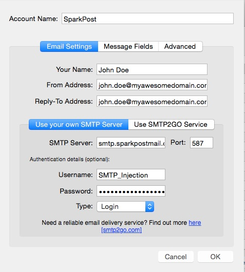
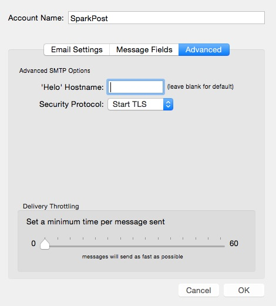

The following steps will walk you through using SparkPost with Infacta's [Hoolie](http://hool.ie).

NOTE: Please make sure you have upgraded your version of [Hoolie](http://hool.ie) to the latest version that includes updated SSL and TLS support (Version 1.9389 or later)

When running Hoolie, click on 'Preferences' and go to the Accounts tab and click on '+' to add a new mail server:

Then configure the new server with the following:

* A 'From Address' that matches one of the sending domains that you've configured in your SparkPost account
* A 'Reply-To Address' of your choice
* Select 'Use your own SMTP Server' and enter 'smtp.sparkpostmail.com' as your SMTP Server name and 587 as the Port
* Enter 'SMTP_Injection' as your Username and enter as the password an API key that you've created from your SparkPost account with the 'Send via SMTP' permission enabled
* Select 'Login' as the authentication type:

Then click on the 'Advanced' tab and select 'Start TLS' as the Security Protocol (you can leave the 'Helo' Hostname blank:

Click OK and you should be good to go!  Happy Sending!
