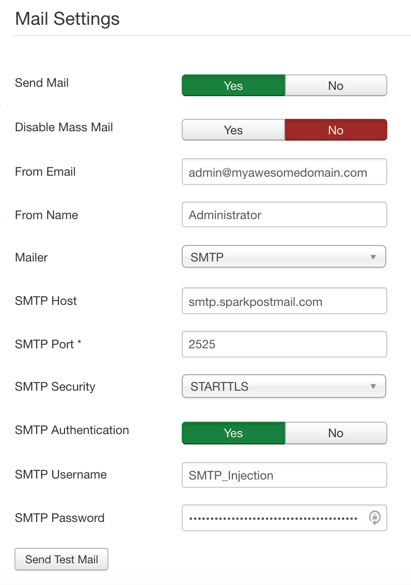

Configuring Joomla to use SparkPost is very straightforward since it can be done from its administration panel.

* [Add Sending Domain](https://www.sparkpost.com/docs/getting-started/getting-started-sparkpost/#preparing-your-from-address) to SparkPost
* [Create an API Key](https://www.sparkpost.com/docs/getting-started/create-api-keys/) with “*Send via SMTP*” permission
* Login to admin panel (as an Administrator) of your Joomla installation
* Open *Server* tab from *System* -> *Global Configurations*
* Use the following information to fill in Mail Settings

    * **Send Mail:** Yes
    * **From Email:** `<EMAIL>`@`<DOMAIN>`
    * **From Name:** `<NAME>`
    * **Mailer:** SMTP
    * **SMTP Host:** smtp.sparkpostmail.com
    * **SMTP Port:** 587
    * **SMTP Security:** STARTTLS 
    * **SMTP Username:** SMTP_Injection
    * **SMTP Password:** `<API_KEY>`

    Note: Replace `<EMAIL>`, `<DOMAIN>`, `<NAME>` and `<API_KEY>` with appropriate values. `<DOMAIN>` must be one of your verified sending domains. 

*   Save settings
*   After save, click Send Test Email. It should attempt to send an email to yourself or, otherwise, will show any issues with this setup.

If there is any connection problem, you can try using port 2525 instead of 587\. If the problem persists, unblock outgoing traffic to port 587 or 2525 from your firewall. If you're in a shared host, contact your hosting provider to unblock one for you. 

*This tutorial is prepared and tested against Joomla v3.6.5*
