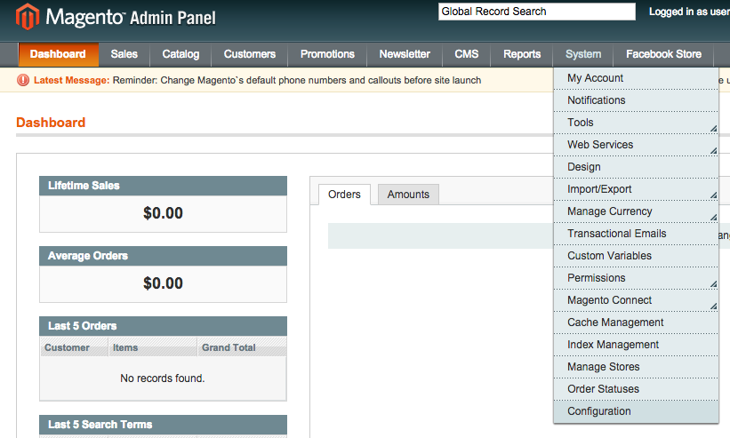
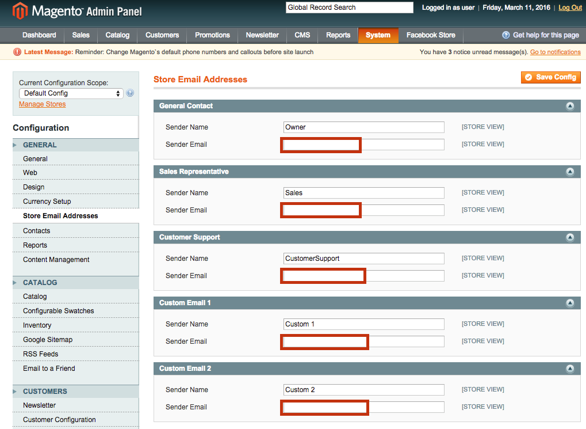
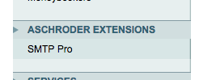
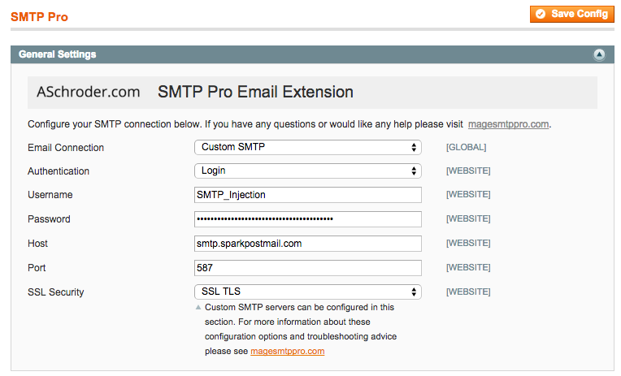
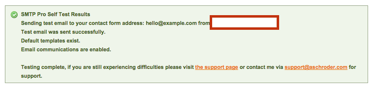

This article will show how to send email from Magento through SparkPost.

**These instructions assume that you are using the excellent [SMTP Pro extension](https://www.magentocommerce.com/magento-connect/smtp-pro-email-free-custom-smtp-email.html) and have a SparkPost account with a verified sending domain.**

Follow these steps to configure Magento and SMTP Pro to send through your SparkPost account.  These instructions were created using Magento 1.9 but should be applicable to most recent 1.x versions.

## Configure Magento

**Note**: to send with SparkPost, Magento needs to use *From* addresses with a *verified sending domain* from your SparkPost account. Learn about configuring [SparkPost sending domains](https://www.sparkpost.com/docs/user-guide/managing-sending-domains/).

To configure Magento to use your sending domain in its *From* addresses, log into your **Magento Admin Panel** and navigate to **System -> Configuration** in the top menu.

From the **General** menu on the left, click **Store Email Addresses** and edit each *Sender Email* field to use a verified sending domain from your SparkPost account.

Click the *Save Config* button to have your changes take effect.

## Configure SMTP Pro

Log into your Magento Admin Panel and navigate to **ASCHRODER EXTENSIONS -> SMTP Pro.**

****

Apply the following settings in the **General Settings** tab:

* Email Connection: Custom SMTP
* Authentication: Login
* Username: SMTP_Injection
* Password: `<your SparkPost API key>`
    * [How to create a SparkPost API key](https://www.sparkpost.com/docs/getting-started/create-api-keys/)
    * Remember to enable the 'Send via SMTP' privilege on your key.
* Host: smtp.sparkpostmail.com
* Port: 587
* SSL Security: SSL TLS

Click the *Save Config* button to have your changes take effect.

To check your configuration changes, click the *Run Self Test* button under the **Logging and Debugging** tab.  Once the self test is complete, a report panel will appear at the top of the page.

