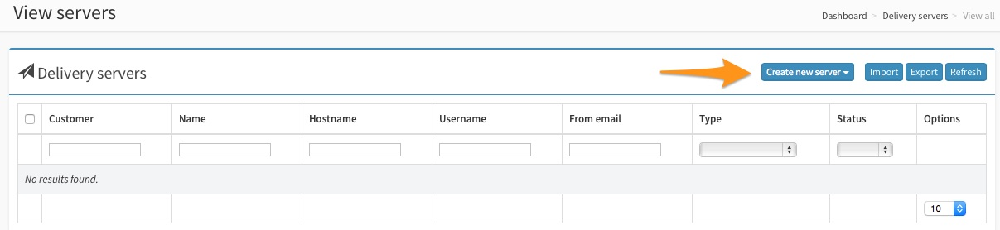
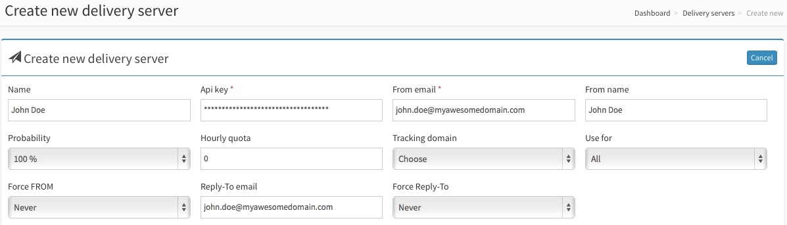

To use SparkPost with [MailWizz](http://mailwizz.com), click on the 'Servers' section of the MailWizz interface. Then click on 'Delivery Servers':

Click on 'Create new server' and select 'Sparkpost Web Api' from the drop-down menu and enter the following information:

* Your Name
* A valid API key you have created using your SparkPost account with all permissions enabled
* Your From email (using one of the domains that you have configured on verified on your SparkPost account)
* Your Reply-to address

Click on 'Save changes' and you should be good to go!

Happy Sending!
