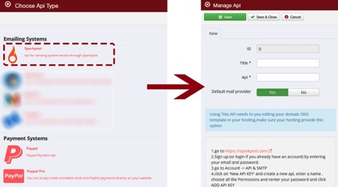

Setting up Marketing Rocket to use the SparkPost integration is simple, and takes only a couple of minutes!

***To correctly authenticate/setup SparkPost to send emails with your domain follow these steps:***

1. Log Into your SparkPost account

1. Go to **Configuration** > **Sending Domains**

1. Press **Add a Domain**

1. Enter the domain you will be sending emails from

1. Under DKIM record, click on CONFIGURE

1. Copy the text under hostname (it will be something like: scph0000._domainkey.YOURDOMAIN.com)

1. Log into your website control panel (CPANEL is most common)

1. Go to Advanced Zone Editor (DNS Zone Editor or Similar)

1. Ensure the correct domain is selected if you have more than one setup, then press ADD

    * In NAME: Paste the HOSTNAME from SparkPost
    * In TTL put: 60
    * In Type put: TXT
    * In TXT Data: Paste the VALUE from SparkPost.
    * Press ADD RECORD.

1. In your SparkPost Account press TEST. *(It can sometimes take a few minutes to recognize and approve with a green check, if it does not work right away, try again in a few minutes)*

1. In Your SparkPost Account go to: **Configuration** > **API Keys**

1. Click on ‘New API KEY” and create a new API, enter a name, select all permissions, confirm your password, and click ADD API KEY

1. Log into Marketing Rocket (New users can sign up for an account [here](https://marketing-rocket.com/pricing))

1. Go to API’s, press NEW and select SparkPost from the list.

1. Copy the API key from SparkPost and enter in the Manage API page, enter a Title for the API and ensure DEFAULT MAIL PROVIDER is set to YES.

1. Press SAVE. Now SparkPost will be your Default Email Delivery Service in Marketing Rocket!

    

For additional information, head to the Marketing Rocket Website [here](https://marketing-rocket.com/).
