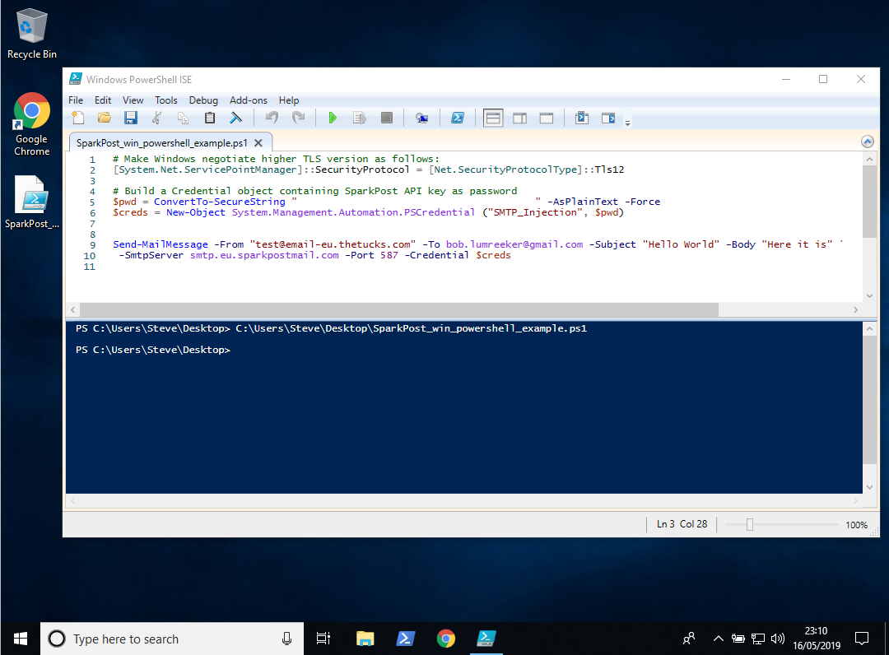
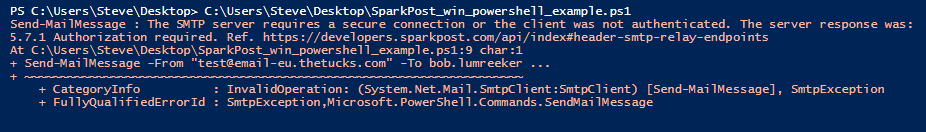

This article helps you develop and test SMTP injection scripts under Microsoft Windows. Here we concentrate on the basic (but usable) Windows PowerShell built-in features for sending via SMTP. 

If you need more options, check out cross-platform tools such as [swaks ("Swiss Army Knife for SMTP")](https://www.sparkpost.com/docs/tech-resources/smtp-injection-with-starttls-using-swaks/).

## Pre-requisites
There are a few things you need:
- [Create a SparkPost account](https://app.sparkpost.com/join) if you don't already have one.

- [Create an API key](https://app.sparkpost.com/account/credentials) with the "Send via SMTP" permission.

- [Create and verify](https://app.sparkpost.com/account/sending-domains) the domain you want to use for sending. The setup process should take about 5-10 minutes if you have access to your DNS server. See [Verify Sending Domains](https://www.sparkpost.com/docs/getting-started/getting-started-sparkpost/#step-2-verifying-domain-ownership) for more information.

## Create PowerShell script

PowerShell scripts are text files with a `.ps1` extension.
 
The `Send-MailMessage` [commandlet](https://docs.microsoft.com/en-us/powershell/module/microsoft.powershell.utility/send-mailmessage?view=powershell-6) is available for PowerShell versions 3.0 through 6.0. It doesn’t have as many options as `swaks`, but you can set up the most important attributes such as To, From, Subject, Body, Server, Port and so on.

Windows by default tries to use TLS 1.0, which is widely [deprecated as insecure](https://www.sparkpost.com/blog/tls-v1-0-deprecation/) and will not be accepted by SparkPost. We select TLS 1.2 instead using:
```
[System.Net.ServicePointManager]::SecurityProtocol = [Net.SecurityProtocolType]::Tls12
```
Credentials (username and password) need to be set up in a `PSCredential` object. The usual Windows behavior is to interactively prompt the user, however we choose to follow [this approach](https://blogs.msdn.microsoft.com/koteshb/2010/02/12/powershell-how-to-create-a-pscredential-object/) and set it directly in the script.

The entire script file looks like this. Don't forget to put in your API key value, sending domain, and recipient domain.

```
# Make Windows negotiate higher TLS version:
[System.Net.ServicePointManager]::SecurityProtocol = [Net.SecurityProtocolType]::Tls12
 
# Build a Credential object containing SparkPost API key as password
$pwd = ConvertTo-SecureString "<<MY API KEY HERE>>" -AsPlainText -Force
$creds = New-Object System.Management.Automation.PSCredential ("SMTP_Injection", $pwd)
 
Send-MailMessage -From me@mysendingdomain.com -To me@myrecipientdomain.com -Subject "Hello World" -Body "Here it is" `
 -SmtpServer smtp.eu.sparkpostmail.com -Port 587 -Credential $creds -UseSsl
```
File: SparkPost_win_powershell_example.ps1

Run the script:

```
> .\SparkPost_win_powershell_example.ps1
```

Comment lines begin with `#`. The backtick character `` ` `` is used to continue a command over several text lines.
 
It’s convenient to edit and run scripts using the [ISE Editor](https://docs.microsoft.com/en-us/powershell/scripting/components/ise/introducing-the-windows-powershell-ise?view=powershell-6). You can open this by selecting right-click “Edit” on your file.



The green triangle on the menu bar is the "run" button.

Your script execution is shown in the lower pane. If the mail sent OK, your command prompt returns without an error message.

### Error messages
If there’s something wrong with your `From`, `To`, `SmtpServer` or `Credentials` settings, you’ll see an error message. For example, an invalid API key will give



