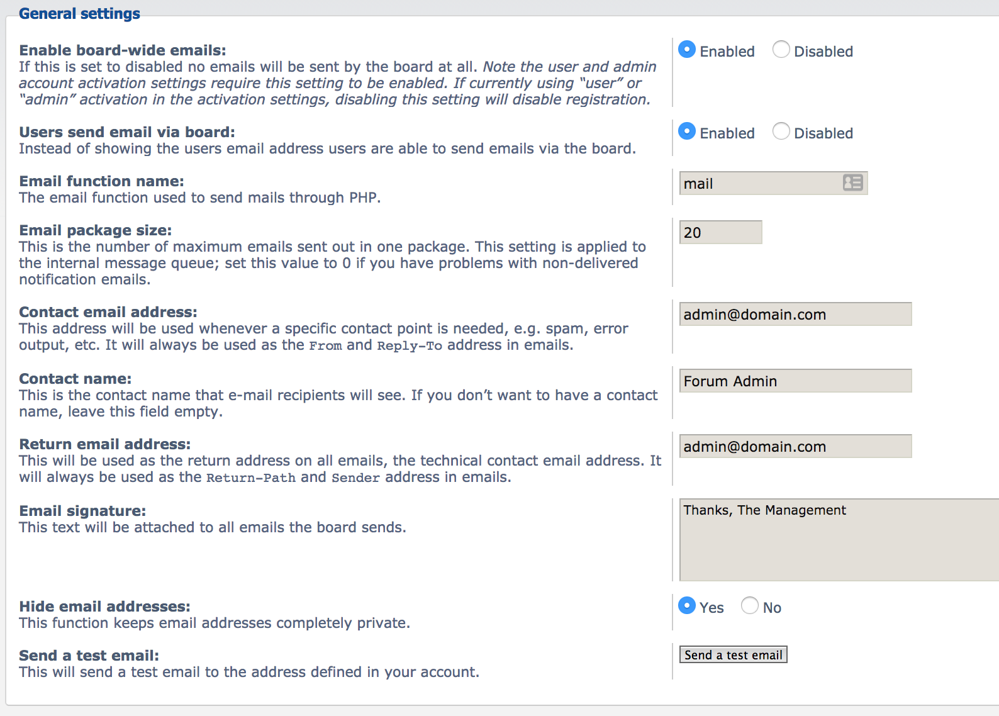

You can configure [PHPBB](https://www.phpbb.com/) to use SparkPost either while setting up a fresh new forum or by modifying settings of an existing forum. For a new forum, we recommend you to configure it after the forum installation is completed as the **E-mail Configuration** step in the installation process is incomplete.

## Staying Safe With Email And Public Forums

It is important to recognize that public forums are a common source of unwanted email content. To combat this when using PHPBB with SparkPost, please consider enabling reCAPTCHA on your forums and remember that any forum content sent through your SparkPost account  could impact your sending reputation or even cause your account to be suspended.

## Preparation

* [Add a Sending Domain](https://www.sparkpost.com/docs/getting-started/getting-started-sparkpost/#preparing-your-from-address) to SparkPost
* [Create an API Key](https://www.sparkpost.com/docs/getting-started/create-api-keys/) with “Send via SMTP” permission
* Keep a note of your API key

## Configuring PHPBB

* Login to PHPBB’s admin panel
* ​Go to Client Communication -> Email Settings
* There are two sections in Email Settings page. Configure **General** **settings** as follows​

    

    * **Enable board-wide emails:** Enabled
    * **Contact email address:** `<email>`@`<domain.com>`
    (Replace `<domain.com>` with the verified sending domain)
    * **Return email address:** This can be same contact email address. You can however use different value as long as your domain is verified to send through sparkpost.

* Configure **SMTP settings** section as follows

    * **Use SMTP server for email:** Yes
    * **SMTP server address:** smtp.sparkpostmail.com
    * **SMTP server port:** 587

        Use 2525 in case port 587 is blocked in your server’s firewall

    * **Authentication method for SMTP:** PLAIN
    * **SMTP username:** SMTP_Injection
    * **SMTP password:** `<API_KEY>`

        Replace `<API_KEY>` with your actual API Key that you’ve created in earlier step. 

## Testing

PHPBB’s Email Settings page has an option to send a test email. However, this is [currently broken](https://tracker.phpbb.com/browse/PHPBB3-14913). So we suggest testing your email setup by sending an email to yourself. 

* Enable “Users send email via board” in General Settings
* Visit your profile page
* Follow the link that says like “Send email to <username>”
* Compose an email and send it. 

## Debugging

In case the emails are not working as expected, you can check PHPBB's error log for details on possible issues. You can access the error log from *Maintenance* -> *Error log*. 

If you need to reach out to SparkPost support, please include the content from your error log.
