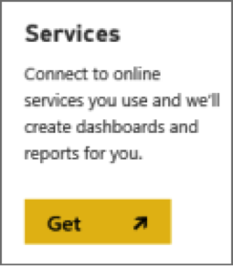
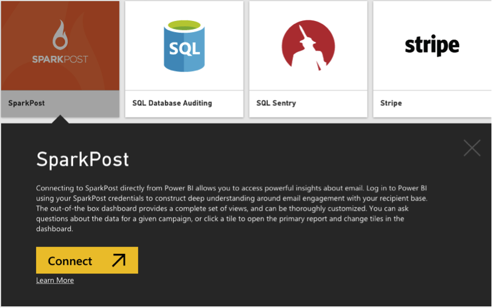
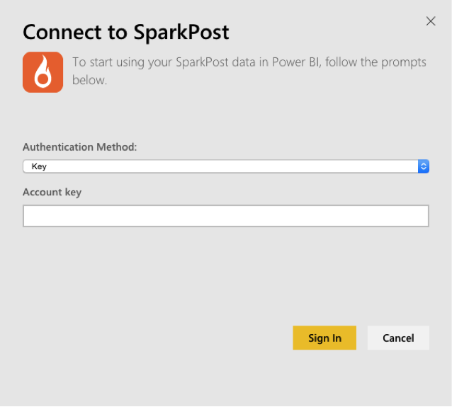
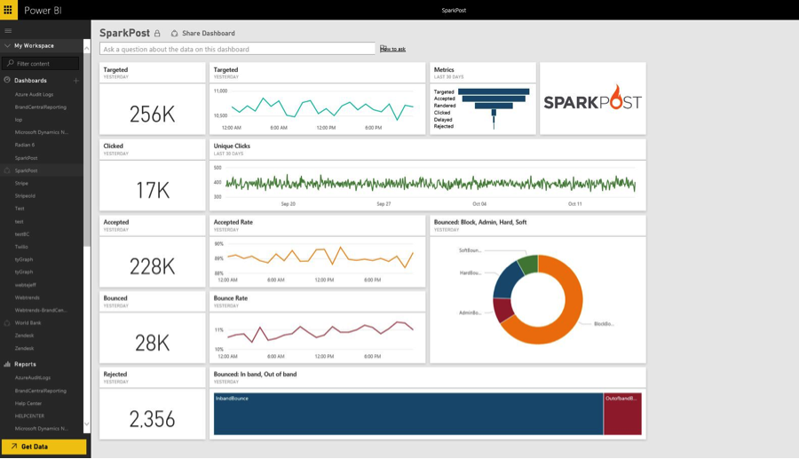

The Power BI content pack for SparkPost allows you to extract valuable datasets from your SparkPost account all into one insightful dashboard. Using the SparkPost content pack you can visualize your overall email statistics, including domains, campaigns, and engagement by ISP.

Connect to the [SparkPost content pack](https://app.powerbi.com/getdata/services/sparkpost) for Power BI.
**Import data from your SparkPost account**

1. Select **Get Data** at the bottom of the left navigation pane.

    

1. In the **Services** box, select **Get**.

     

1. Select the **SparkPost** content pack and click **Connect**. 

    ****

1. When prompted, select Key as the Authentication Method and provide your SparkPost API Key. The API Key can be created in your SparkPost account under **Configuration** > **API Keys**. Then select **Sign In**   .

    

1. After Power BI imports the data, you’ll see the default dashboard, report, and dataset in the left navigation pane, populated with your email statistics for the past 90 days. New items are marked with a yellow asterisk *.

    

You have the freedom to change the dashboard to display your data anyway you see fit. In addition, you can ask a [question in ](http://support.powerbi.com/knowledgebase/articles/474566-q-a-in-power-bi)[Q&A](http://support.powerbi.com/knowledgebase/articles/474566-q-a-in-power-bi) or click a tile to [open the underlying report](http://support.powerbi.com/knowledgebase/articles/425669-when-you-click-a-tile-in-a-dashboard) and [c](http://support.powerbi.com/knowledgebase/articles/424878-edit-a-tile-resize-move-rename-delete)[hange the tiles](http://support.powerbi.com/knowledgebase/articles/424878-edit-a-tile-resize-move-rename-delete) in the dashboard. The SparkPost content pack is configured by default to refresh once a day.

**See Also:**

* [Services in Power BI](https://support.powerbi.com/knowledgebase/topics/88770-services-in-power-bi)
* [Get started with Power BI](http://support.powerbi.com/knowledgebase/articles/430814-get-started-with-power-bi)
* [Get Data](http://support.powerbi.com/knowledgebase/articles/434354-get-data)
