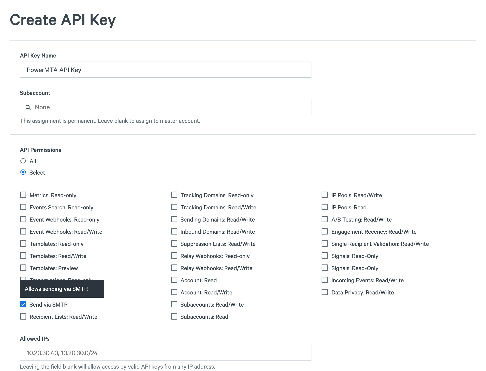

If you’re interested in relaying mail through PowerMTA to SparkPost, there are only a few things you need to do. First, [create a SparkPost account](https://app.sparkpost.com/join) if you don't already have one.

Next, [create an API key](https://app.sparkpost.com/account/credentials) with the "Send via SMTP" permission:



Now [create and verify](https://app.sparkpost.com/account/sending-domains) the domain you want to use for sending. The setup process should take about 5-10 minutes if you have access to your DNS server. See [Verify Sending Domains](https://www.sparkpost.com/docs/getting-started/getting-started-sparkpost/#step-2-verifying-domain-ownership) for more information.


## PowerMTA basic configuration

Add the following to your PowerMTA config, changing the value for auth-password to the SparkPost API key you created above.

The `{sparkpost}` special domain is a short way to get the needed configuration.

```
<domain {sparkpost}>
    auth-password ###YOUR API KEY HERE###           # generate under Account/API Keys
    sparkpost-ip-pool test                          # if you want to select a specific SparkPost IP pool
</domain>

<domain *>
 queue-to {sparkpost}
</domain>
```

The config can optionally select a particular SparkPost dedicated IP pool by name, or select a SparkPost subaccount for delivery. See PowerMTA User Guide "SparkPost Traffic Redirection Support" for more information.


Benefits of using PowerMTA to relay to SparkPost:
* You don’t need to change your existing message generation architecture:
    * PowerMTA handles all the queueing and any network issues that might arise during delivery.
    * Your message generation platform may not supply a SMTP username and password, particularly if it's directly connected to your MTA over a private network. Any cloud sending service expects authentication; PowerMTA can supply the username and password on the outgoing connection.
    * PowerMTA supports TLS, ensuring the outgoing connection is secure.

* PowerMTA supports multiple connections, which provides fast message injection to SparkPost.

* You get the [built in analytics](https://app.sparkpost.com/reports/summary) and event reporting that are part of SparkPost.

## Selecting domains to relay to SparkPost

The `<domain *>` directive shown above causes all mail to be sent to SparkPost. More realistically, you will want to migrate gradually, by selecting which traffic streams go to SparkPost, and which ones are delivered by PowerMTA as before. With PowerMTA, you can select based on the `MAIL FROM` domain (known as the sending domain in SparkPost).

In your PowerMTA configuration, include a `pattern-list` into the source directive that receives your incoming messages.  For example:

```
# Settings per source IP address (for incoming SMTP connections)
<source 127.0.0.1>
    always-allow-relaying yes   # allow feeding from 127.0.0.1
    process-x-virtual-mta yes   # allow selection of a virtual MTA
    max-message-size unlimited
    smtp-service yes            # allow SMTP service
    pattern-list domainsRelayedToSparkPost
</source>
```

Then set up the `pattern-list` to match each `MAIL FROM` domain using a regex. This domain must be sendable by SparkPost, i.e. registered as a valid sending domain. Don't add a trailing `$` (matching end-of-line) to the regex target, because then it would not match addresses that are surrounded by `<` `>` brackets.

```
# SparkPost injection, conditional on the sending domain (mailfrom address) using the following
# pattern.  This pattern should be included in your active <source> directive(s).
<pattern-list domainsRelayedToSparkPost>
    mail-from /@email.mydomain.com/ virtual-mta=SparkPostRelay
</pattern-list>
```

Next, we set up a virtual-mta to handle this traffic with your chosen name. In the example below, it's called `SparkPostRelay`.

```
<virtual-mta SparkPostRelay>
    <domain *>
        queue-to {sparkpost}
    </domain>
</virtual-mta>
```

See also: [Hybrid Cloud: Migrating Traffic Streams Smoothly from PowerMTA to SparkPost](https://www.sparkpost.com/blog/hybrid-cloud-migrating-traffic-streams-smoothly-from-powermta-to-sparkpost/).