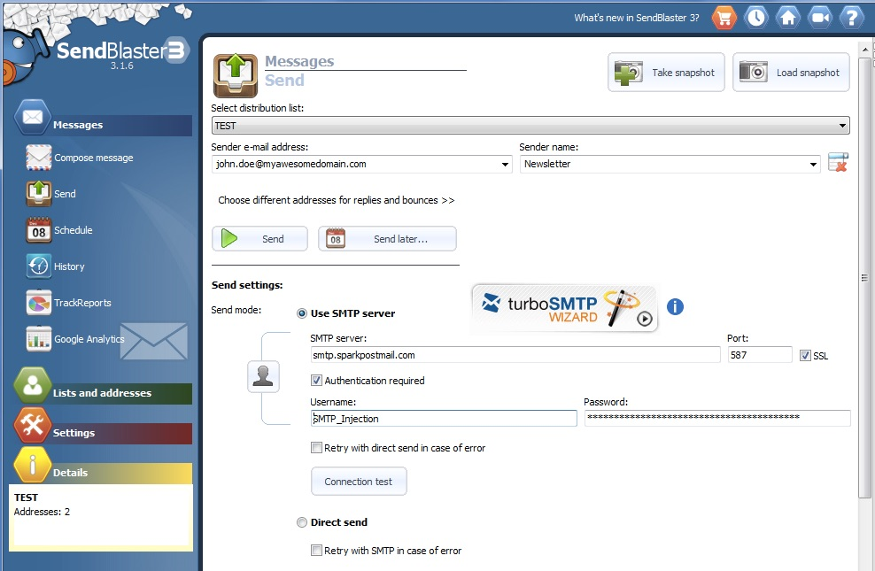

To use SparkPost as your SMTP Relay with [SendBlaster](http://sendblaster.com), click 'Send' under the Messages Menu on the left-hand navigation to bring up a dialogue box and follow these steps:

* Set up your 'Sender e-mail address' to be an address from one of your SparkPost verified sending domains
* Click 'Use SMTP Server'
* Set the SMTP server to be smtp.sparkpostmail.com
* Set the port to 587
* Enable SSL
* Enable the 'Authentication Required' checkbox
* Set the Username to SMTP_Injection and the password to a valid API key you've created through your SparkPost account with at least the 'Send via SMTP' permission enabled

Test the connection with the 'Connection Test' button and you should be good to go!

Happy Sending!
