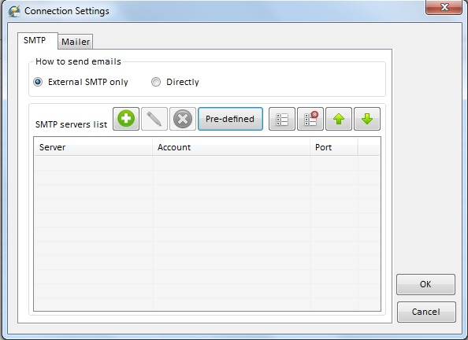
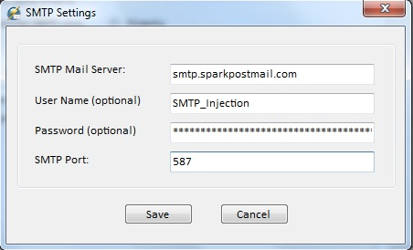

The following steps will walk you through using SparkPost with [Thunder Mailer](http://thundermailer.com).

Click on 'Connections' and bring up the list of SMTP servers:

Click on the green '+' symbol to create a new SMTP server profile and enter the information as shown:

* Set the SMTP Mail Server name to smtp.sparkpostmail.com
* Set the user name to SMTP_Injection
* Set the password to an API key you have created from your SparkPost account that has the 'Send via SMTP' permission enabled.
* Set the SMTP port to 587 (TLS will be enabled automatically by Thunder Mailer)

Also remember that your "From address" needs to be from a domain that you've set up as a valid sending domain in SparkPost and is listed as 'Ready to Send'

Happy Sending!
